# Peak Assignment Report
129 peaks found in 5084.log at 2016-04-04 15:38:57.146653

[-343.1048](#-343.1048)  
[-298.9853](#-298.9853)  
[-198.7688](#-198.7688)  
[-173.679](#-173.679)  
[-71.8912](#-71.8912)  
[-25.2442](#-25.2442)  
[10.4206](#10.4206)  
[48.917](#48.917)  
[60.2793](#60.2793)  
[74.5377](#74.5377)  
[102.2441](#102.2441)  
[104.6166](#104.6166)  
[134.6845](#134.6845)  
[167.6956](#167.6956)  
[179.3843](#179.3843)  
[185.0291](#185.0291)  
[224.1804](#224.1804)  
[264.2156](#264.2156)  
[265.8779](#265.8779)  
[286.4224](#286.4224)  
[294.6102](#294.6102)  
[299.1555](#299.1555)  
[316.7161](#316.7161)  
[324.1044](#324.1044)  
[329.2205](#329.2205)  
[357.5153](#357.5153)  
[378.1795](#378.1795)  
[396.9105](#396.9105)  
[415.1376](#415.1376)  
[427.7156](#427.7156)  
[439.0979](#439.0979)  
[476.5895](#476.5895)  
[488.4655](#488.4655)  
[515.0459](#515.0459)  
[535.2932](#535.2932)  
[566.6399](#566.6399)  
[582.531](#582.531)  
[595.4919](#595.4919)  
[622.3964](#622.3964)  
[626.5772](#626.5772)  
[678.5897](#678.5897)  
[693.0335](#693.0335)  
[695.6348](#695.6348)  
[716.8389](#716.8389)  
[775.9118](#775.9118)  
[778.2628](#778.2628)  
[807.4822](#807.4822)  
[850.0719](#850.0719)  
[854.4006](#854.4006)  
[910.1591](#910.1591)  
[943.465](#943.465)  
[972.3639](#972.3639)  
[978.9826](#978.9826)  
[980.1232](#980.1232)  
[986.4872](#986.4872)  
[1002.6739](#1002.6739)  
[1018.9049](#1018.9049)  
[1033.6893](#1033.6893)  
[1052.8917](#1052.8917)  
[1068.0444](#1068.0444)  
[1072.8387](#1072.8387)  
[1079.309](#1079.309)  
[1082.2722](#1082.2722)  
[1097.7484](#1097.7484)  
[1106.0222](#1106.0222)  
[1113.2987](#1113.2987)  
[1116.157](#1116.157)  
[1120.8841](#1120.8841)  
[1139.0881](#1139.0881)  
[1149.6123](#1149.6123)  
[1155.314](#1155.314)  
[1159.1402](#1159.1402)  
[1166.6813](#1166.6813)  
[1175.9506](#1175.9506)  
[1182.1088](#1182.1088)  
[1198.6989](#1198.6989)  
[1225.103](#1225.103)  
[1227.218](#1227.218)  
[1236.522](#1236.522)  
[1250.735](#1250.735)  
[1258.5554](#1258.5554)  
[1281.7167](#1281.7167)  
[1288.4681](#1288.4681)  
[1293.2812](#1293.2812)  
[1296.6373](#1296.6373)  
[1300.568](#1300.568)  
[1310.0913](#1310.0913)  
[1316.399](#1316.399)  
[1325.4022](#1325.4022)  
[1331.251](#1331.251)  
[1343.6574](#1343.6574)  
[1352.0824](#1352.0824)  
[1362.7136](#1362.7136)  
[1371.818](#1371.818)  
[1377.8222](#1377.8222)  
[1379.0807](#1379.0807)  
[1387.9248](#1387.9248)  
[1399.1324](#1399.1324)  
[1404.8601](#1404.8601)  
[1415.2558](#1415.2558)  
[1463.6816](#1463.6816)  
[1467.0853](#1467.0853)  
[1473.2524](#1473.2524)  
[1479.5118](#1479.5118)  
[1486.5206](#1486.5206)  
[1509.4214](#1509.4214)  
[1512.3754](#1512.3754)  
[3244.7686](#3244.7686)  
[3258.2029](#3258.2029)  
[3262.5593](#3262.5593)  
[3266.9181](#3266.9181)  
[3271.9023](#3271.9023)  
[3272.4927](#3272.4927)  
[3278.5755](#3278.5755)  
[3284.1337](#3284.1337)  
[3286.4632](#3286.4632)  
[3290.2493](#3290.2493)  
[3296.2868](#3296.2868)  
[3302.2901](#3302.2901)  
[3303.9508](#3303.9508)  
[3310.3008](#3310.3008)  
[3317.3855](#3317.3855)  
[3328.9199](#3328.9199)  
[3358.7347](#3358.7347)  
[3358.8022](#3358.8022)  
[3360.341](#3360.341)  
[3367.9895](#3367.9895)  
[3890.3454](#3890.3454)  
[3890.6867](#3890.6867)  
  
## Peak #1: -343.1048 1/cm   
Raman activity: 0.0444  
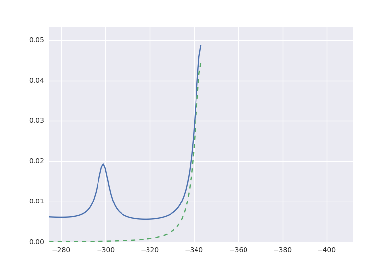

| Atom # | Element | Sum of vibrational eigenvalues |
|--------|---------|--------------------------------|
| 39 | 1 | 0.8618584570566098 |
| 9 | 6 | 0.15362291495737218 |
| 38 | 1 | 0.1307669683062202 |
| 11 | 1 | 0.12 |
| 41 | 1 | 0.10392304845413264 |
| 10 | 8 | 0.09848857801796104 |
| 42 | 1 | 0.04358898943540673 |
| 40 | 1 | 0.0412310562561766 |
| 43 | 1 | 0.024494897427831782 |
| 12 | 6 | 0.024494897427831782 |
| 44 | 1 | 0.017320508075688773 |
| 3 | 6 | 0.017320508075688773 |
| 1 | 8 | 0.017320508075688773 |
| 2 | 6 | 0.01414213562373095 |

## Peak #2: -298.9853 1/cm   
Raman activity: 0.0141  
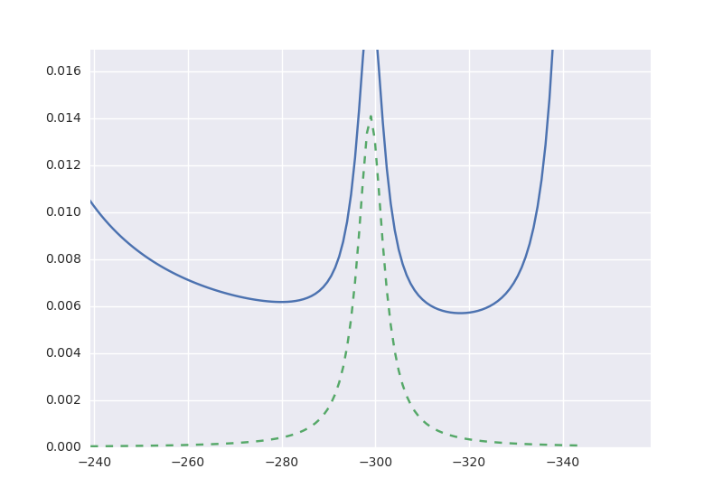

| Atom # | Element | Sum of vibrational eigenvalues |
|--------|---------|--------------------------------|
| 37 | 1 | 0.9033825324855468 |
| 23 | 6 | 0.1905255888325765 |
| 35 | 1 | 0.12328828005937952 |
| 36 | 1 | 0.11489125293076058 |
| 24 | 8 | 0.10344080432788601 |
| 25 | 1 | 0.10099504938362078 |
| 34 | 1 | 0.042426406871192854 |
| 33 | 1 | 0.033166247903554 |
| 26 | 6 | 0.024494897427831782 |
| 8 | 1 | 0.024494897427831782 |
| 43 | 1 | 0.017320508075688773 |
| 32 | 1 | 0.017320508075688773 |
| 17 | 6 | 0.017320508075688773 |
| 16 | 6 | 0.017320508075688773 |
| 45 | 1 | 0.01414213562373095 |
| 14 | 6 | 0.01414213562373095 |
| 7 | 8 | 0.01414213562373095 |
| 44 | 1 | 0.01 |

## Peak #3: -198.7688 1/cm   
Raman activity: 0.7323  
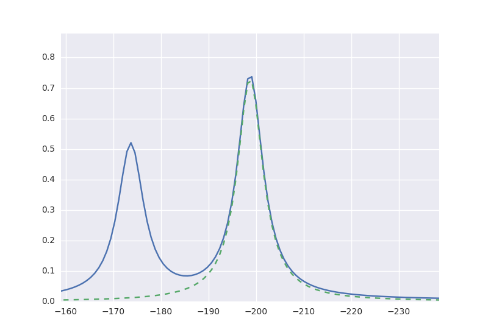

| Atom # | Element | Sum of vibrational eigenvalues |
|--------|---------|--------------------------------|
| 30 | 1 | 0.9882307422864358 |
| 29 | 8 | 0.12727922061357855 |
| 22 | 1 | 0.11 |
| 21 | 8 | 0.03 |
| 31 | 1 | 0.0282842712474619 |
| 38 | 1 | 0.02 |
| 36 | 1 | 0.017320508075688773 |
| 32 | 1 | 0.017320508075688773 |
| 25 | 1 | 0.017320508075688773 |
| 24 | 8 | 0.017320508075688773 |
| 23 | 6 | 0.017320508075688773 |
| 33 | 1 | 0.01414213562373095 |
| 20 | 6 | 0.01414213562373095 |
| 17 | 6 | 0.01414213562373095 |
| 37 | 1 | 0.01 |
| 35 | 1 | 0.01 |
| 34 | 1 | 0.01 |
| 28 | 6 | 0.01 |
| 27 | 8 | 0.01 |
| 26 | 6 | 0.01 |

## Peak #4: -173.679 1/cm   
Raman activity: 0.5033  
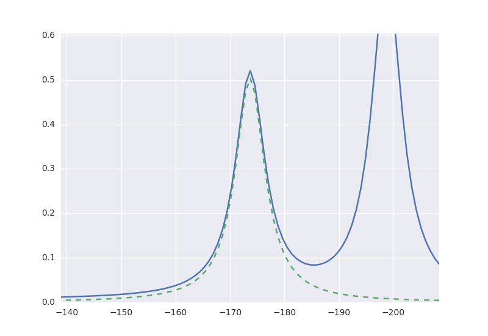

| Atom # | Element | Sum of vibrational eigenvalues |
|--------|---------|--------------------------------|
| 38 | 1 | 0.990151503558925 |
| 39 | 1 | 0.08660254037844388 |
| 1 | 8 | 0.08 |
| 42 | 1 | 0.0565685424949238 |
| 11 | 1 | 0.04690415759823429 |
| 41 | 1 | 0.034641016151377546 |
| 12 | 6 | 0.03 |
| 40 | 1 | 0.024494897427831782 |
| 10 | 8 | 0.024494897427831782 |
| 4 | 8 | 0.024494897427831782 |
| 30 | 1 | 0.02 |
| 5 | 1 | 0.02 |
| 7 | 8 | 0.017320508075688773 |
| 3 | 6 | 0.017320508075688773 |
| 13 | 8 | 0.01414213562373095 |
| 8 | 1 | 0.01414213562373095 |
| 45 | 1 | 0.01 |
| 44 | 1 | 0.01 |
| 43 | 1 | 0.01 |
| 9 | 6 | 0.01 |
| 6 | 6 | 0.01 |
| 2 | 6 | 0.01 |

## Peak #5: -71.8912 1/cm   
Raman activity: 0.0221  
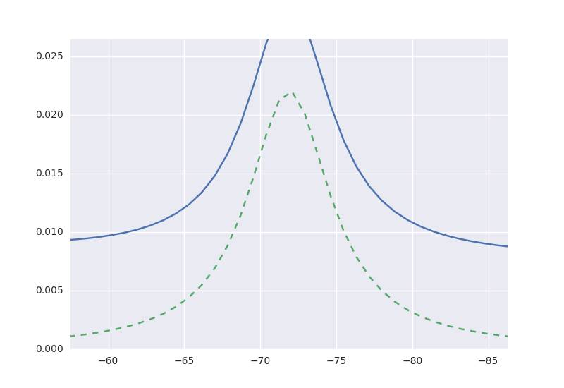

| Atom # | Element | Sum of vibrational eigenvalues |
|--------|---------|--------------------------------|
| 32 | 1 | 0.25 |
| 31 | 1 | 0.16248076809271922 |
| 43 | 1 | 0.15524174696260024 |
| 33 | 1 | 0.14628738838327796 |
| 45 | 1 | 0.1407124727947029 |
| 34 | 1 | 0.1392838827718412 |
| 22 | 1 | 0.1307669683062202 |
| 41 | 1 | 0.1236931687685298 |
| 42 | 1 | 0.11789826122551596 |
| 21 | 8 | 0.11575836902790226 |
| 35 | 1 | 0.11357816691600547 |
| 30 | 1 | 0.10392304845413264 |
| 38 | 1 | 0.09433981132056603 |
| 27 | 8 | 0.09380831519646858 |
| 44 | 1 | 0.0824621125123532 |
| 37 | 1 | 0.0754983443527075 |
| 39 | 1 | 0.07141428428542851 |
| 18 | 8 | 0.06928203230275509 |
| 4 | 8 | 0.05830951894845301 |
| 3 | 6 | 0.05830951894845301 |
| 11 | 1 | 0.05744562646538029 |
| 40 | 1 | 0.05196152422706632 |
| 29 | 8 | 0.048989794855663564 |
| 20 | 6 | 0.048989794855663564 |
| 19 | 1 | 0.04690415759823429 |
| 7 | 8 | 0.04690415759823429 |
| 5 | 1 | 0.04690415759823429 |
| 10 | 8 | 0.04358898943540673 |
| 17 | 6 | 0.034641016151377546 |
| 16 | 6 | 0.033166247903554 |
| 14 | 6 | 0.033166247903554 |
| 8 | 1 | 0.03 |
| 12 | 6 | 0.024494897427831782 |
| 1 | 8 | 0.024494897427831782 |
| 36 | 1 | 0.017320508075688773 |
| 25 | 1 | 0.017320508075688773 |
| 15 | 8 | 0.017320508075688773 |
| 13 | 8 | 0.017320508075688773 |
| 23 | 6 | 0.01414213562373095 |
| 6 | 6 | 0.01414213562373095 |
| 28 | 6 | 0.01 |
| 26 | 6 | 0.01 |
| 24 | 8 | 0.01 |
| 2 | 6 | 0.01 |

## Peak #6: -25.2442 1/cm   
Raman activity: 0.0536  
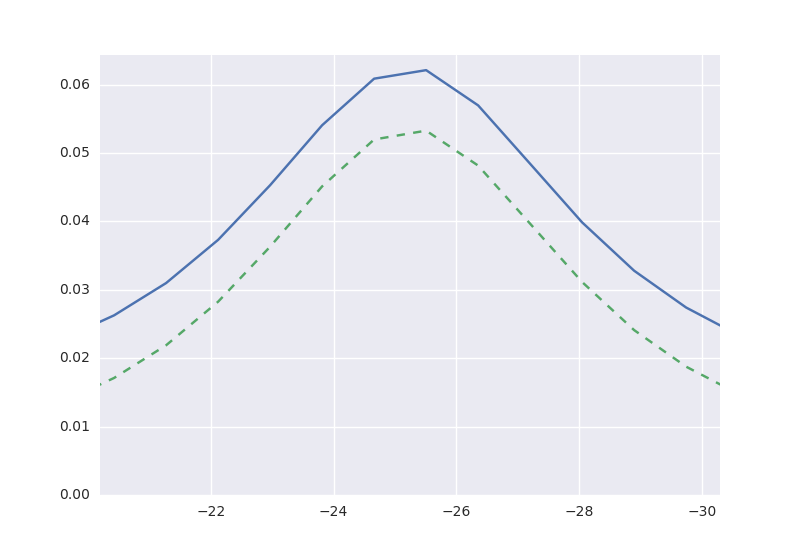

| Atom # | Element | Sum of vibrational eigenvalues |
|--------|---------|--------------------------------|
| 38 | 1 | 0.2142428528562855 |
| 32 | 1 | 0.20469489490458723 |
| 43 | 1 | 0.20420577856662137 |
| 41 | 1 | 0.2002498439450079 |
| 33 | 1 | 0.19339079605813717 |
| 29 | 8 | 0.18493242008906932 |
| 35 | 1 | 0.18 |
| 31 | 1 | 0.17088007490635063 |
| 30 | 1 | 0.1307669683062202 |
| 44 | 1 | 0.12727922061357855 |
| 42 | 1 | 0.12369316876852982 |
| 37 | 1 | 0.09949874371066199 |
| 45 | 1 | 0.08485281374238571 |
| 27 | 8 | 0.07141428428542851 |
| 4 | 8 | 0.07141428428542851 |
| 3 | 6 | 0.07141428428542851 |
| 5 | 1 | 0.07071067811865477 |
| 11 | 1 | 0.06 |
| 21 | 8 | 0.05830951894845301 |
| 7 | 8 | 0.05744562646538029 |
| 34 | 1 | 0.05196152422706632 |
| 10 | 8 | 0.05196152422706632 |
| 22 | 1 | 0.048989794855663564 |
| 40 | 1 | 0.04690415759823429 |
| 8 | 1 | 0.04690415759823429 |
| 17 | 6 | 0.04358898943540673 |
| 12 | 6 | 0.04358898943540673 |
| 25 | 1 | 0.0412310562561766 |
| 39 | 1 | 0.034641016151377546 |
| 1 | 8 | 0.034641016151377546 |
| 28 | 6 | 0.03 |
| 26 | 6 | 0.03 |
| 24 | 8 | 0.03 |
| 20 | 6 | 0.03 |
| 19 | 1 | 0.03 |
| 13 | 8 | 0.03 |
| 14 | 6 | 0.024494897427831782 |
| 36 | 1 | 0.017320508075688773 |
| 23 | 6 | 0.017320508075688773 |
| 18 | 8 | 0.017320508075688773 |
| 15 | 8 | 0.017320508075688773 |
| 9 | 6 | 0.017320508075688773 |
| 2 | 6 | 0.01 |

## Peak #7: 10.4206 1/cm   
Raman activity: 0.0471  
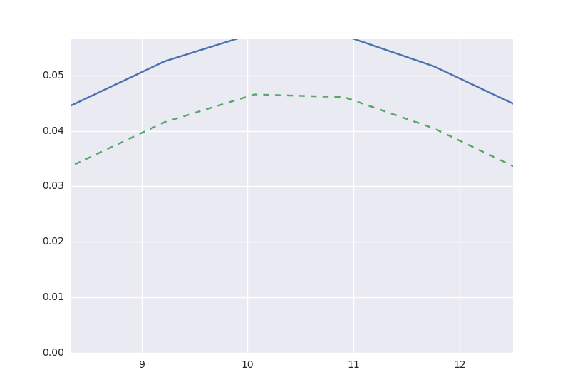

| Atom # | Element | Sum of vibrational eigenvalues |
|--------|---------|--------------------------------|
| 32 | 1 | 0.34307433596816883 |
| 33 | 1 | 0.3034798181098704 |
| 22 | 1 | 0.1584297951775486 |
| 41 | 1 | 0.157797338380595 |
| 37 | 1 | 0.15033296378372907 |
| 35 | 1 | 0.14798648586948743 |
| 31 | 1 | 0.13 |
| 21 | 8 | 0.12727922061357858 |
| 20 | 6 | 0.09 |
| 10 | 8 | 0.08544003745317531 |
| 39 | 1 | 0.08 |
| 11 | 1 | 0.07141428428542851 |
| 40 | 1 | 0.07071067811865477 |
| 44 | 1 | 0.06164414002968976 |
| 34 | 1 | 0.06164414002968976 |
| 29 | 8 | 0.05830951894845301 |
| 38 | 1 | 0.057445626465380296 |
| 24 | 8 | 0.057445626465380296 |
| 27 | 8 | 0.05744562646538029 |
| 12 | 6 | 0.05744562646538029 |
| 19 | 1 | 0.05196152422706632 |
| 17 | 6 | 0.05196152422706632 |
| 30 | 1 | 0.048989794855663564 |
| 9 | 6 | 0.04690415759823429 |
| 42 | 1 | 0.042426406871192854 |
| 28 | 6 | 0.042426406871192854 |
| 25 | 1 | 0.04 |
| 45 | 1 | 0.03 |
| 26 | 6 | 0.03 |
| 15 | 8 | 0.03 |
| 7 | 8 | 0.0282842712474619 |
| 43 | 1 | 0.024494897427831782 |
| 2 | 6 | 0.024494897427831782 |
| 1 | 8 | 0.024494897427831782 |
| 36 | 1 | 0.02 |
| 13 | 8 | 0.02 |
| 8 | 1 | 0.02 |
| 6 | 6 | 0.02 |
| 14 | 6 | 0.017320508075688773 |
| 5 | 1 | 0.017320508075688773 |
| 4 | 8 | 0.017320508075688773 |
| 23 | 6 | 0.01414213562373095 |
| 18 | 8 | 0.01414213562373095 |
| 3 | 6 | 0.01414213562373095 |

## Peak #8: 48.917 1/cm   
Raman activity: 0.0963  
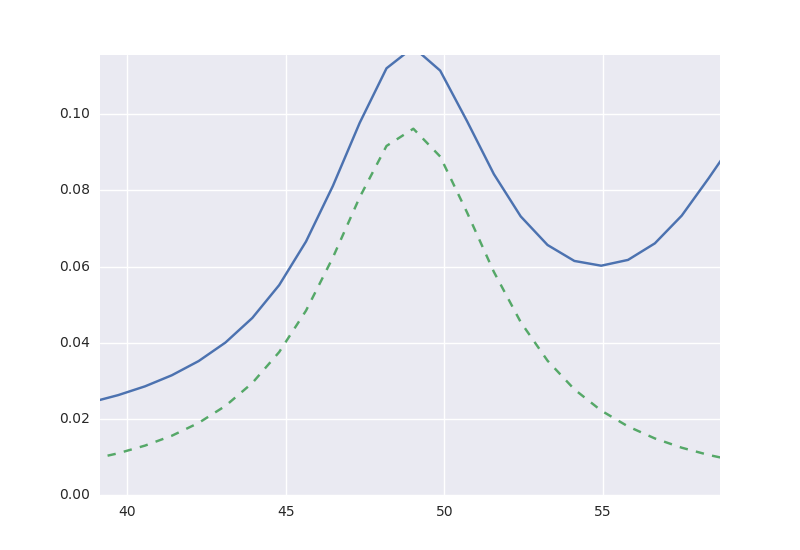

| Atom # | Element | Sum of vibrational eigenvalues |
|--------|---------|--------------------------------|
| 39 | 1 | 0.31272991542223777 |
| 11 | 1 | 0.3029851481508623 |
| 45 | 1 | 0.2803569153775238 |
| 10 | 8 | 0.22338307903688676 |
| 44 | 1 | 0.22315913604421397 |
| 40 | 1 | 0.21794494717703367 |
| 7 | 8 | 0.19697715603592209 |
| 9 | 6 | 0.1862793601019716 |
| 22 | 1 | 0.1705872210923198 |
| 43 | 1 | 0.16248076809271922 |
| 8 | 1 | 0.15362291495737218 |
| 21 | 8 | 0.15000000000000002 |
| 38 | 1 | 0.14798648586948743 |
| 25 | 1 | 0.11704699910719625 |
| 42 | 1 | 0.11 |
| 14 | 6 | 0.11 |
| 24 | 8 | 0.10677078252031312 |
| 41 | 1 | 0.1063014581273465 |
| 1 | 8 | 0.1063014581273465 |
| 36 | 1 | 0.10099504938362078 |
| 32 | 1 | 0.10099504938362078 |
| 29 | 8 | 0.09949874371066199 |
| 19 | 1 | 0.09848857801796104 |
| 13 | 8 | 0.09848857801796104 |
| 31 | 1 | 0.09433981132056603 |
| 30 | 1 | 0.09055385138137417 |
| 18 | 8 | 0.09 |
| 20 | 6 | 0.08717797887081347 |
| 6 | 6 | 0.08717797887081347 |
| 37 | 1 | 0.08544003745317531 |
| 23 | 6 | 0.08485281374238571 |
| 33 | 1 | 0.07141428428542851 |
| 17 | 6 | 0.07141428428542851 |
| 28 | 6 | 0.066332495807108 |
| 15 | 8 | 0.06164414002968976 |
| 4 | 8 | 0.06 |
| 5 | 1 | 0.05830951894845301 |
| 12 | 6 | 0.042426406871192854 |
| 34 | 1 | 0.0412310562561766 |
| 27 | 8 | 0.0412310562561766 |
| 16 | 6 | 0.033166247903554 |
| 2 | 6 | 0.03 |
| 35 | 1 | 0.017320508075688773 |
| 26 | 6 | 0.01414213562373095 |
| 3 | 6 | 0.01 |

## Peak #9: 60.2793 1/cm   
Raman activity: 0.0663  
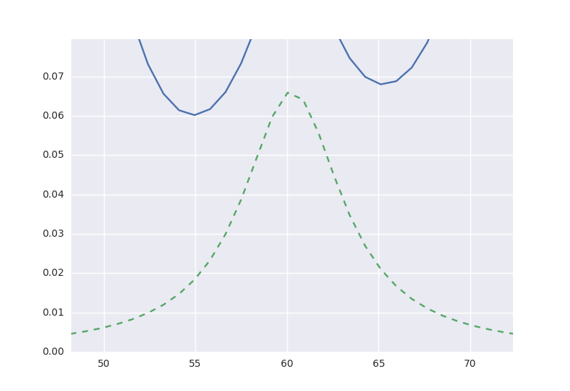

| Atom # | Element | Sum of vibrational eigenvalues |
|--------|---------|--------------------------------|
| 41 | 1 | 0.4337049688440288 |
| 33 | 1 | 0.2968164415931166 |
| 39 | 1 | 0.20273134932713294 |
| 18 | 8 | 0.20223748416156684 |
| 19 | 1 | 0.17492855684535902 |
| 10 | 8 | 0.17233687939614084 |
| 45 | 1 | 0.17146428199482247 |
| 30 | 1 | 0.15684387141358122 |
| 40 | 1 | 0.15588457268119896 |
| 21 | 8 | 0.15588457268119896 |
| 25 | 1 | 0.15000000000000002 |
| 11 | 1 | 0.14456832294800961 |
| 12 | 6 | 0.14142135623730953 |
| 22 | 1 | 0.1407124727947029 |
| 9 | 6 | 0.13674794331177342 |
| 34 | 1 | 0.132664991614216 |
| 44 | 1 | 0.13114877048604 |
| 17 | 6 | 0.12884098726725124 |
| 24 | 8 | 0.12806248474865697 |
| 32 | 1 | 0.12083045973594571 |
| 15 | 8 | 0.11789826122551596 |
| 1 | 8 | 0.11489125293076059 |
| 29 | 8 | 0.11445523142259598 |
| 36 | 1 | 0.11357816691600547 |
| 23 | 6 | 0.10099504938362078 |
| 37 | 1 | 0.09 |
| 35 | 1 | 0.09 |
| 20 | 6 | 0.09 |
| 42 | 1 | 0.08717797887081347 |
| 16 | 6 | 0.07141428428542851 |
| 13 | 8 | 0.07141428428542851 |
| 5 | 1 | 0.066332495807108 |
| 28 | 6 | 0.06557438524302 |
| 4 | 8 | 0.06557438524302 |
| 26 | 6 | 0.06 |
| 8 | 1 | 0.05830951894845301 |
| 7 | 8 | 0.04358898943540673 |
| 38 | 1 | 0.042426406871192854 |
| 2 | 6 | 0.042426406871192854 |
| 43 | 1 | 0.0412310562561766 |
| 6 | 6 | 0.0412310562561766 |
| 31 | 1 | 0.04 |
| 27 | 8 | 0.04 |
| 3 | 6 | 0.03 |
| 14 | 6 | 0.02 |

## Peak #10: 74.5377 1/cm   
Raman activity: 0.2724  
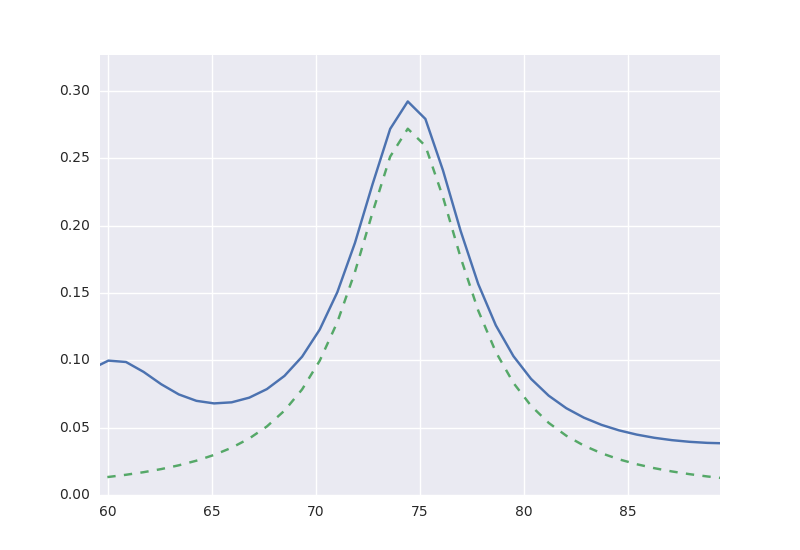

| Atom # | Element | Sum of vibrational eigenvalues |
|--------|---------|--------------------------------|
| 38 | 1 | 0.4164132562731403 |
| 11 | 1 | 0.24556058315617352 |
| 31 | 1 | 0.24372115213907883 |
| 42 | 1 | 0.24062418831031931 |
| 10 | 8 | 0.220454076850486 |
| 40 | 1 | 0.21794494717703367 |
| 29 | 8 | 0.20420577856662137 |
| 43 | 1 | 0.16673332000533067 |
| 30 | 1 | 0.15033296378372907 |
| 41 | 1 | 0.14177446878757827 |
| 9 | 6 | 0.14142135623730953 |
| 22 | 1 | 0.1407124727947029 |
| 44 | 1 | 0.13379088160259653 |
| 34 | 1 | 0.13341664064126332 |
| 32 | 1 | 0.13341664064126332 |
| 21 | 8 | 0.1307669683062202 |
| 39 | 1 | 0.12767145334803703 |
| 45 | 1 | 0.10677078252031312 |
| 19 | 1 | 0.09848857801796104 |
| 33 | 1 | 0.09 |
| 18 | 8 | 0.09 |
| 13 | 8 | 0.09 |
| 20 | 6 | 0.08717797887081347 |
| 8 | 1 | 0.0824621125123532 |
| 35 | 1 | 0.08124038404635961 |
| 4 | 8 | 0.07681145747868609 |
| 17 | 6 | 0.07348469228349536 |
| 37 | 1 | 0.07141428428542851 |
| 15 | 8 | 0.07141428428542851 |
| 2 | 6 | 0.07071067811865477 |
| 5 | 1 | 0.06557438524302 |
| 14 | 6 | 0.057445626465380296 |
| 27 | 8 | 0.05744562646538029 |
| 25 | 1 | 0.0565685424949238 |
| 28 | 6 | 0.05196152422706632 |
| 3 | 6 | 0.04358898943540673 |
| 24 | 8 | 0.042426406871192854 |
| 6 | 6 | 0.042426406871192854 |
| 12 | 6 | 0.03 |
| 36 | 1 | 0.0282842712474619 |
| 16 | 6 | 0.024494897427831782 |
| 7 | 8 | 0.024494897427831782 |
| 26 | 6 | 0.017320508075688773 |
| 23 | 6 | 0.01414213562373095 |
| 1 | 8 | 0.01 |

## Peak #11: 102.2441 1/cm   
Raman activity: 0.082  
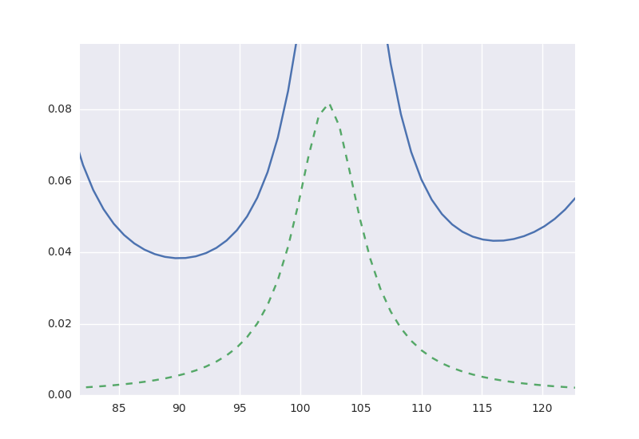

| Atom # | Element | Sum of vibrational eigenvalues |
|--------|---------|--------------------------------|
| 38 | 1 | 0.38392707640904933 |
| 31 | 1 | 0.29849623113198603 |
| 43 | 1 | 0.2716615541441225 |
| 42 | 1 | 0.2092844953645635 |
| 29 | 8 | 0.16340134638368192 |
| 35 | 1 | 0.15362291495737218 |
| 44 | 1 | 0.14456832294800961 |
| 37 | 1 | 0.13 |
| 34 | 1 | 0.11704699910719625 |
| 39 | 1 | 0.11090536506409417 |
| 45 | 1 | 0.09949874371066199 |
| 7 | 8 | 0.09848857801796104 |
| 41 | 1 | 0.09380831519646858 |
| 4 | 8 | 0.09055385138137417 |
| 8 | 1 | 0.09 |
| 33 | 1 | 0.0824621125123532 |
| 30 | 1 | 0.08124038404635961 |
| 27 | 8 | 0.08124038404635961 |
| 5 | 1 | 0.08124038404635961 |
| 24 | 8 | 0.07348469228349536 |
| 1 | 8 | 0.07348469228349534 |
| 10 | 8 | 0.07141428428542851 |
| 40 | 1 | 0.06 |
| 6 | 6 | 0.06 |
| 36 | 1 | 0.05744562646538029 |
| 14 | 6 | 0.05196152422706632 |
| 25 | 1 | 0.04690415759823429 |
| 9 | 6 | 0.04690415759823429 |
| 28 | 6 | 0.04358898943540673 |
| 16 | 6 | 0.04358898943540673 |
| 3 | 6 | 0.042426406871192854 |
| 32 | 1 | 0.0412310562561766 |
| 23 | 6 | 0.034641016151377546 |
| 13 | 8 | 0.034641016151377546 |
| 2 | 6 | 0.034641016151377546 |
| 22 | 1 | 0.03 |
| 21 | 8 | 0.03 |
| 15 | 8 | 0.03 |
| 11 | 1 | 0.0282842712474619 |
| 26 | 6 | 0.017320508075688773 |
| 18 | 8 | 0.017320508075688773 |
| 20 | 6 | 0.01414213562373095 |
| 19 | 1 | 0.01 |
| 17 | 6 | 0.01 |
| 12 | 6 | 0.01 |

## Peak #12: 104.6166 1/cm   
Raman activity: 0.0765  
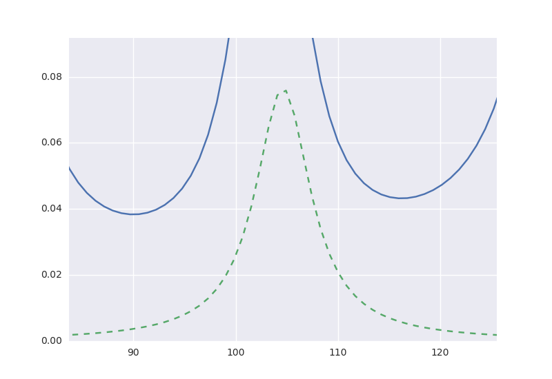

| Atom # | Element | Sum of vibrational eigenvalues |
|--------|---------|--------------------------------|
| 31 | 1 | 0.3167017524422623 |
| 43 | 1 | 0.24738633753705963 |
| 37 | 1 | 0.232163735324878 |
| 33 | 1 | 0.17492855684535902 |
| 29 | 8 | 0.1705872210923198 |
| 45 | 1 | 0.1649242250247064 |
| 11 | 1 | 0.1606237840420901 |
| 38 | 1 | 0.157797338380595 |
| 41 | 1 | 0.15556349186104046 |
| 42 | 1 | 0.14456832294800961 |
| 35 | 1 | 0.13892443989449804 |
| 10 | 8 | 0.12 |
| 40 | 1 | 0.11704699910719625 |
| 39 | 1 | 0.11704699910719625 |
| 44 | 1 | 0.10677078252031312 |
| 30 | 1 | 0.09000000000000001 |
| 24 | 8 | 0.08660254037844388 |
| 9 | 6 | 0.08485281374238571 |
| 1 | 8 | 0.07549834435270751 |
| 5 | 1 | 0.07348469228349536 |
| 3 | 6 | 0.07348469228349536 |
| 21 | 8 | 0.07141428428542851 |
| 22 | 1 | 0.07071067811865477 |
| 15 | 8 | 0.07 |
| 32 | 1 | 0.06928203230275509 |
| 4 | 8 | 0.06928203230275509 |
| 13 | 8 | 0.057445626465380296 |
| 28 | 6 | 0.0565685424949238 |
| 27 | 8 | 0.05196152422706632 |
| 8 | 1 | 0.05196152422706632 |
| 34 | 1 | 0.048989794855663564 |
| 25 | 1 | 0.048989794855663564 |
| 17 | 6 | 0.048989794855663564 |
| 20 | 6 | 0.04358898943540673 |
| 12 | 6 | 0.04358898943540673 |
| 36 | 1 | 0.042426406871192854 |
| 18 | 8 | 0.042426406871192854 |
| 19 | 1 | 0.0412310562561766 |
| 2 | 6 | 0.034641016151377546 |
| 23 | 6 | 0.033166247903554 |
| 16 | 6 | 0.03 |
| 14 | 6 | 0.0282842712474619 |
| 6 | 6 | 0.02 |
| 7 | 8 | 0.01414213562373095 |
| 26 | 6 | 0.01 |

## Peak #13: 134.6845 1/cm   
Raman activity: 0.398  
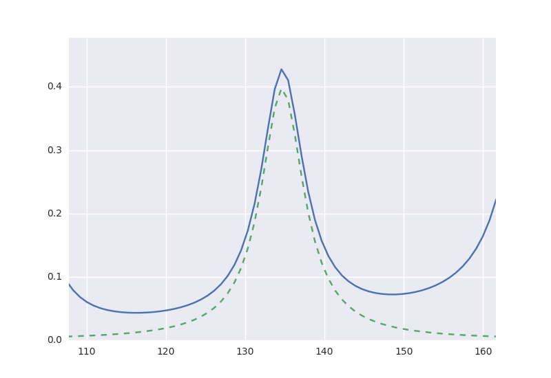

| Atom # | Element | Sum of vibrational eigenvalues |
|--------|---------|--------------------------------|
| 11 | 1 | 0.39912404086950215 |
| 24 | 8 | 0.36 |
| 25 | 1 | 0.35679125549822543 |
| 40 | 1 | 0.32832910318764 |
| 10 | 8 | 0.3189043743820395 |
| 36 | 1 | 0.3112876483254676 |
| 39 | 1 | 0.2503996805109783 |
| 23 | 6 | 0.23685438564654024 |
| 33 | 1 | 0.22405356502408078 |
| 9 | 6 | 0.21794494717703367 |
| 31 | 1 | 0.2142428528562855 |
| 45 | 1 | 0.2137755832643195 |
| 27 | 8 | 0.20199009876724155 |
| 44 | 1 | 0.19 |
| 34 | 1 | 0.1705872210923198 |
| 37 | 1 | 0.1676305461424021 |
| 43 | 1 | 0.12124355652982141 |
| 8 | 1 | 0.12 |
| 35 | 1 | 0.11489125293076058 |
| 4 | 8 | 0.11 |
| 17 | 6 | 0.10862780491200216 |
| 5 | 1 | 0.10677078252031312 |
| 1 | 8 | 0.1063014581273465 |
| 28 | 6 | 0.10099504938362078 |
| 16 | 6 | 0.099498743710662 |
| 26 | 6 | 0.09848857801796104 |
| 7 | 8 | 0.09380831519646858 |
| 3 | 6 | 0.09273618495495704 |
| 19 | 1 | 0.09055385138137417 |
| 6 | 6 | 0.09055385138137417 |
| 2 | 6 | 0.0824621125123532 |
| 41 | 1 | 0.07549834435270751 |
| 18 | 8 | 0.07549834435270751 |
| 14 | 6 | 0.07348469228349534 |
| 12 | 6 | 0.07348469228349534 |
| 21 | 8 | 0.07141428428542851 |
| 38 | 1 | 0.07071067811865477 |
| 42 | 1 | 0.06928203230275509 |
| 22 | 1 | 0.06403124237432849 |
| 13 | 8 | 0.057445626465380296 |
| 30 | 1 | 0.05744562646538029 |
| 32 | 1 | 0.05196152422706632 |
| 15 | 8 | 0.05196152422706632 |
| 20 | 6 | 0.0412310562561766 |
| 29 | 8 | 0.033166247903554 |

## Peak #14: 167.6956 1/cm   
Raman activity: 0.7193  
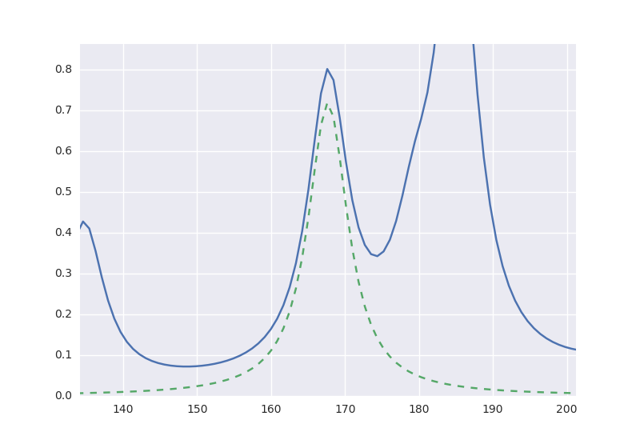

| Atom # | Element | Sum of vibrational eigenvalues |
|--------|---------|--------------------------------|
| 35 | 1 | 0.35114099732158877 |
| 45 | 1 | 0.2903446228191595 |
| 31 | 1 | 0.28879058156387305 |
| 42 | 1 | 0.27730849247724093 |
| 7 | 8 | 0.22181073012818836 |
| 40 | 1 | 0.22 |
| 11 | 1 | 0.21307275752662516 |
| 32 | 1 | 0.21000000000000002 |
| 25 | 1 | 0.19209372712298547 |
| 24 | 8 | 0.189208879284245 |
| 10 | 8 | 0.1862793601019716 |
| 27 | 8 | 0.1841195263952197 |
| 19 | 1 | 0.17492855684535902 |
| 8 | 1 | 0.17492855684535902 |
| 18 | 8 | 0.17233687939614087 |
| 38 | 1 | 0.17233687939614084 |
| 22 | 1 | 0.16999999999999998 |
| 13 | 8 | 0.157797338380595 |
| 21 | 8 | 0.15684387141358122 |
| 2 | 6 | 0.15362291495737218 |
| 34 | 1 | 0.14798648586948743 |
| 37 | 1 | 0.13856406460551018 |
| 36 | 1 | 0.13674794331177342 |
| 23 | 6 | 0.13379088160259653 |
| 20 | 6 | 0.13341664064126332 |
| 28 | 6 | 0.1307669683062202 |
| 39 | 1 | 0.12727922061357858 |
| 1 | 8 | 0.12369316876852982 |
| 5 | 1 | 0.11661903789690602 |
| 41 | 1 | 0.11357816691600546 |
| 3 | 6 | 0.10677078252031312 |
| 30 | 1 | 0.10392304845413264 |
| 4 | 8 | 0.10392304845413264 |
| 12 | 6 | 0.09797958971132713 |
| 33 | 1 | 0.09000000000000001 |
| 9 | 6 | 0.09 |
| 17 | 6 | 0.08660254037844388 |
| 6 | 6 | 0.08660254037844388 |
| 43 | 1 | 0.08544003745317531 |
| 26 | 6 | 0.08485281374238571 |
| 16 | 6 | 0.08485281374238571 |
| 14 | 6 | 0.07681145747868609 |
| 15 | 8 | 0.06403124237432849 |
| 29 | 8 | 0.05830951894845301 |
| 44 | 1 | 0.05196152422706632 |

## Peak #15: 179.3843 1/cm   
Raman activity: 0.2434  
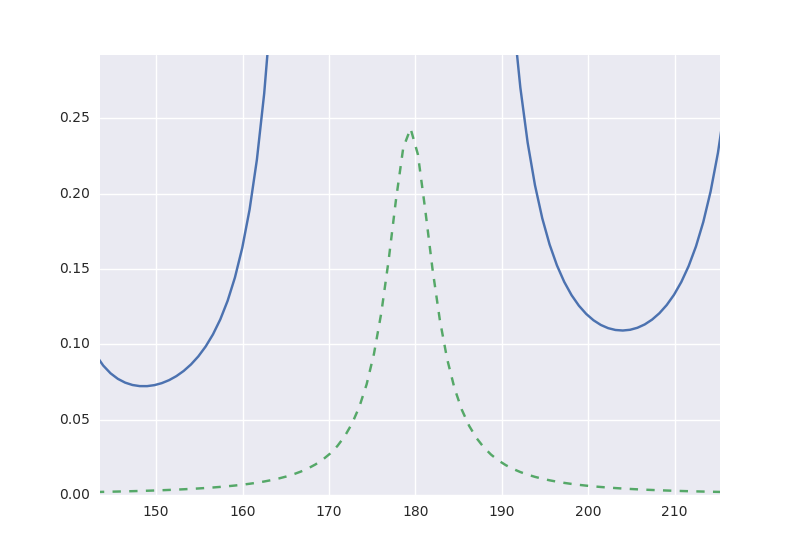

| Atom # | Element | Sum of vibrational eigenvalues |
|--------|---------|--------------------------------|
| 11 | 1 | 0.4910193478876367 |
| 25 | 1 | 0.3971145930332956 |
| 10 | 8 | 0.3919183588453085 |
| 24 | 8 | 0.3670149860700514 |
| 36 | 1 | 0.3238826948140329 |
| 1 | 8 | 0.3127299154222378 |
| 41 | 1 | 0.2576819745345025 |
| 40 | 1 | 0.24879710609249459 |
| 12 | 6 | 0.2404163056034262 |
| 42 | 1 | 0.22978250586152116 |
| 13 | 8 | 0.2142428528562855 |
| 2 | 6 | 0.20420577856662137 |
| 38 | 1 | 0.198997487421324 |
| 23 | 6 | 0.1881488772222678 |
| 37 | 1 | 0.1862793601019716 |
| 39 | 1 | 0.157797338380595 |
| 5 | 1 | 0.15264337522473748 |
| 7 | 8 | 0.1452583904633395 |
| 15 | 8 | 0.13892443989449804 |
| 14 | 6 | 0.12124355652982141 |
| 4 | 8 | 0.11489125293076059 |
| 30 | 1 | 0.11090536506409417 |
| 8 | 1 | 0.10392304845413264 |
| 45 | 1 | 0.09055385138137417 |
| 9 | 6 | 0.07549834435270751 |
| 34 | 1 | 0.06403124237432849 |
| 22 | 1 | 0.06403124237432849 |
| 29 | 8 | 0.06 |
| 27 | 8 | 0.05744562646538029 |
| 3 | 6 | 0.05196152422706632 |
| 21 | 8 | 0.04690415759823429 |
| 16 | 6 | 0.04358898943540673 |
| 33 | 1 | 0.042426406871192854 |
| 43 | 1 | 0.03 |
| 32 | 1 | 0.03 |
| 26 | 6 | 0.03 |
| 19 | 1 | 0.03 |
| 6 | 6 | 0.03 |
| 20 | 6 | 0.0282842712474619 |
| 28 | 6 | 0.02 |
| 31 | 1 | 0.017320508075688773 |
| 18 | 8 | 0.017320508075688773 |
| 17 | 6 | 0.017320508075688773 |
| 35 | 1 | 0.01414213562373095 |
| 44 | 1 | 0.01 |

## Peak #16: 185.0291 1/cm   
Raman activity: 1.1566  
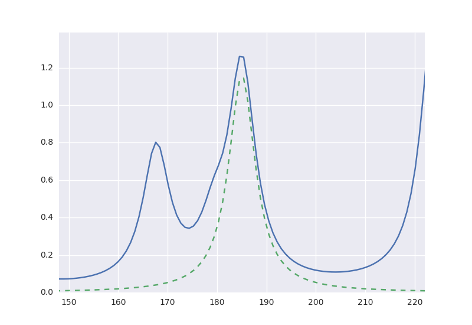

| Atom # | Element | Sum of vibrational eigenvalues |
|--------|---------|--------------------------------|
| 8 | 1 | 0.38418745424597095 |
| 35 | 1 | 0.3011644069275119 |
| 25 | 1 | 0.2971531591620725 |
| 7 | 8 | 0.2939387691339814 |
| 44 | 1 | 0.28861739379323625 |
| 4 | 8 | 0.27331300737432895 |
| 5 | 1 | 0.25670995305986877 |
| 36 | 1 | 0.23043437243605824 |
| 24 | 8 | 0.22715633383201095 |
| 21 | 8 | 0.22715633383201095 |
| 33 | 1 | 0.223159136044214 |
| 43 | 1 | 0.20199009876724155 |
| 22 | 1 | 0.2002498439450079 |
| 45 | 1 | 0.19595917942265426 |
| 37 | 1 | 0.19209372712298547 |
| 6 | 6 | 0.18761663039293716 |
| 3 | 6 | 0.1841195263952197 |
| 23 | 6 | 0.1769180601295413 |
| 18 | 8 | 0.1407124727947029 |
| 19 | 1 | 0.13856406460551018 |
| 20 | 6 | 0.1307669683062202 |
| 1 | 8 | 0.1307669683062202 |
| 17 | 6 | 0.12124355652982141 |
| 31 | 1 | 0.12 |
| 39 | 1 | 0.11489125293076059 |
| 26 | 6 | 0.11090536506409418 |
| 30 | 1 | 0.10677078252031312 |
| 11 | 1 | 0.10677078252031312 |
| 29 | 8 | 0.099498743710662 |
| 14 | 6 | 0.09949874371066199 |
| 10 | 8 | 0.09797958971132713 |
| 42 | 1 | 0.08717797887081347 |
| 38 | 1 | 0.08544003745317531 |
| 28 | 6 | 0.08544003745317531 |
| 2 | 6 | 0.08544003745317531 |
| 13 | 8 | 0.07549834435270751 |
| 27 | 8 | 0.07141428428542851 |
| 9 | 6 | 0.066332495807108 |
| 40 | 1 | 0.06403124237432849 |
| 41 | 1 | 0.05830951894845301 |
| 12 | 6 | 0.057445626465380296 |
| 32 | 1 | 0.05744562646538029 |
| 16 | 6 | 0.033166247903554 |
| 34 | 1 | 0.03 |
| 15 | 8 | 0.0282842712474619 |

## Peak #17: 224.1804 1/cm   
Raman activity: 1.5635  
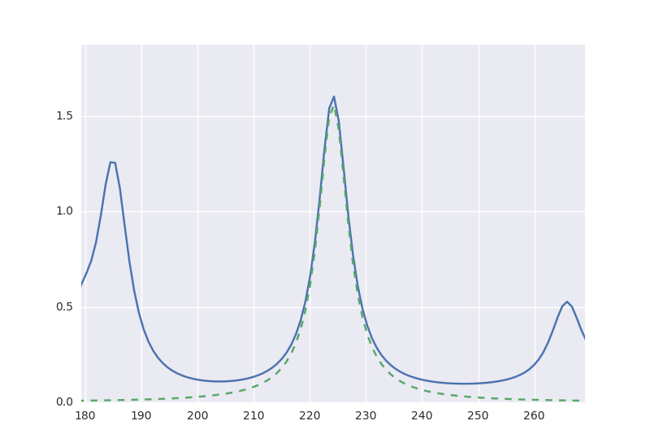

| Atom # | Element | Sum of vibrational eigenvalues |
|--------|---------|--------------------------------|
| 35 | 1 | 0.436692111217961 |
| 25 | 1 | 0.40137264480778956 |
| 36 | 1 | 0.31032241298365804 |
| 24 | 8 | 0.3034798181098704 |
| 30 | 1 | 0.29274562336608895 |
| 26 | 6 | 0.26999999999999996 |
| 19 | 1 | 0.24041630560342617 |
| 18 | 8 | 0.23 |
| 29 | 8 | 0.21236760581595301 |
| 27 | 8 | 0.21236760581595301 |
| 34 | 1 | 0.20784609690826528 |
| 31 | 1 | 0.1982422760159901 |
| 16 | 6 | 0.1905255888325765 |
| 38 | 1 | 0.18 |
| 1 | 8 | 0.1705872210923198 |
| 41 | 1 | 0.16970562748477142 |
| 28 | 6 | 0.15684387141358122 |
| 42 | 1 | 0.15556349186104046 |
| 17 | 6 | 0.15556349186104046 |
| 45 | 1 | 0.12767145334803703 |
| 12 | 6 | 0.12727922061357855 |
| 2 | 6 | 0.12727922061357855 |
| 22 | 1 | 0.12124355652982141 |
| 7 | 8 | 0.11489125293076058 |
| 10 | 8 | 0.11357816691600546 |
| 11 | 1 | 0.09949874371066199 |
| 32 | 1 | 0.09110433579144298 |
| 8 | 1 | 0.09 |
| 21 | 8 | 0.08544003745317531 |
| 33 | 1 | 0.08124038404635961 |
| 37 | 1 | 0.07681145747868609 |
| 9 | 6 | 0.07681145747868609 |
| 13 | 8 | 0.07141428428542851 |
| 43 | 1 | 0.06928203230275509 |
| 39 | 1 | 0.06928203230275509 |
| 20 | 6 | 0.06557438524302 |
| 5 | 1 | 0.06 |
| 15 | 8 | 0.05196152422706632 |
| 3 | 6 | 0.04690415759823429 |
| 44 | 1 | 0.042426406871192854 |
| 6 | 6 | 0.0412310562561766 |
| 40 | 1 | 0.034641016151377546 |
| 4 | 8 | 0.033166247903554 |
| 23 | 6 | 0.03 |
| 14 | 6 | 0.03 |

## Peak #18: 264.2156 1/cm   
Raman activity: 0.0432  
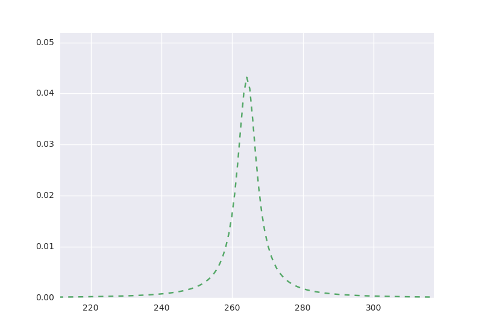

| Atom # | Element | Sum of vibrational eigenvalues |
|--------|---------|--------------------------------|
| 41 | 1 | 0.4261455150532503 |
| 42 | 1 | 0.3535533905932738 |
| 21 | 8 | 0.27037011669191546 |
| 30 | 1 | 0.24515301344262524 |
| 22 | 1 | 0.23727621035409344 |
| 45 | 1 | 0.23 |
| 38 | 1 | 0.22825424421026658 |
| 44 | 1 | 0.2211334438749598 |
| 33 | 1 | 0.196468827043885 |
| 34 | 1 | 0.17492855684535902 |
| 43 | 1 | 0.17233687939614084 |
| 39 | 1 | 0.15 |
| 35 | 1 | 0.12767145334803703 |
| 29 | 8 | 0.11661903789690602 |
| 32 | 1 | 0.11575836902790226 |
| 1 | 8 | 0.09273618495495704 |
| 18 | 8 | 0.09 |
| 19 | 1 | 0.08717797887081347 |
| 31 | 1 | 0.08124038404635961 |
| 13 | 8 | 0.07348469228349536 |
| 12 | 6 | 0.07348469228349536 |
| 2 | 6 | 0.07141428428542851 |
| 10 | 8 | 0.066332495807108 |
| 15 | 8 | 0.06 |
| 11 | 1 | 0.05830951894845301 |
| 37 | 1 | 0.05196152422706632 |
| 40 | 1 | 0.048989794855663564 |
| 17 | 6 | 0.048989794855663564 |
| 28 | 6 | 0.04690415759823429 |
| 16 | 6 | 0.04690415759823429 |
| 14 | 6 | 0.042426406871192854 |
| 6 | 6 | 0.04 |
| 8 | 1 | 0.033166247903554 |
| 7 | 8 | 0.033166247903554 |
| 27 | 8 | 0.0282842712474619 |
| 26 | 6 | 0.0282842712474619 |
| 5 | 1 | 0.02 |
| 3 | 6 | 0.02 |
| 24 | 8 | 0.017320508075688773 |
| 4 | 8 | 0.017320508075688773 |
| 9 | 6 | 0.01414213562373095 |
| 25 | 1 | 0.01 |
| 23 | 6 | 0.01 |

## Peak #19: 265.8779 1/cm   
Raman activity: 0.39  
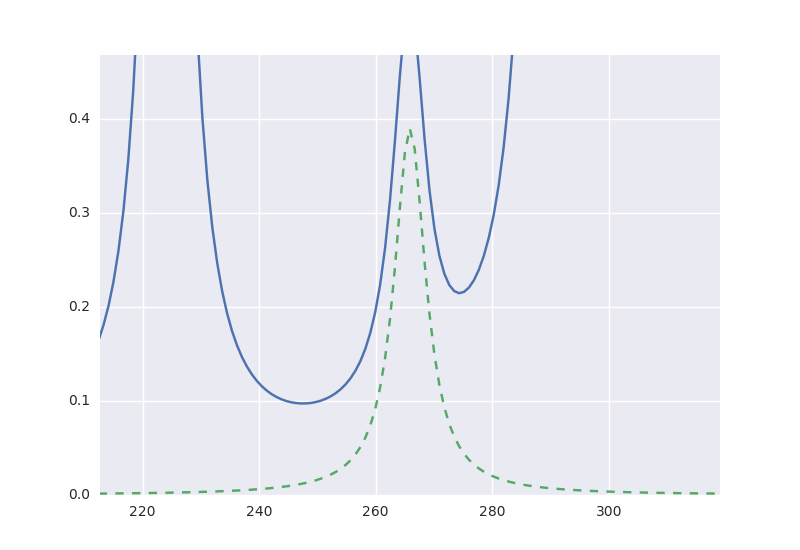

| Atom # | Element | Sum of vibrational eigenvalues |
|--------|---------|--------------------------------|
| 41 | 1 | 0.36769552621700474 |
| 42 | 1 | 0.3624913792078372 |
| 30 | 1 | 0.33166247903554 |
| 39 | 1 | 0.24041630560342617 |
| 44 | 1 | 0.2345207879911715 |
| 21 | 8 | 0.22825424421026658 |
| 33 | 1 | 0.22649503305812252 |
| 38 | 1 | 0.2142428528562855 |
| 43 | 1 | 0.20784609690826528 |
| 22 | 1 | 0.20615528128088303 |
| 34 | 1 | 0.19209372712298547 |
| 29 | 8 | 0.16822603841260722 |
| 4 | 8 | 0.1606237840420901 |
| 32 | 1 | 0.15588457268119896 |
| 5 | 1 | 0.15556349186104046 |
| 35 | 1 | 0.12767145334803703 |
| 31 | 1 | 0.12328828005937952 |
| 8 | 1 | 0.12 |
| 7 | 8 | 0.1131370849898476 |
| 2 | 6 | 0.08544003745317531 |
| 25 | 1 | 0.0818535277187245 |
| 24 | 8 | 0.08 |
| 28 | 6 | 0.07681145747868609 |
| 13 | 8 | 0.07348469228349536 |
| 11 | 1 | 0.07348469228349536 |
| 19 | 1 | 0.07141428428542851 |
| 12 | 6 | 0.07071067811865477 |
| 17 | 6 | 0.06557438524302 |
| 15 | 8 | 0.06 |
| 6 | 6 | 0.05830951894845301 |
| 27 | 8 | 0.05744562646538029 |
| 3 | 6 | 0.05196152422706632 |
| 10 | 8 | 0.048989794855663564 |
| 16 | 6 | 0.04690415759823429 |
| 45 | 1 | 0.04358898943540673 |
| 18 | 8 | 0.042426406871192854 |
| 14 | 6 | 0.042426406871192854 |
| 9 | 6 | 0.042426406871192854 |
| 20 | 6 | 0.03 |
| 1 | 8 | 0.03 |
| 23 | 6 | 0.024494897427831782 |
| 40 | 1 | 0.017320508075688773 |
| 37 | 1 | 0.017320508075688773 |
| 26 | 6 | 0.017320508075688773 |

## Peak #20: 286.4224 1/cm   
Raman activity: 0.2933  
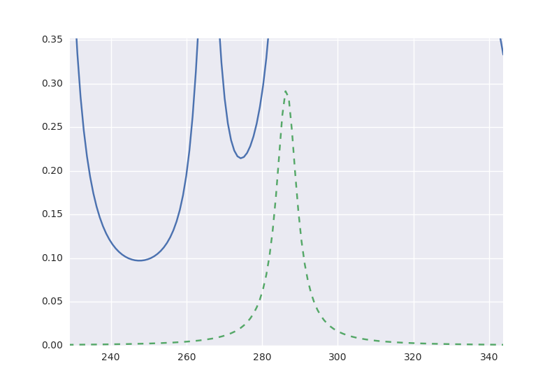

| Atom # | Element | Sum of vibrational eigenvalues |
|--------|---------|--------------------------------|
| 8 | 1 | 0.5122499389946279 |
| 7 | 8 | 0.4246174749112429 |
| 30 | 1 | 0.3570714214271425 |
| 4 | 8 | 0.29698484809834996 |
| 5 | 1 | 0.24556058315617352 |
| 32 | 1 | 0.22045407685048604 |
| 33 | 1 | 0.21794494717703367 |
| 29 | 8 | 0.212602916254693 |
| 19 | 1 | 0.21236760581595301 |
| 31 | 1 | 0.19697715603592209 |
| 18 | 8 | 0.19672315572906005 |
| 45 | 1 | 0.157797338380595 |
| 3 | 6 | 0.15588457268119896 |
| 34 | 1 | 0.15033296378372907 |
| 38 | 1 | 0.1407124727947029 |
| 37 | 1 | 0.13304134695650072 |
| 43 | 1 | 0.12247448713915891 |
| 41 | 1 | 0.12247448713915891 |
| 1 | 8 | 0.12083045973594571 |
| 35 | 1 | 0.12 |
| 40 | 1 | 0.11789826122551596 |
| 44 | 1 | 0.11 |
| 11 | 1 | 0.10677078252031312 |
| 20 | 6 | 0.10099504938362078 |
| 14 | 6 | 0.10099504938362078 |
| 42 | 1 | 0.09848857801796104 |
| 27 | 8 | 0.09380831519646858 |
| 25 | 1 | 0.08717797887081347 |
| 39 | 1 | 0.08485281374238571 |
| 22 | 1 | 0.08485281374238571 |
| 12 | 6 | 0.07549834435270751 |
| 2 | 6 | 0.0754983443527075 |
| 9 | 6 | 0.07141428428542851 |
| 21 | 8 | 0.06557438524302 |
| 10 | 8 | 0.06403124237432849 |
| 16 | 6 | 0.0565685424949238 |
| 28 | 6 | 0.05196152422706632 |
| 6 | 6 | 0.04690415759823429 |
| 15 | 8 | 0.04358898943540673 |
| 23 | 6 | 0.04 |
| 26 | 6 | 0.034641016151377546 |
| 24 | 8 | 0.033166247903554 |
| 17 | 6 | 0.033166247903554 |
| 36 | 1 | 0.024494897427831782 |
| 13 | 8 | 0.02 |

## Peak #21: 294.6102 1/cm   
Raman activity: 2.1764  
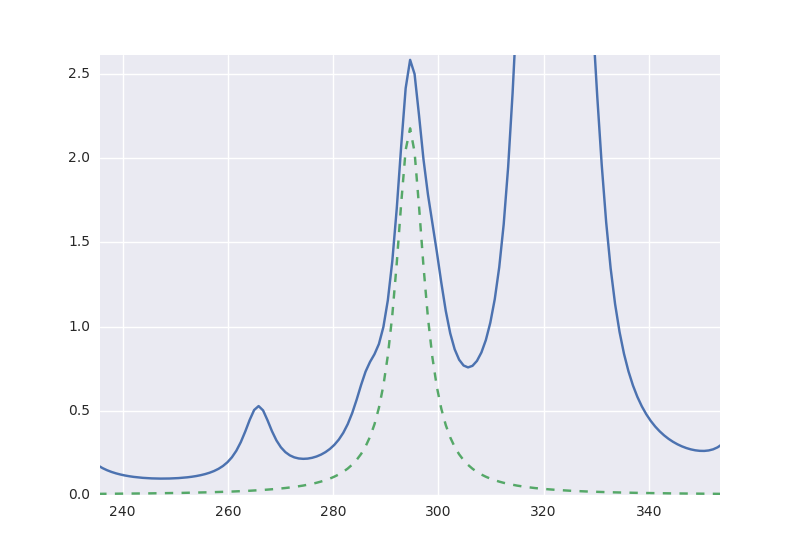

| Atom # | Element | Sum of vibrational eigenvalues |
|--------|---------|--------------------------------|
| 19 | 1 | 0.3433656942677879 |
| 18 | 8 | 0.32496153618543844 |
| 8 | 1 | 0.3056141357987225 |
| 30 | 1 | 0.25632011235952595 |
| 43 | 1 | 0.24062418831031931 |
| 7 | 8 | 0.2142428528562855 |
| 42 | 1 | 0.20784609690826528 |
| 10 | 8 | 0.20615528128088303 |
| 44 | 1 | 0.2 |
| 40 | 1 | 0.19209372712298547 |
| 34 | 1 | 0.18761663039293716 |
| 37 | 1 | 0.18493242008906927 |
| 32 | 1 | 0.18493242008906927 |
| 31 | 1 | 0.17972200755611428 |
| 29 | 8 | 0.163707055437449 |
| 22 | 1 | 0.16340134638368192 |
| 38 | 1 | 0.16248076809271922 |
| 11 | 1 | 0.15684387141358122 |
| 35 | 1 | 0.15556349186104046 |
| 33 | 1 | 0.15362291495737218 |
| 1 | 8 | 0.15099668870541502 |
| 5 | 1 | 0.1452583904633395 |
| 9 | 6 | 0.1445683229480096 |
| 41 | 1 | 0.13674794331177342 |
| 39 | 1 | 0.1307669683062202 |
| 3 | 6 | 0.12767145334803703 |
| 21 | 8 | 0.12727922061357855 |
| 4 | 8 | 0.12369316876852982 |
| 2 | 6 | 0.11704699910719625 |
| 45 | 1 | 0.11489125293076059 |
| 24 | 8 | 0.09433981132056603 |
| 6 | 6 | 0.09110433579144298 |
| 23 | 6 | 0.0824621125123532 |
| 25 | 1 | 0.08124038404635961 |
| 12 | 6 | 0.07549834435270751 |
| 20 | 6 | 0.07141428428542851 |
| 14 | 6 | 0.07 |
| 27 | 8 | 0.06403124237432849 |
| 16 | 6 | 0.06 |
| 26 | 6 | 0.05744562646538029 |
| 28 | 6 | 0.04690415759823429 |
| 15 | 8 | 0.042426406871192854 |
| 36 | 1 | 0.03 |
| 17 | 6 | 0.017320508075688773 |
| 13 | 8 | 0.01414213562373095 |

## Peak #22: 299.1555 1/cm   
Raman activity: 0.5477  
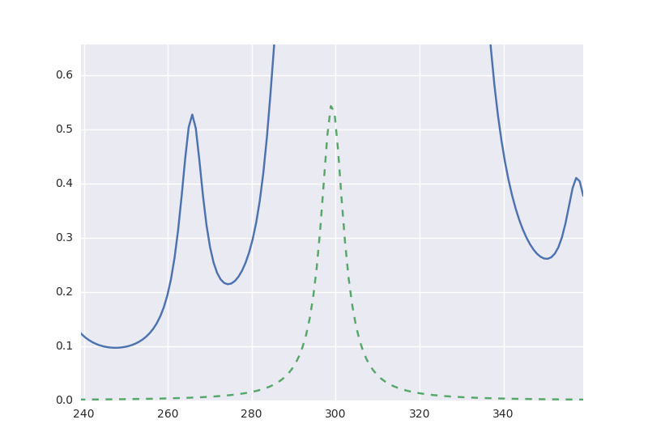

| Atom # | Element | Sum of vibrational eigenvalues |
|--------|---------|--------------------------------|
| 22 | 1 | 0.3991240408695021 |
| 21 | 8 | 0.35679125549822543 |
| 19 | 1 | 0.33645207682521444 |
| 18 | 8 | 0.3212475680841802 |
| 44 | 1 | 0.28757607689096815 |
| 43 | 1 | 0.2412467616362964 |
| 31 | 1 | 0.23323807579381203 |
| 30 | 1 | 0.23108440016582688 |
| 45 | 1 | 0.2142428528562855 |
| 35 | 1 | 0.198997487421324 |
| 5 | 1 | 0.18493242008906927 |
| 10 | 8 | 0.1649242250247064 |
| 32 | 1 | 0.15 |
| 42 | 1 | 0.14628738838327796 |
| 8 | 1 | 0.1445683229480096 |
| 4 | 8 | 0.1407124727947029 |
| 6 | 6 | 0.13304134695650072 |
| 40 | 1 | 0.12806248474865697 |
| 39 | 1 | 0.12767145334803703 |
| 9 | 6 | 0.12369316876852982 |
| 27 | 8 | 0.12 |
| 11 | 1 | 0.11789826122551596 |
| 7 | 8 | 0.11 |
| 34 | 1 | 0.10099504938362078 |
| 1 | 8 | 0.10099504938362078 |
| 28 | 6 | 0.08717797887081347 |
| 17 | 6 | 0.08717797887081347 |
| 14 | 6 | 0.08124038404635961 |
| 24 | 8 | 0.07549834435270751 |
| 3 | 6 | 0.07348469228349536 |
| 2 | 6 | 0.07348469228349536 |
| 20 | 6 | 0.06928203230275509 |
| 25 | 1 | 0.06164414002968976 |
| 15 | 8 | 0.05196152422706632 |
| 33 | 1 | 0.05 |
| 41 | 1 | 0.042426406871192854 |
| 29 | 8 | 0.042426406871192854 |
| 36 | 1 | 0.0412310562561766 |
| 13 | 8 | 0.0412310562561766 |
| 37 | 1 | 0.034641016151377546 |
| 23 | 6 | 0.034641016151377546 |
| 12 | 6 | 0.034641016151377546 |
| 38 | 1 | 0.033166247903554 |
| 26 | 6 | 0.024494897427831782 |
| 16 | 6 | 0.01 |

## Peak #23: 316.7161 1/cm   
Raman activity: 2.5771  
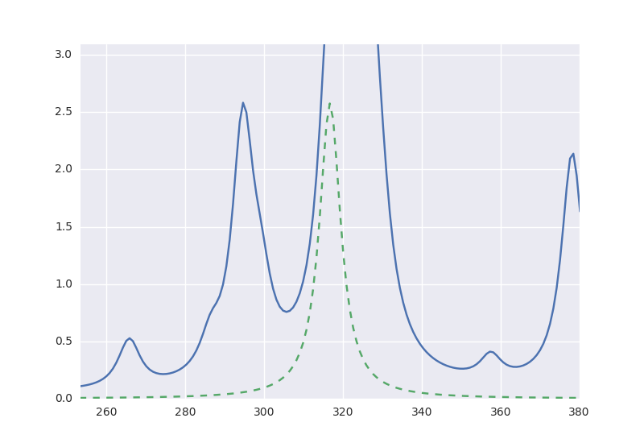

| Atom # | Element | Sum of vibrational eigenvalues |
|--------|---------|--------------------------------|
| 30 | 1 | 0.42848570571257094 |
| 38 | 1 | 0.3047950130825634 |
| 10 | 8 | 0.3023243291566195 |
| 39 | 1 | 0.2503996805109783 |
| 37 | 1 | 0.22649503305812246 |
| 9 | 6 | 0.21354156504062624 |
| 11 | 1 | 0.21047565179849187 |
| 35 | 1 | 0.20420577856662137 |
| 8 | 1 | 0.1982422760159901 |
| 15 | 8 | 0.19467922333931784 |
| 40 | 1 | 0.1881488772222678 |
| 1 | 8 | 0.1849324200890693 |
| 7 | 8 | 0.1676305461424021 |
| 24 | 8 | 0.16031219541881397 |
| 29 | 8 | 0.15588457268119896 |
| 25 | 1 | 0.15588457268119896 |
| 32 | 1 | 0.14798648586948743 |
| 34 | 1 | 0.1469693845669907 |
| 31 | 1 | 0.13892443989449804 |
| 33 | 1 | 0.13379088160259653 |
| 23 | 6 | 0.1307669683062202 |
| 22 | 1 | 0.12369316876852982 |
| 41 | 1 | 0.11575836902790226 |
| 21 | 8 | 0.11489125293076058 |
| 27 | 8 | 0.11090536506409418 |
| 44 | 1 | 0.10677078252031312 |
| 42 | 1 | 0.10392304845413264 |
| 6 | 6 | 0.09055385138137417 |
| 36 | 1 | 0.09000000000000001 |
| 26 | 6 | 0.0824621125123532 |
| 5 | 1 | 0.07549834435270751 |
| 2 | 6 | 0.0754983443527075 |
| 4 | 8 | 0.07348469228349534 |
| 3 | 6 | 0.07 |
| 14 | 6 | 0.06164414002968976 |
| 28 | 6 | 0.05830951894845301 |
| 45 | 1 | 0.0565685424949238 |
| 43 | 1 | 0.04690415759823429 |
| 18 | 8 | 0.04358898943540673 |
| 13 | 8 | 0.04358898943540673 |
| 17 | 6 | 0.042426406871192854 |
| 20 | 6 | 0.04 |
| 19 | 1 | 0.04 |
| 12 | 6 | 0.03 |
| 16 | 6 | 0.01414213562373095 |

## Peak #24: 324.1044 1/cm   
Raman activity: 6.5293  
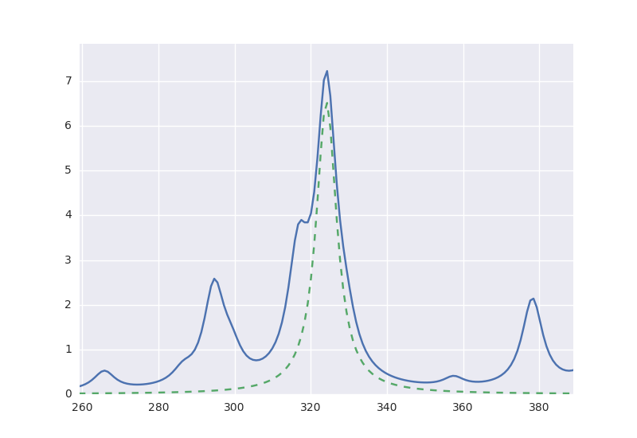

| Atom # | Element | Sum of vibrational eigenvalues |
|--------|---------|--------------------------------|
| 24 | 8 | 0.38444765573482176 |
| 38 | 1 | 0.35902646142032485 |
| 25 | 1 | 0.30199337741083004 |
| 36 | 1 | 0.2830194339616981 |
| 32 | 1 | 0.25632011235952595 |
| 37 | 1 | 0.24738633753705963 |
| 23 | 6 | 0.23685438564654024 |
| 33 | 1 | 0.22715633383201095 |
| 22 | 1 | 0.21213203435596428 |
| 30 | 1 | 0.20445048300260873 |
| 34 | 1 | 0.19339079605813717 |
| 20 | 6 | 0.1881488772222678 |
| 1 | 8 | 0.18110770276274835 |
| 21 | 8 | 0.17916472867168917 |
| 10 | 8 | 0.14696938456699069 |
| 17 | 6 | 0.14456832294800961 |
| 11 | 1 | 0.12247448713915891 |
| 28 | 6 | 0.11789826122551596 |
| 19 | 1 | 0.11489125293076059 |
| 16 | 6 | 0.11357816691600547 |
| 9 | 6 | 0.11357816691600547 |
| 41 | 1 | 0.11357816691600546 |
| 4 | 8 | 0.11 |
| 5 | 1 | 0.10677078252031312 |
| 29 | 8 | 0.10392304845413264 |
| 35 | 1 | 0.10344080432788601 |
| 31 | 1 | 0.10099504938362078 |
| 7 | 8 | 0.099498743710662 |
| 39 | 1 | 0.09899494936611666 |
| 40 | 1 | 0.09848857801796104 |
| 15 | 8 | 0.09273618495495704 |
| 8 | 1 | 0.09000000000000001 |
| 44 | 1 | 0.08717797887081347 |
| 43 | 1 | 0.0824621125123532 |
| 3 | 6 | 0.0818535277187245 |
| 42 | 1 | 0.07141428428542851 |
| 12 | 6 | 0.066332495807108 |
| 6 | 6 | 0.06557438524302 |
| 26 | 6 | 0.06 |
| 27 | 8 | 0.05196152422706632 |
| 18 | 8 | 0.05196152422706632 |
| 45 | 1 | 0.0412310562561766 |
| 2 | 6 | 0.04 |
| 13 | 8 | 0.034641016151377546 |
| 14 | 6 | 0.0282842712474619 |

## Peak #25: 329.2205 1/cm   
Raman activity: 0.7309  
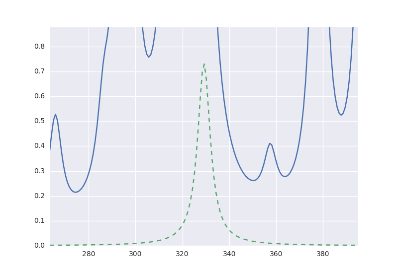

| Atom # | Element | Sum of vibrational eigenvalues |
|--------|---------|--------------------------------|
| 38 | 1 | 0.596992462263972 |
| 5 | 1 | 0.4855924216871594 |
| 4 | 8 | 0.36701498607005134 |
| 1 | 8 | 0.2535744466621193 |
| 8 | 1 | 0.20199009876724155 |
| 34 | 1 | 0.18493242008906932 |
| 7 | 8 | 0.17088007490635063 |
| 44 | 1 | 0.14177446878757827 |
| 30 | 1 | 0.14177446878757827 |
| 35 | 1 | 0.14142135623730953 |
| 22 | 1 | 0.12328828005937952 |
| 21 | 8 | 0.10099504938362078 |
| 41 | 1 | 0.09949874371066199 |
| 24 | 8 | 0.09273618495495704 |
| 42 | 1 | 0.09055385138137417 |
| 31 | 1 | 0.08660254037844388 |
| 27 | 8 | 0.08660254037844388 |
| 39 | 1 | 0.0818535277187245 |
| 36 | 1 | 0.08124038404635961 |
| 11 | 1 | 0.07681145747868609 |
| 37 | 1 | 0.0754983443527075 |
| 20 | 6 | 0.0754983443527075 |
| 9 | 6 | 0.06928203230275509 |
| 40 | 1 | 0.066332495807108 |
| 25 | 1 | 0.06557438524302 |
| 43 | 1 | 0.06403124237432849 |
| 15 | 8 | 0.06164414002968976 |
| 6 | 6 | 0.05830951894845301 |
| 29 | 8 | 0.057445626465380296 |
| 10 | 8 | 0.057445626465380296 |
| 45 | 1 | 0.05744562646538029 |
| 16 | 6 | 0.0565685424949238 |
| 12 | 6 | 0.05196152422706632 |
| 33 | 1 | 0.05 |
| 28 | 6 | 0.04690415759823429 |
| 23 | 6 | 0.04358898943540673 |
| 17 | 6 | 0.04358898943540673 |
| 19 | 1 | 0.042426406871192854 |
| 18 | 8 | 0.042426406871192854 |
| 3 | 6 | 0.0412310562561766 |
| 2 | 6 | 0.0412310562561766 |
| 26 | 6 | 0.0282842712474619 |
| 32 | 1 | 0.02 |
| 13 | 8 | 0.02 |
| 14 | 6 | 0.01 |

## Peak #26: 357.5153 1/cm   
Raman activity: 0.2143  
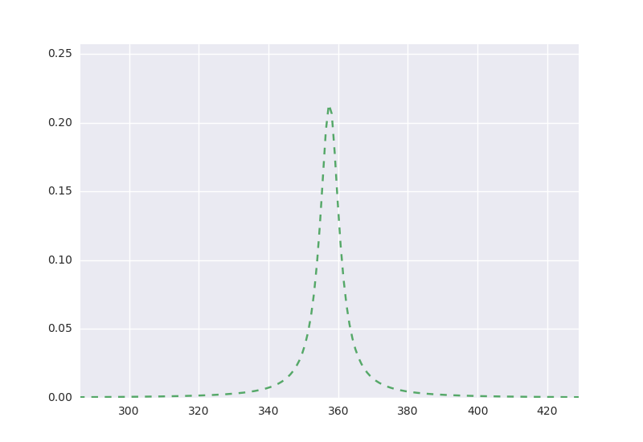

| Atom # | Element | Sum of vibrational eigenvalues |
|--------|---------|--------------------------------|
| 35 | 1 | 0.363455636907725 |
| 37 | 1 | 0.33 |
| 31 | 1 | 0.32015621187164245 |
| 30 | 1 | 0.28 |
| 33 | 1 | 0.27730849247724093 |
| 34 | 1 | 0.23853720883753127 |
| 21 | 8 | 0.21213203435596428 |
| 19 | 1 | 0.18220867158288595 |
| 29 | 8 | 0.17492855684535902 |
| 18 | 8 | 0.16970562748477142 |
| 22 | 1 | 0.1606237840420901 |
| 26 | 6 | 0.1469693845669907 |
| 32 | 1 | 0.14696938456699069 |
| 27 | 8 | 0.13304134695650072 |
| 15 | 8 | 0.1307669683062202 |
| 20 | 6 | 0.12369316876852982 |
| 43 | 1 | 0.1131370849898476 |
| 38 | 1 | 0.1063014581273465 |
| 44 | 1 | 0.099498743710662 |
| 24 | 8 | 0.099498743710662 |
| 42 | 1 | 0.09797958971132713 |
| 8 | 1 | 0.09000000000000001 |
| 45 | 1 | 0.08544003745317531 |
| 23 | 6 | 0.0818535277187245 |
| 39 | 1 | 0.08 |
| 36 | 1 | 0.07348469228349536 |
| 13 | 8 | 0.07348469228349536 |
| 28 | 6 | 0.07071067811865477 |
| 25 | 1 | 0.06557438524302 |
| 1 | 8 | 0.06557438524302 |
| 7 | 8 | 0.06403124237432849 |
| 5 | 1 | 0.06403124237432849 |
| 17 | 6 | 0.05830951894845301 |
| 4 | 8 | 0.05744562646538029 |
| 3 | 6 | 0.042426406871192854 |
| 6 | 6 | 0.0412310562561766 |
| 2 | 6 | 0.034641016151377546 |
| 11 | 1 | 0.033166247903554 |
| 10 | 8 | 0.033166247903554 |
| 9 | 6 | 0.033166247903554 |
| 41 | 1 | 0.03 |
| 16 | 6 | 0.024494897427831782 |
| 40 | 1 | 0.017320508075688773 |
| 14 | 6 | 0.01414213562373095 |
| 12 | 6 | 0.01 |

## Peak #27: 378.1795 1/cm   
Raman activity: 1.9927  
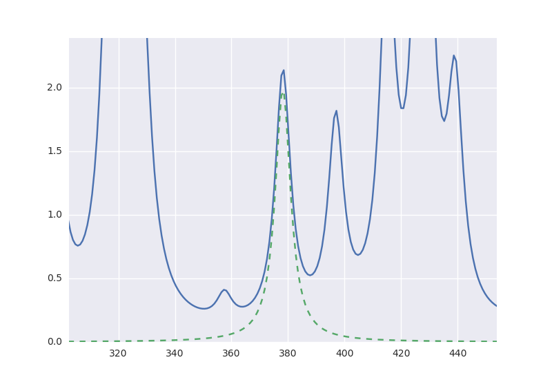

| Atom # | Element | Sum of vibrational eigenvalues |
|--------|---------|--------------------------------|
| 45 | 1 | 0.38691084244306206 |
| 15 | 8 | 0.3502855977627399 |
| 42 | 1 | 0.2903446228191595 |
| 5 | 1 | 0.24515301344262524 |
| 7 | 8 | 0.23043437243605827 |
| 39 | 1 | 0.22158519806160337 |
| 43 | 1 | 0.21307275752662516 |
| 41 | 1 | 0.198997487421324 |
| 1 | 8 | 0.198997487421324 |
| 4 | 8 | 0.17972200755611428 |
| 21 | 8 | 0.17320508075688776 |
| 8 | 1 | 0.17233687939614087 |
| 44 | 1 | 0.16186414056238646 |
| 30 | 1 | 0.15556349186104046 |
| 6 | 6 | 0.1452583904633395 |
| 38 | 1 | 0.13341664064126332 |
| 2 | 6 | 0.12727922061357858 |
| 22 | 1 | 0.12369316876852982 |
| 31 | 1 | 0.12124355652982141 |
| 29 | 8 | 0.11090536506409418 |
| 14 | 6 | 0.11 |
| 37 | 1 | 0.10099504938362078 |
| 32 | 1 | 0.1 |
| 20 | 6 | 0.09797958971132713 |
| 28 | 6 | 0.09273618495495704 |
| 13 | 8 | 0.09 |
| 24 | 8 | 0.08124038404635961 |
| 36 | 1 | 0.07681145747868609 |
| 33 | 1 | 0.07141428428542851 |
| 27 | 8 | 0.06 |
| 12 | 6 | 0.06 |
| 16 | 6 | 0.057445626465380296 |
| 23 | 6 | 0.05744562646538029 |
| 19 | 1 | 0.0565685424949238 |
| 40 | 1 | 0.05 |
| 25 | 1 | 0.048989794855663564 |
| 35 | 1 | 0.042426406871192854 |
| 3 | 6 | 0.0412310562561766 |
| 34 | 1 | 0.033166247903554 |
| 9 | 6 | 0.033166247903554 |
| 18 | 8 | 0.03 |
| 17 | 6 | 0.0282842712474619 |
| 26 | 6 | 0.024494897427831782 |
| 11 | 1 | 0.024494897427831782 |
| 10 | 8 | 0.017320508075688773 |

## Peak #28: 396.9105 1/cm   
Raman activity: 1.5597  
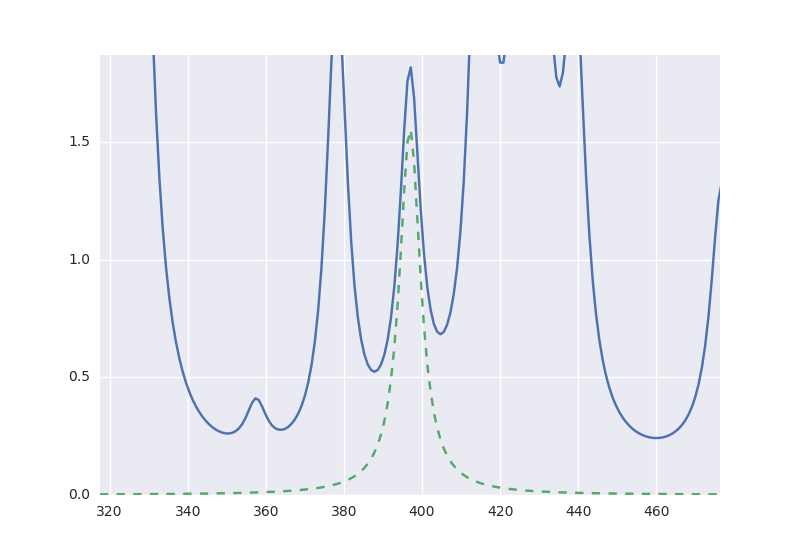

| Atom # | Element | Sum of vibrational eigenvalues |
|--------|---------|--------------------------------|
| 44 | 1 | 0.45354161881794264 |
| 42 | 1 | 0.3303028912982749 |
| 34 | 1 | 0.3029851481508623 |
| 35 | 1 | 0.30066592756745814 |
| 39 | 1 | 0.28879058156387305 |
| 43 | 1 | 0.2422808287917144 |
| 37 | 1 | 0.23388031127053 |
| 13 | 8 | 0.1705872210923198 |
| 32 | 1 | 0.16970562748477142 |
| 21 | 8 | 0.16673332000533067 |
| 31 | 1 | 0.16248076809271922 |
| 6 | 6 | 0.14282856857085702 |
| 38 | 1 | 0.14177446878757827 |
| 22 | 1 | 0.14177446878757827 |
| 41 | 1 | 0.13892443989449804 |
| 25 | 1 | 0.1307669683062202 |
| 15 | 8 | 0.12247448713915891 |
| 16 | 6 | 0.12124355652982141 |
| 1 | 8 | 0.11661903789690602 |
| 45 | 1 | 0.11575836902790226 |
| 2 | 6 | 0.10677078252031312 |
| 26 | 6 | 0.10392304845413264 |
| 33 | 1 | 0.099498743710662 |
| 23 | 6 | 0.09110433579144298 |
| 8 | 1 | 0.09110433579144298 |
| 9 | 6 | 0.09 |
| 11 | 1 | 0.08660254037844388 |
| 20 | 6 | 0.08485281374238571 |
| 28 | 6 | 0.08124038404635961 |
| 3 | 6 | 0.07348469228349536 |
| 4 | 8 | 0.06557438524302 |
| 36 | 1 | 0.06164414002968976 |
| 40 | 1 | 0.057445626465380296 |
| 5 | 1 | 0.05744562646538029 |
| 27 | 8 | 0.05 |
| 12 | 6 | 0.048989794855663564 |
| 10 | 8 | 0.048989794855663564 |
| 30 | 1 | 0.042426406871192854 |
| 24 | 8 | 0.04 |
| 17 | 6 | 0.033166247903554 |
| 18 | 8 | 0.03 |
| 14 | 6 | 0.03 |
| 19 | 1 | 0.0282842712474619 |
| 7 | 8 | 0.02 |
| 29 | 8 | 0.017320508075688773 |

## Peak #29: 415.1376 1/cm   
Raman activity: 2.7424  
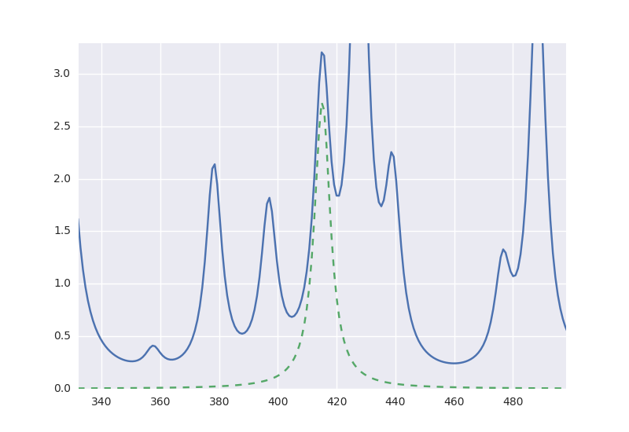

| Atom # | Element | Sum of vibrational eigenvalues |
|--------|---------|--------------------------------|
| 41 | 1 | 0.3762977544445356 |
| 7 | 8 | 0.3327160951922825 |
| 1 | 8 | 0.32832910318764 |
| 8 | 1 | 0.32542280190545964 |
| 38 | 1 | 0.3179622619116929 |
| 13 | 8 | 0.2473863375370596 |
| 4 | 8 | 0.24556058315617352 |
| 11 | 1 | 0.2422808287917144 |
| 39 | 1 | 0.2368543856465402 |
| 2 | 6 | 0.22 |
| 45 | 1 | 0.2042057785666214 |
| 5 | 1 | 0.18493242008906932 |
| 34 | 1 | 0.17435595774162693 |
| 12 | 6 | 0.17233687939614087 |
| 42 | 1 | 0.16673332000533067 |
| 44 | 1 | 0.1649242250247064 |
| 40 | 1 | 0.1606237840420901 |
| 14 | 6 | 0.1606237840420901 |
| 9 | 6 | 0.14798648586948743 |
| 6 | 6 | 0.132664991614216 |
| 3 | 6 | 0.1236931687685298 |
| 43 | 1 | 0.11789826122551596 |
| 31 | 1 | 0.09380831519646858 |
| 37 | 1 | 0.09 |
| 35 | 1 | 0.08717797887081347 |
| 30 | 1 | 0.07141428428542851 |
| 29 | 8 | 0.07141428428542851 |
| 10 | 8 | 0.07141428428542851 |
| 16 | 6 | 0.07071067811865477 |
| 15 | 8 | 0.06557438524302 |
| 28 | 6 | 0.06 |
| 25 | 1 | 0.04358898943540673 |
| 27 | 8 | 0.042426406871192854 |
| 26 | 6 | 0.042426406871192854 |
| 23 | 6 | 0.034641016151377546 |
| 18 | 8 | 0.033166247903554 |
| 32 | 1 | 0.03 |
| 24 | 8 | 0.03 |
| 36 | 1 | 0.0282842712474619 |
| 20 | 6 | 0.0282842712474619 |
| 33 | 1 | 0.02 |
| 22 | 1 | 0.017320508075688773 |
| 21 | 8 | 0.017320508075688773 |
| 17 | 6 | 0.017320508075688773 |
| 19 | 1 | 0.01 |

## Peak #30: 427.7156 1/cm   
Raman activity: 5.4151  
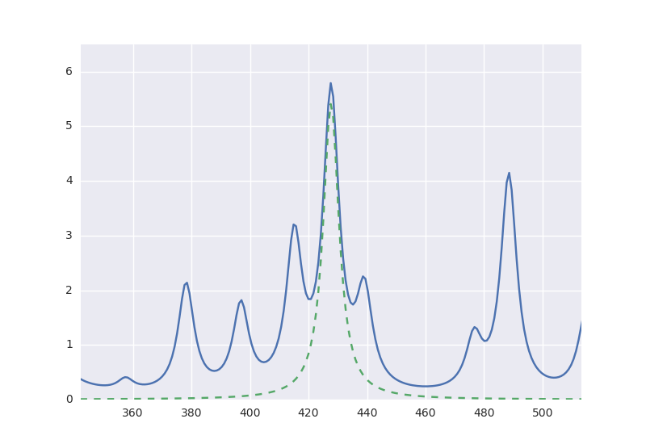

| Atom # | Element | Sum of vibrational eigenvalues |
|--------|---------|--------------------------------|
| 34 | 1 | 0.42532340636273475 |
| 33 | 1 | 0.375632799419859 |
| 30 | 1 | 0.3371943060017473 |
| 31 | 1 | 0.3212475680841802 |
| 18 | 8 | 0.3168595903550972 |
| 19 | 1 | 0.298496231131986 |
| 27 | 8 | 0.2903446228191595 |
| 29 | 8 | 0.21794494717703367 |
| 37 | 1 | 0.21047565179849187 |
| 17 | 6 | 0.2027313493271329 |
| 28 | 6 | 0.19672315572906005 |
| 16 | 6 | 0.16 |
| 44 | 1 | 0.1584297951775486 |
| 42 | 1 | 0.14282856857085702 |
| 32 | 1 | 0.13892443989449804 |
| 45 | 1 | 0.1307669683062202 |
| 22 | 1 | 0.12369316876852982 |
| 24 | 8 | 0.11357816691600546 |
| 25 | 1 | 0.1063014581273465 |
| 43 | 1 | 0.10099504938362078 |
| 21 | 8 | 0.099498743710662 |
| 36 | 1 | 0.08485281374238571 |
| 15 | 8 | 0.08485281374238571 |
| 13 | 8 | 0.07681145747868609 |
| 39 | 1 | 0.07141428428542851 |
| 23 | 6 | 0.07141428428542851 |
| 35 | 1 | 0.066332495807108 |
| 26 | 6 | 0.06164414002968976 |
| 5 | 1 | 0.05744562646538029 |
| 4 | 8 | 0.05744562646538029 |
| 14 | 6 | 0.0565685424949238 |
| 8 | 1 | 0.04358898943540673 |
| 3 | 6 | 0.04358898943540673 |
| 41 | 1 | 0.042426406871192854 |
| 20 | 6 | 0.042426406871192854 |
| 7 | 8 | 0.0412310562561766 |
| 6 | 6 | 0.0412310562561766 |
| 38 | 1 | 0.04 |
| 2 | 6 | 0.04 |
| 11 | 1 | 0.024494897427831782 |
| 10 | 8 | 0.024494897427831782 |
| 1 | 8 | 0.02 |
| 40 | 1 | 0.017320508075688773 |
| 9 | 6 | 0.017320508075688773 |
| 12 | 6 | 0.01 |

## Peak #31: 439.0979 1/cm   
Raman activity: 1.7135  
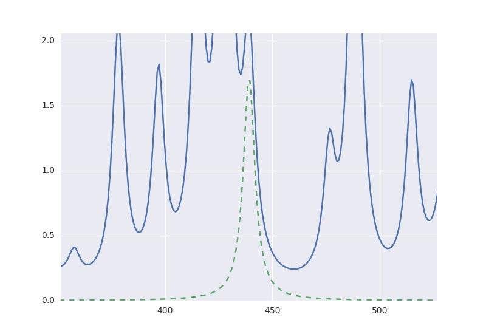

| Atom # | Element | Sum of vibrational eigenvalues |
|--------|---------|--------------------------------|
| 37 | 1 | 0.37107950630558945 |
| 31 | 1 | 0.37027017163147236 |
| 35 | 1 | 0.33481338085566414 |
| 45 | 1 | 0.2872281323269015 |
| 32 | 1 | 0.2547547840571399 |
| 44 | 1 | 0.2345207879911715 |
| 33 | 1 | 0.22158519806160337 |
| 30 | 1 | 0.2142428528562855 |
| 28 | 6 | 0.21307275752662516 |
| 14 | 6 | 0.1841195263952197 |
| 19 | 1 | 0.18055470085267789 |
| 29 | 8 | 0.17972200755611428 |
| 15 | 8 | 0.1769180601295413 |
| 23 | 6 | 0.17233687939614084 |
| 36 | 1 | 0.1655294535724685 |
| 26 | 6 | 0.163707055437449 |
| 34 | 1 | 0.15588457268119896 |
| 39 | 1 | 0.15556349186104046 |
| 20 | 6 | 0.150996688705415 |
| 42 | 1 | 0.15000000000000002 |
| 25 | 1 | 0.1469693845669907 |
| 41 | 1 | 0.14282856857085702 |
| 1 | 8 | 0.14282856857085702 |
| 16 | 6 | 0.14177446878757827 |
| 18 | 8 | 0.13304134695650072 |
| 38 | 1 | 0.12884098726725124 |
| 6 | 6 | 0.12 |
| 17 | 6 | 0.10099504938362078 |
| 2 | 6 | 0.099498743710662 |
| 27 | 8 | 0.09000000000000001 |
| 9 | 6 | 0.0824621125123532 |
| 24 | 8 | 0.07549834435270751 |
| 11 | 1 | 0.07348469228349536 |
| 43 | 1 | 0.07348469228349534 |
| 12 | 6 | 0.07141428428542851 |
| 40 | 1 | 0.066332495807108 |
| 4 | 8 | 0.06557438524302 |
| 5 | 1 | 0.06164414002968976 |
| 13 | 8 | 0.057445626465380296 |
| 21 | 8 | 0.048989794855663564 |
| 10 | 8 | 0.048989794855663564 |
| 3 | 6 | 0.033166247903554 |
| 22 | 1 | 0.03 |
| 8 | 1 | 0.017320508075688773 |
| 7 | 8 | 0.01414213562373095 |

## Peak #32: 476.5895 1/cm   
Raman activity: 0.9423  
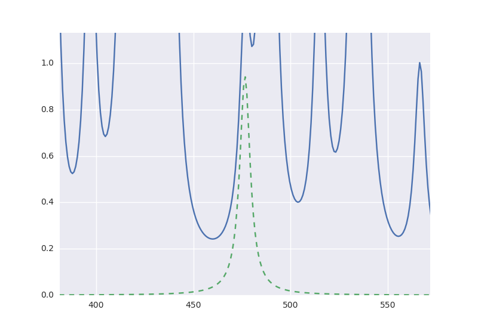

| Atom # | Element | Sum of vibrational eigenvalues |
|--------|---------|--------------------------------|
| 32 | 1 | 0.35818989377144633 |
| 15 | 8 | 0.28565713714171403 |
| 35 | 1 | 0.2596150997149434 |
| 37 | 1 | 0.2545584412271571 |
| 31 | 1 | 0.2503996805109783 |
| 45 | 1 | 0.2473863375370596 |
| 29 | 8 | 0.2412467616362964 |
| 44 | 1 | 0.21354156504062624 |
| 13 | 8 | 0.21236760581595301 |
| 1 | 8 | 0.21213203435596426 |
| 34 | 1 | 0.20615528128088303 |
| 42 | 1 | 0.196468827043885 |
| 33 | 1 | 0.19467922333931784 |
| 39 | 1 | 0.18 |
| 14 | 6 | 0.18 |
| 16 | 6 | 0.16999999999999998 |
| 41 | 1 | 0.157797338380595 |
| 30 | 1 | 0.15588457268119896 |
| 43 | 1 | 0.14628738838327796 |
| 4 | 8 | 0.13304134695650072 |
| 5 | 1 | 0.12124355652982141 |
| 19 | 1 | 0.12083045973594571 |
| 40 | 1 | 0.11789826122551596 |
| 25 | 1 | 0.1131370849898476 |
| 11 | 1 | 0.11090536506409418 |
| 23 | 6 | 0.10392304845413264 |
| 26 | 6 | 0.099498743710662 |
| 2 | 6 | 0.099498743710662 |
| 28 | 6 | 0.09055385138137417 |
| 36 | 1 | 0.08124038404635961 |
| 9 | 6 | 0.08124038404635961 |
| 3 | 6 | 0.08124038404635961 |
| 12 | 6 | 0.07681145747868609 |
| 38 | 1 | 0.07348469228349536 |
| 27 | 8 | 0.07348469228349536 |
| 20 | 6 | 0.07348469228349536 |
| 10 | 8 | 0.06928203230275509 |
| 22 | 1 | 0.06557438524302 |
| 21 | 8 | 0.05196152422706632 |
| 18 | 8 | 0.0412310562561766 |
| 17 | 6 | 0.03 |
| 7 | 8 | 0.0282842712474619 |
| 24 | 8 | 0.02 |
| 8 | 1 | 0.02 |
| 6 | 6 | 0.017320508075688773 |

## Peak #33: 488.4655 1/cm   
Raman activity: 3.989  
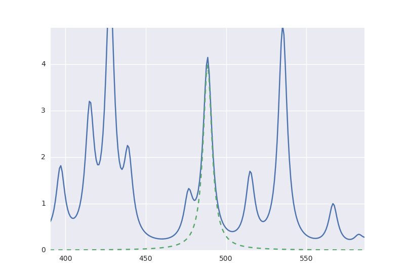

| Atom # | Element | Sum of vibrational eigenvalues |
|--------|---------|--------------------------------|
| 41 | 1 | 0.3558089374931439 |
| 45 | 1 | 0.2971531591620725 |
| 5 | 1 | 0.265329983228432 |
| 32 | 1 | 0.26438608132804575 |
| 40 | 1 | 0.2437211521390788 |
| 11 | 1 | 0.24062418831031931 |
| 34 | 1 | 0.2389560629069704 |
| 42 | 1 | 0.22869193252058542 |
| 43 | 1 | 0.22715633383201092 |
| 39 | 1 | 0.2142428528562855 |
| 4 | 8 | 0.212602916254693 |
| 35 | 1 | 0.20615528128088303 |
| 9 | 6 | 0.2042057785666214 |
| 12 | 6 | 0.19672315572906005 |
| 44 | 1 | 0.17972200755611428 |
| 31 | 1 | 0.1705872210923198 |
| 33 | 1 | 0.16970562748477142 |
| 3 | 6 | 0.12369316876852982 |
| 14 | 6 | 0.12 |
| 26 | 6 | 0.099498743710662 |
| 6 | 6 | 0.09949874371066199 |
| 37 | 1 | 0.09797958971132713 |
| 15 | 8 | 0.09797958971132713 |
| 13 | 8 | 0.09433981132056603 |
| 36 | 1 | 0.09110433579144298 |
| 20 | 6 | 0.07681145747868609 |
| 16 | 6 | 0.07681145747868609 |
| 8 | 1 | 0.07549834435270751 |
| 38 | 1 | 0.0754983443527075 |
| 27 | 8 | 0.0754983443527075 |
| 23 | 6 | 0.07348469228349534 |
| 2 | 6 | 0.07348469228349534 |
| 28 | 6 | 0.07141428428542851 |
| 7 | 8 | 0.07 |
| 10 | 8 | 0.06164414002968976 |
| 17 | 6 | 0.057445626465380296 |
| 25 | 1 | 0.04358898943540673 |
| 30 | 1 | 0.0412310562561766 |
| 19 | 1 | 0.03 |
| 21 | 8 | 0.0282842712474619 |
| 29 | 8 | 0.024494897427831782 |
| 18 | 8 | 0.024494897427831782 |
| 1 | 8 | 0.024494897427831782 |
| 24 | 8 | 0.02 |
| 22 | 1 | 0.01414213562373095 |

## Peak #34: 515.0459 1/cm   
Raman activity: 1.4767  
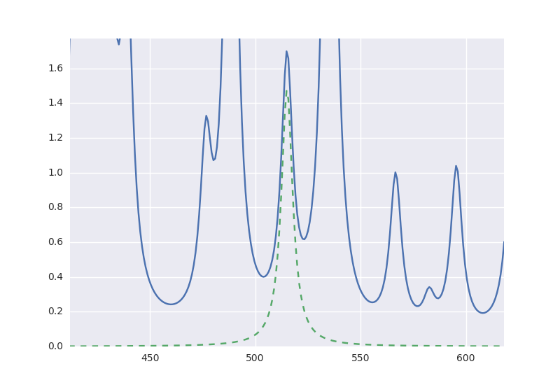

| Atom # | Element | Sum of vibrational eigenvalues |
|--------|---------|--------------------------------|
| 34 | 1 | 0.47613023428469653 |
| 35 | 1 | 0.44249293779675175 |
| 33 | 1 | 0.3374907406137241 |
| 32 | 1 | 0.3168595903550972 |
| 36 | 1 | 0.2615339366124404 |
| 26 | 6 | 0.24738633753705963 |
| 31 | 1 | 0.24494897427831783 |
| 18 | 8 | 0.23685438564654024 |
| 19 | 1 | 0.198997487421324 |
| 37 | 1 | 0.17146428199482247 |
| 45 | 1 | 0.16999999999999998 |
| 17 | 6 | 0.15684387141358122 |
| 44 | 1 | 0.15000000000000002 |
| 41 | 1 | 0.1469693845669907 |
| 13 | 8 | 0.12767145334803703 |
| 21 | 8 | 0.12369316876852982 |
| 16 | 6 | 0.12328828005937952 |
| 38 | 1 | 0.11704699910719625 |
| 23 | 6 | 0.11661903789690602 |
| 42 | 1 | 0.11575836902790226 |
| 25 | 1 | 0.11357816691600547 |
| 14 | 6 | 0.11357816691600547 |
| 1 | 8 | 0.11357816691600547 |
| 22 | 1 | 0.09 |
| 43 | 1 | 0.08717797887081347 |
| 12 | 6 | 0.08544003745317531 |
| 15 | 8 | 0.07681145747868609 |
| 28 | 6 | 0.0754983443527075 |
| 27 | 8 | 0.0754983443527075 |
| 30 | 1 | 0.07141428428542851 |
| 39 | 1 | 0.06403124237432849 |
| 29 | 8 | 0.06403124237432849 |
| 20 | 6 | 0.06 |
| 6 | 6 | 0.06 |
| 2 | 6 | 0.06 |
| 5 | 1 | 0.05830951894845301 |
| 40 | 1 | 0.057445626465380296 |
| 10 | 8 | 0.04690415759823429 |
| 4 | 8 | 0.04690415759823429 |
| 3 | 6 | 0.04358898943540673 |
| 24 | 8 | 0.0412310562561766 |
| 8 | 1 | 0.033166247903554 |
| 11 | 1 | 0.02 |
| 7 | 8 | 0.017320508075688773 |

## Peak #35: 535.2932 1/cm   
Raman activity: 4.7478  
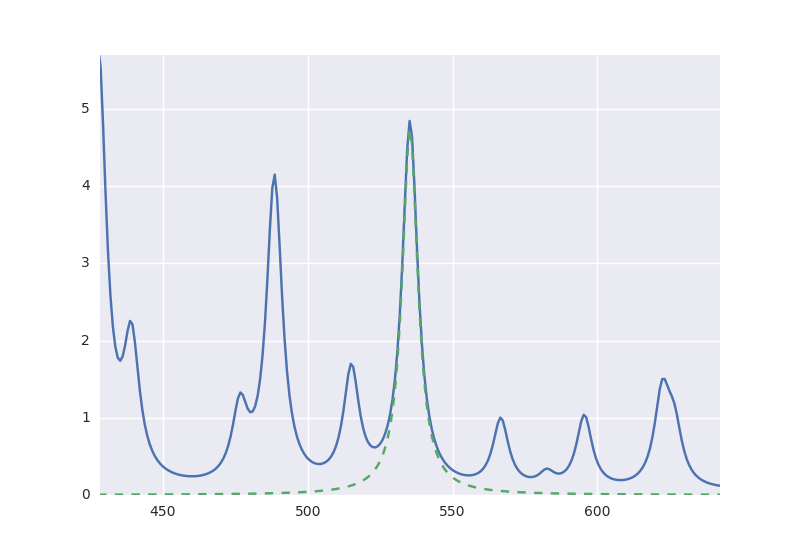

| Atom # | Element | Sum of vibrational eigenvalues |
|--------|---------|--------------------------------|
| 44 | 1 | 0.4467661580737735 |
| 45 | 1 | 0.39395431207184417 |
| 43 | 1 | 0.3624913792078372 |
| 42 | 1 | 0.3511409973215887 |
| 32 | 1 | 0.33 |
| 34 | 1 | 0.26758176320519306 |
| 31 | 1 | 0.23685438564654024 |
| 41 | 1 | 0.23173260452512934 |
| 38 | 1 | 0.21354156504062624 |
| 5 | 1 | 0.19000000000000003 |
| 39 | 1 | 0.18000000000000002 |
| 12 | 6 | 0.13341664064126332 |
| 40 | 1 | 0.13 |
| 14 | 6 | 0.12 |
| 4 | 8 | 0.11661903789690602 |
| 18 | 8 | 0.11575836902790226 |
| 6 | 6 | 0.11489125293076058 |
| 3 | 6 | 0.11489125293076058 |
| 28 | 6 | 0.11357816691600547 |
| 16 | 6 | 0.11090536506409418 |
| 13 | 8 | 0.10099504938362078 |
| 2 | 6 | 0.09433981132056603 |
| 20 | 6 | 0.09380831519646858 |
| 30 | 1 | 0.09 |
| 7 | 8 | 0.08485281374238571 |
| 35 | 1 | 0.08124038404635961 |
| 33 | 1 | 0.0754983443527075 |
| 19 | 1 | 0.07348469228349536 |
| 17 | 6 | 0.07141428428542851 |
| 27 | 8 | 0.06557438524302 |
| 1 | 8 | 0.06403124237432849 |
| 15 | 8 | 0.06 |
| 29 | 8 | 0.05196152422706632 |
| 37 | 1 | 0.05 |
| 8 | 1 | 0.048989794855663564 |
| 26 | 6 | 0.04358898943540673 |
| 25 | 1 | 0.042426406871192854 |
| 11 | 1 | 0.042426406871192854 |
| 9 | 6 | 0.034641016151377546 |
| 22 | 1 | 0.0282842712474619 |
| 21 | 8 | 0.0282842712474619 |
| 10 | 8 | 0.0282842712474619 |
| 36 | 1 | 0.02 |
| 23 | 6 | 0.02 |
| 24 | 8 | 0.017320508075688773 |

## Peak #36: 566.6399 1/cm   
Raman activity: 0.8873  
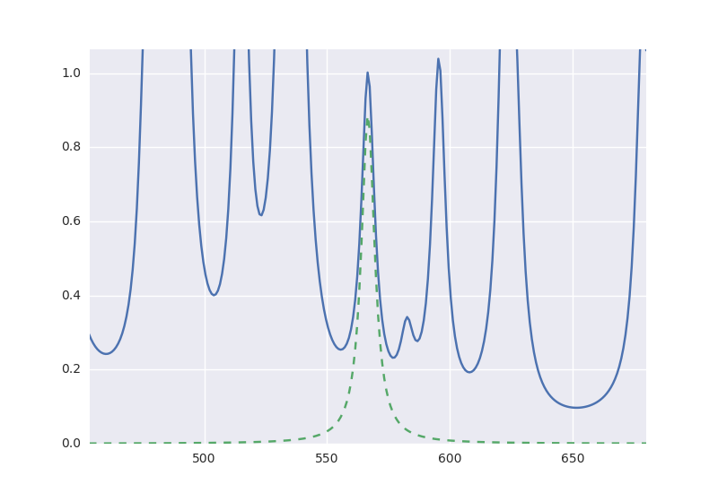

| Atom # | Element | Sum of vibrational eigenvalues |
|--------|---------|--------------------------------|
| 33 | 1 | 0.6721606950722424 |
| 32 | 1 | 0.5883876273342259 |
| 17 | 6 | 0.2195449840010015 |
| 31 | 1 | 0.20445048300260873 |
| 20 | 6 | 0.1841195263952197 |
| 34 | 1 | 0.18220867158288595 |
| 19 | 1 | 0.18220867158288595 |
| 44 | 1 | 0.1606237840420901 |
| 30 | 1 | 0.15099668870541502 |
| 45 | 1 | 0.14798648586948743 |
| 22 | 1 | 0.14628738838327796 |
| 37 | 1 | 0.13379088160259653 |
| 29 | 8 | 0.12806248474865697 |
| 42 | 1 | 0.12727922061357858 |
| 43 | 1 | 0.12124355652982141 |
| 8 | 1 | 0.12083045973594571 |
| 13 | 8 | 0.11489125293076059 |
| 35 | 1 | 0.11 |
| 28 | 6 | 0.10862780491200216 |
| 14 | 6 | 0.10392304845413264 |
| 1 | 8 | 0.10344080432788601 |
| 6 | 6 | 0.099498743710662 |
| 16 | 6 | 0.09433981132056603 |
| 18 | 8 | 0.09 |
| 21 | 8 | 0.08717797887081347 |
| 27 | 8 | 0.08485281374238571 |
| 7 | 8 | 0.08124038404635961 |
| 36 | 1 | 0.07348469228349534 |
| 3 | 6 | 0.06403124237432849 |
| 5 | 1 | 0.06164414002968976 |
| 26 | 6 | 0.06 |
| 15 | 8 | 0.05830951894845301 |
| 40 | 1 | 0.05196152422706632 |
| 2 | 6 | 0.05196152422706632 |
| 24 | 8 | 0.04690415759823429 |
| 11 | 1 | 0.04358898943540673 |
| 38 | 1 | 0.042426406871192854 |
| 4 | 8 | 0.034641016151377546 |
| 39 | 1 | 0.03 |
| 12 | 6 | 0.03 |
| 10 | 8 | 0.03 |
| 41 | 1 | 0.024494897427831782 |
| 9 | 6 | 0.024494897427831782 |
| 25 | 1 | 0.02 |
| 23 | 6 | 0.01 |

## Peak #37: 582.531 1/cm   
Raman activity: 0.1789  
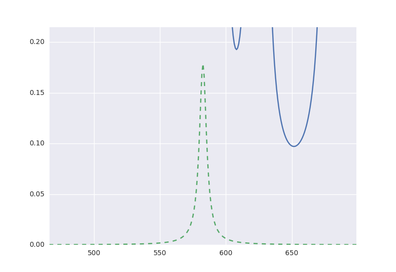

| Atom # | Element | Sum of vibrational eigenvalues |
|--------|---------|--------------------------------|
| 43 | 1 | 0.46195237849804394 |
| 32 | 1 | 0.40024992192379 |
| 33 | 1 | 0.34727510708370674 |
| 44 | 1 | 0.33075670817082453 |
| 45 | 1 | 0.2503996805109783 |
| 13 | 8 | 0.2118962010041709 |
| 42 | 1 | 0.2080865204668481 |
| 41 | 1 | 0.19339079605813717 |
| 8 | 1 | 0.19209372712298545 |
| 3 | 6 | 0.17972200755611428 |
| 6 | 6 | 0.17088007490635063 |
| 5 | 1 | 0.16031219541881397 |
| 12 | 6 | 0.15588457268119896 |
| 39 | 1 | 0.15362291495737218 |
| 40 | 1 | 0.14628738838327796 |
| 31 | 1 | 0.1452583904633395 |
| 15 | 8 | 0.14 |
| 38 | 1 | 0.13379088160259653 |
| 14 | 6 | 0.13304134695650072 |
| 37 | 1 | 0.1307669683062202 |
| 35 | 1 | 0.12247448713915891 |
| 1 | 8 | 0.12124355652982141 |
| 20 | 6 | 0.11704699910719625 |
| 7 | 8 | 0.11489125293076059 |
| 10 | 8 | 0.09380831519646858 |
| 18 | 8 | 0.08544003745317531 |
| 2 | 6 | 0.08485281374238571 |
| 28 | 6 | 0.07681145747868609 |
| 30 | 1 | 0.07549834435270751 |
| 17 | 6 | 0.0754983443527075 |
| 27 | 8 | 0.06928203230275509 |
| 11 | 1 | 0.06928203230275509 |
| 34 | 1 | 0.06557438524302 |
| 4 | 8 | 0.057445626465380296 |
| 26 | 6 | 0.05744562646538029 |
| 22 | 1 | 0.04690415759823429 |
| 25 | 1 | 0.042426406871192854 |
| 29 | 8 | 0.0412310562561766 |
| 21 | 8 | 0.0412310562561766 |
| 19 | 1 | 0.0412310562561766 |
| 36 | 1 | 0.033166247903554 |
| 9 | 6 | 0.033166247903554 |
| 23 | 6 | 0.024494897427831782 |
| 16 | 6 | 0.024494897427831782 |
| 24 | 8 | 0.01 |

## Peak #38: 595.4919 1/cm   
Raman activity: 0.9484  
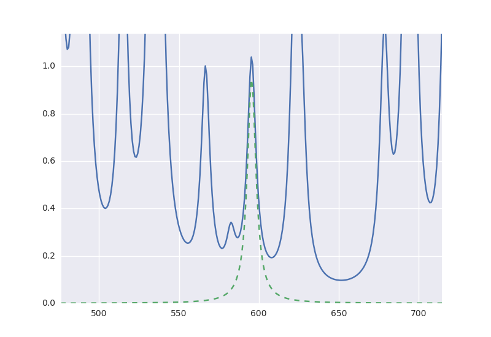

| Atom # | Element | Sum of vibrational eigenvalues |
|--------|---------|--------------------------------|
| 43 | 1 | 0.4702127178203499 |
| 44 | 1 | 0.41388404173149757 |
| 39 | 1 | 0.23388031127053 |
| 31 | 1 | 0.22338307903688676 |
| 35 | 1 | 0.19339079605813717 |
| 13 | 8 | 0.19209372712298545 |
| 42 | 1 | 0.19052558883257653 |
| 45 | 1 | 0.1881488772222678 |
| 27 | 8 | 0.18788294228055935 |
| 7 | 8 | 0.18110770276274835 |
| 41 | 1 | 0.16340134638368192 |
| 38 | 1 | 0.15588457268119896 |
| 32 | 1 | 0.14628738838327796 |
| 37 | 1 | 0.13304134695650072 |
| 6 | 6 | 0.13304134695650072 |
| 14 | 6 | 0.12727922061357858 |
| 3 | 6 | 0.12727922061357858 |
| 34 | 1 | 0.11661903789690602 |
| 30 | 1 | 0.1131370849898476 |
| 29 | 8 | 0.10099504938362078 |
| 21 | 8 | 0.10099504938362078 |
| 22 | 1 | 0.1 |
| 18 | 8 | 0.099498743710662 |
| 28 | 6 | 0.09848857801796104 |
| 36 | 1 | 0.09110433579144298 |
| 33 | 1 | 0.08660254037844388 |
| 23 | 6 | 0.08485281374238571 |
| 4 | 8 | 0.08485281374238571 |
| 11 | 1 | 0.0824621125123532 |
| 15 | 8 | 0.08124038404635961 |
| 8 | 1 | 0.07681145747868609 |
| 25 | 1 | 0.07348469228349536 |
| 40 | 1 | 0.06928203230275509 |
| 10 | 8 | 0.06928203230275509 |
| 19 | 1 | 0.06403124237432849 |
| 5 | 1 | 0.06164414002968976 |
| 2 | 6 | 0.06164414002968976 |
| 20 | 6 | 0.06 |
| 12 | 6 | 0.06 |
| 26 | 6 | 0.05830951894845301 |
| 17 | 6 | 0.0565685424949238 |
| 9 | 6 | 0.05 |
| 16 | 6 | 0.034641016151377546 |
| 1 | 8 | 0.034641016151377546 |
| 24 | 8 | 0.01414213562373095 |

## Peak #39: 622.3964 1/cm   
Raman activity: 1.1789  

| Atom # | Element | Sum of vibrational eigenvalues |
|--------|---------|--------------------------------|
| 44 | 1 | 0.5330103188494573 |
| 45 | 1 | 0.3733630940518894 |
| 34 | 1 | 0.298496231131986 |
| 41 | 1 | 0.28861739379323625 |
| 13 | 8 | 0.21748563170931548 |
| 43 | 1 | 0.2054263858417414 |
| 35 | 1 | 0.19824227601599007 |
| 39 | 1 | 0.1881488772222678 |
| 6 | 6 | 0.18761663039293716 |
| 33 | 1 | 0.16583123951777 |
| 32 | 1 | 0.16583123951777 |
| 31 | 1 | 0.16340134638368192 |
| 27 | 8 | 0.16340134638368192 |
| 42 | 1 | 0.1584297951775486 |
| 38 | 1 | 0.14282856857085702 |
| 36 | 1 | 0.14 |
| 12 | 6 | 0.13674794331177342 |
| 25 | 1 | 0.12884098726725124 |
| 21 | 8 | 0.12369316876852982 |
| 4 | 8 | 0.12 |
| 1 | 8 | 0.1131370849898476 |
| 7 | 8 | 0.10677078252031312 |
| 37 | 1 | 0.10099504938362078 |
| 15 | 8 | 0.1 |
| 23 | 6 | 0.09949874371066199 |
| 11 | 1 | 0.09899494936611666 |
| 22 | 1 | 0.09 |
| 14 | 6 | 0.09 |
| 8 | 1 | 0.09 |
| 3 | 6 | 0.0824621125123532 |
| 19 | 1 | 0.08124038404635961 |
| 18 | 8 | 0.08124038404635961 |
| 16 | 6 | 0.07681145747868609 |
| 30 | 1 | 0.07141428428542851 |
| 26 | 6 | 0.066332495807108 |
| 28 | 6 | 0.06403124237432849 |
| 9 | 6 | 0.06164414002968976 |
| 2 | 6 | 0.06 |
| 20 | 6 | 0.05196152422706632 |
| 17 | 6 | 0.05196152422706632 |
| 29 | 8 | 0.042426406871192854 |
| 5 | 1 | 0.042426406871192854 |
| 24 | 8 | 0.0282842712474619 |
| 40 | 1 | 0.024494897427831782 |
| 10 | 8 | 0.024494897427831782 |

## Peak #40: 626.5772 1/cm   
Raman activity: 0.679  
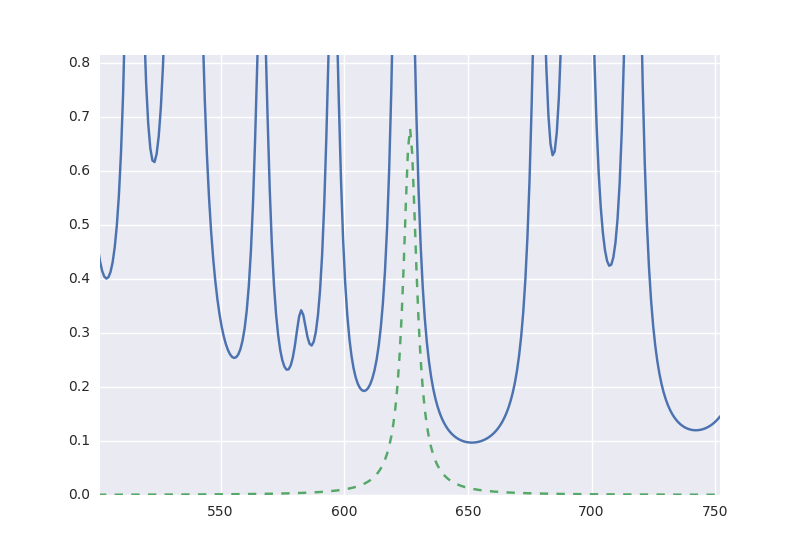

| Atom # | Element | Sum of vibrational eigenvalues |
|--------|---------|--------------------------------|
| 27 | 8 | 0.30757112998459396 |
| 41 | 1 | 0.29849623113198603 |
| 31 | 1 | 0.2814249455894058 |
| 42 | 1 | 0.2718455443813637 |
| 35 | 1 | 0.2640075756488817 |
| 43 | 1 | 0.24738633753705963 |
| 13 | 8 | 0.24062418831031931 |
| 26 | 6 | 0.24 |
| 29 | 8 | 0.23151673805580453 |
| 22 | 1 | 0.22715633383201092 |
| 32 | 1 | 0.21748563170931542 |
| 30 | 1 | 0.20199009876724155 |
| 1 | 8 | 0.18493242008906932 |
| 21 | 8 | 0.18493242008906927 |
| 12 | 6 | 0.1705872210923198 |
| 15 | 8 | 0.16673332000533067 |
| 44 | 1 | 0.15588457268119896 |
| 37 | 1 | 0.14798648586948743 |
| 28 | 6 | 0.14282856857085702 |
| 24 | 8 | 0.13856406460551018 |
| 33 | 1 | 0.12369316876852982 |
| 5 | 1 | 0.12369316876852982 |
| 36 | 1 | 0.1236931687685298 |
| 45 | 1 | 0.12124355652982141 |
| 16 | 6 | 0.11704699910719625 |
| 34 | 1 | 0.11 |
| 11 | 1 | 0.10344080432788601 |
| 25 | 1 | 0.08485281374238571 |
| 20 | 6 | 0.0824621125123532 |
| 4 | 8 | 0.07348469228349534 |
| 2 | 6 | 0.06928203230275509 |
| 3 | 6 | 0.06 |
| 10 | 8 | 0.05830951894845301 |
| 39 | 1 | 0.05744562646538029 |
| 40 | 1 | 0.04690415759823429 |
| 38 | 1 | 0.04358898943540673 |
| 6 | 6 | 0.04358898943540673 |
| 9 | 6 | 0.042426406871192854 |
| 8 | 1 | 0.04 |
| 17 | 6 | 0.03 |
| 14 | 6 | 0.024494897427831782 |
| 7 | 8 | 0.02 |
| 23 | 6 | 0.017320508075688773 |
| 19 | 1 | 0.01414213562373095 |
| 18 | 8 | 0.01414213562373095 |

## Peak #41: 678.5897 1/cm   
Raman activity: 0.9971  
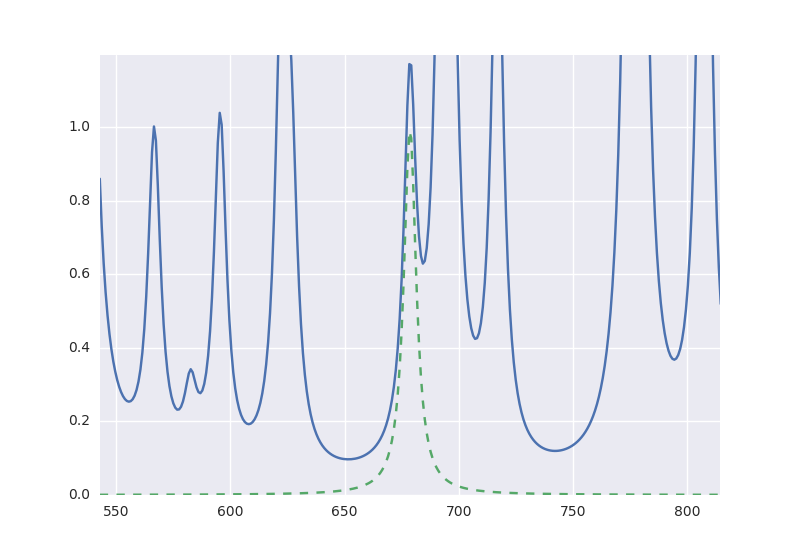

| Atom # | Element | Sum of vibrational eigenvalues |
|--------|---------|--------------------------------|
| 35 | 1 | 0.4436214602563767 |
| 44 | 1 | 0.34655446902326914 |
| 34 | 1 | 0.3327160951922825 |
| 15 | 8 | 0.3290896534380867 |
| 43 | 1 | 0.30724582991474436 |
| 41 | 1 | 0.30000000000000004 |
| 27 | 8 | 0.2971531591620725 |
| 33 | 1 | 0.23173260452512934 |
| 29 | 8 | 0.23043437243605824 |
| 42 | 1 | 0.2137755832643195 |
| 13 | 8 | 0.1982422760159901 |
| 26 | 6 | 0.19672315572906005 |
| 31 | 1 | 0.18193405398660253 |
| 12 | 6 | 0.1769180601295413 |
| 16 | 6 | 0.16970562748477142 |
| 1 | 8 | 0.15684387141358122 |
| 45 | 1 | 0.15588457268119896 |
| 37 | 1 | 0.1452583904633395 |
| 32 | 1 | 0.14282856857085702 |
| 5 | 1 | 0.1392838827718412 |
| 30 | 1 | 0.13892443989449804 |
| 11 | 1 | 0.11704699910719625 |
| 14 | 6 | 0.1131370849898476 |
| 25 | 1 | 0.09380831519646858 |
| 22 | 1 | 0.08717797887081347 |
| 3 | 6 | 0.08124038404635961 |
| 19 | 1 | 0.07681145747868609 |
| 24 | 8 | 0.0754983443527075 |
| 4 | 8 | 0.0754983443527075 |
| 18 | 8 | 0.06557438524302 |
| 36 | 1 | 0.06403124237432849 |
| 28 | 6 | 0.06 |
| 39 | 1 | 0.0565685424949238 |
| 10 | 8 | 0.05196152422706632 |
| 23 | 6 | 0.05 |
| 8 | 1 | 0.04690415759823429 |
| 40 | 1 | 0.042426406871192854 |
| 2 | 6 | 0.042426406871192854 |
| 21 | 8 | 0.034641016151377546 |
| 9 | 6 | 0.03 |
| 6 | 6 | 0.03 |
| 38 | 1 | 0.024494897427831782 |
| 20 | 6 | 0.02 |
| 17 | 6 | 0.017320508075688773 |
| 7 | 8 | 0.01414213562373095 |

## Peak #42: 693.0335 1/cm   
Raman activity: 1.5007  
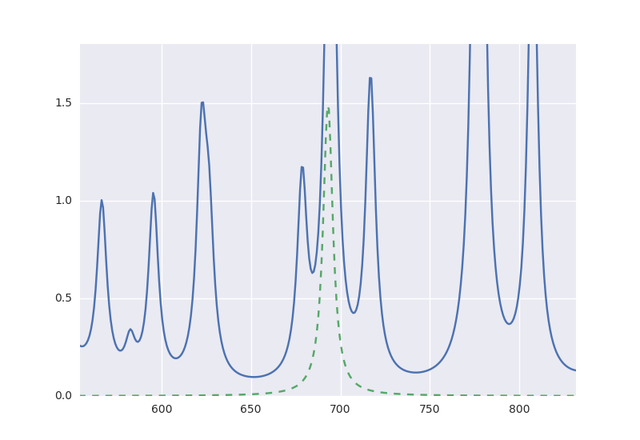

| Atom # | Element | Sum of vibrational eigenvalues |
|--------|---------|--------------------------------|
| 11 | 1 | 0.46021733996015407 |
| 5 | 1 | 0.13114877048604 |
| 44 | 1 | 0.09 |
| 38 | 1 | 0.066332495807108 |
| 43 | 1 | 0.06 |
| 45 | 1 | 0.04358898943540673 |
| 39 | 1 | 0.04358898943540673 |
| 40 | 1 | 0.033166247903554 |
| 25 | 1 | 0.0282842712474619 |
| 9 | 6 | 0.024494897427831782 |
| 4 | 8 | 0.024494897427831782 |
| 3 | 6 | 0.02 |
| 34 | 1 | 0.017320508075688773 |
| 10 | 8 | 0.017320508075688773 |
| 8 | 1 | 0.017320508075688773 |
| 7 | 8 | 0.017320508075688773 |
| 35 | 1 | 0.01414213562373095 |
| 14 | 6 | 0.01414213562373095 |
| 6 | 6 | 0.01414213562373095 |
| 36 | 1 | 0.01 |
| 33 | 1 | 0.01 |
| 13 | 8 | 0.01 |
| 12 | 6 | 0.01 |

## Peak #43: 695.6348 1/cm   
Raman activity: 1.7745  
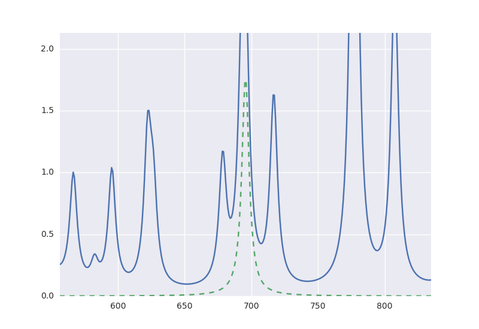

| Atom # | Element | Sum of vibrational eigenvalues |
|--------|---------|--------------------------------|
| 11 | 1 | 0.3167017524422623 |
| 5 | 1 | 0.1649242250247064 |
| 44 | 1 | 0.10344080432788601 |
| 38 | 1 | 0.09949874371066199 |
| 45 | 1 | 0.06403124237432849 |
| 43 | 1 | 0.042426406871192854 |
| 25 | 1 | 0.042426406871192854 |
| 4 | 8 | 0.0412310562561766 |
| 42 | 1 | 0.033166247903554 |
| 41 | 1 | 0.03 |
| 6 | 6 | 0.03 |
| 39 | 1 | 0.0282842712474619 |
| 40 | 1 | 0.024494897427831782 |
| 3 | 6 | 0.02 |
| 34 | 1 | 0.017320508075688773 |
| 33 | 1 | 0.017320508075688773 |
| 15 | 8 | 0.017320508075688773 |
| 14 | 6 | 0.017320508075688773 |
| 13 | 8 | 0.017320508075688773 |
| 10 | 8 | 0.017320508075688773 |
| 8 | 1 | 0.017320508075688773 |
| 7 | 8 | 0.017320508075688773 |
| 35 | 1 | 0.01414213562373095 |
| 26 | 6 | 0.01414213562373095 |
| 36 | 1 | 0.01 |
| 19 | 1 | 0.01 |
| 12 | 6 | 0.01 |
| 9 | 6 | 0.01 |

## Peak #44: 716.8389 1/cm   
Raman activity: 1.5299  
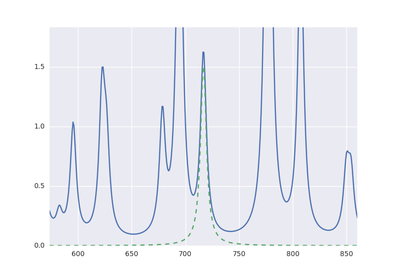

| Atom # | Element | Sum of vibrational eigenvalues |
|--------|---------|--------------------------------|
| 25 | 1 | 0.6847627326307997 |
| 8 | 1 | 0.07141428428542851 |
| 44 | 1 | 0.04358898943540673 |
| 43 | 1 | 0.034641016151377546 |
| 24 | 8 | 0.0282842712474619 |
| 5 | 1 | 0.02 |
| 38 | 1 | 0.017320508075688773 |
| 3 | 6 | 0.017320508075688773 |
| 37 | 1 | 0.01414213562373095 |
| 36 | 1 | 0.01414213562373095 |
| 23 | 6 | 0.01414213562373095 |
| 14 | 6 | 0.01414213562373095 |
| 41 | 1 | 0.01 |
| 39 | 1 | 0.01 |
| 33 | 1 | 0.01 |
| 31 | 1 | 0.01 |
| 19 | 1 | 0.01 |

## Peak #45: 775.9118 1/cm   
Raman activity: 2.2718  
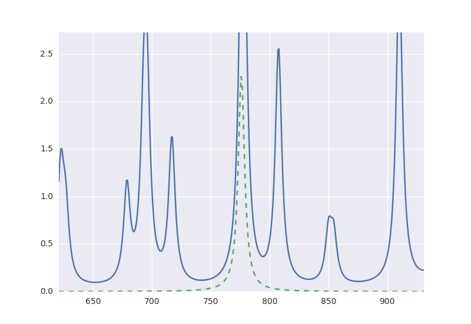

| Atom # | Element | Sum of vibrational eigenvalues |
|--------|---------|--------------------------------|
| 22 | 1 | 0.5801723881744115 |
| 19 | 1 | 0.4264973622427224 |
| 33 | 1 | 0.04690415759823429 |
| 31 | 1 | 0.042426406871192854 |
| 30 | 1 | 0.042426406871192854 |
| 21 | 8 | 0.0412310562561766 |
| 32 | 1 | 0.04 |
| 44 | 1 | 0.03 |
| 12 | 6 | 0.03 |
| 37 | 1 | 0.024494897427831782 |
| 28 | 6 | 0.024494897427831782 |
| 18 | 8 | 0.024494897427831782 |
| 34 | 1 | 0.02 |
| 39 | 1 | 0.017320508075688773 |
| 20 | 6 | 0.017320508075688773 |
| 17 | 6 | 0.017320508075688773 |
| 16 | 6 | 0.017320508075688773 |
| 14 | 6 | 0.017320508075688773 |
| 8 | 1 | 0.017320508075688773 |
| 29 | 8 | 0.01414213562373095 |
| 15 | 8 | 0.01414213562373095 |
| 11 | 1 | 0.01414213562373095 |
| 10 | 8 | 0.01414213562373095 |
| 45 | 1 | 0.01 |
| 41 | 1 | 0.01 |
| 40 | 1 | 0.01 |
| 36 | 1 | 0.01 |
| 35 | 1 | 0.01 |
| 13 | 8 | 0.01 |

## Peak #46: 778.2628 1/cm   
Raman activity: 2.7361  
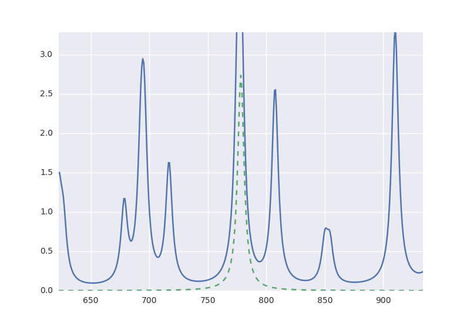

| Atom # | Element | Sum of vibrational eigenvalues |
|--------|---------|--------------------------------|
| 22 | 1 | 0.6191122676865644 |
| 19 | 1 | 0.3762977544445356 |
| 8 | 1 | 0.06403124237432849 |
| 30 | 1 | 0.05196152422706632 |
| 21 | 8 | 0.048989794855663564 |
| 33 | 1 | 0.042426406871192854 |
| 31 | 1 | 0.042426406871192854 |
| 18 | 8 | 0.034641016151377546 |
| 32 | 1 | 0.03 |
| 12 | 6 | 0.03 |
| 44 | 1 | 0.017320508075688773 |
| 39 | 1 | 0.017320508075688773 |
| 20 | 6 | 0.017320508075688773 |
| 14 | 6 | 0.017320508075688773 |
| 29 | 8 | 0.01414213562373095 |
| 17 | 6 | 0.01414213562373095 |
| 15 | 8 | 0.01414213562373095 |
| 11 | 1 | 0.01414213562373095 |
| 6 | 6 | 0.01414213562373095 |
| 45 | 1 | 0.01 |
| 40 | 1 | 0.01 |
| 34 | 1 | 0.01 |
| 28 | 6 | 0.01 |
| 13 | 8 | 0.01 |

## Peak #47: 807.4822 1/cm   
Raman activity: 2.488  
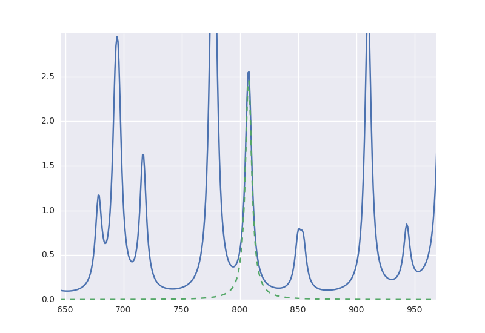

| Atom # | Element | Sum of vibrational eigenvalues |
|--------|---------|--------------------------------|
| 8 | 1 | 0.8964373932405989 |
| 25 | 1 | 0.099498743710662 |
| 37 | 1 | 0.06403124237432849 |
| 7 | 8 | 0.06403124237432849 |
| 44 | 1 | 0.048989794855663564 |
| 35 | 1 | 0.048989794855663564 |
| 36 | 1 | 0.042426406871192854 |
| 19 | 1 | 0.042426406871192854 |
| 34 | 1 | 0.0412310562561766 |
| 45 | 1 | 0.034641016151377546 |
| 23 | 6 | 0.03 |
| 14 | 6 | 0.03 |
| 41 | 1 | 0.017320508075688773 |
| 33 | 1 | 0.017320508075688773 |
| 22 | 1 | 0.017320508075688773 |
| 32 | 1 | 0.01414213562373095 |
| 27 | 8 | 0.01414213562373095 |
| 15 | 8 | 0.01414213562373095 |
| 13 | 8 | 0.01414213562373095 |
| 6 | 6 | 0.01414213562373095 |
| 42 | 1 | 0.01 |
| 40 | 1 | 0.01 |
| 39 | 1 | 0.01 |
| 31 | 1 | 0.01 |
| 26 | 6 | 0.01 |
| 24 | 8 | 0.01 |
| 16 | 6 | 0.01 |

## Peak #48: 850.0719 1/cm   
Raman activity: 0.5276  

| Atom # | Element | Sum of vibrational eigenvalues |
|--------|---------|--------------------------------|
| 39 | 1 | 0.4809365862564419 |
| 40 | 1 | 0.39799497484264795 |
| 42 | 1 | 0.3934463114581201 |
| 41 | 1 | 0.35832945734337834 |
| 11 | 1 | 0.24372115213907883 |
| 9 | 6 | 0.23108440016582688 |
| 38 | 1 | 0.14177446878757827 |
| 43 | 1 | 0.11 |
| 2 | 6 | 0.09797958971132713 |
| 5 | 1 | 0.09000000000000001 |
| 3 | 6 | 0.08660254037844388 |
| 8 | 1 | 0.05830951894845301 |
| 13 | 8 | 0.05744562646538029 |
| 10 | 8 | 0.04690415759823429 |
| 44 | 1 | 0.042426406871192854 |
| 6 | 6 | 0.042426406871192854 |
| 45 | 1 | 0.0412310562561766 |
| 14 | 6 | 0.0412310562561766 |
| 12 | 6 | 0.0282842712474619 |
| 37 | 1 | 0.024494897427831782 |
| 34 | 1 | 0.024494897427831782 |
| 7 | 8 | 0.024494897427831782 |
| 1 | 8 | 0.024494897427831782 |
| 36 | 1 | 0.02 |
| 35 | 1 | 0.02 |
| 19 | 1 | 0.02 |
| 23 | 6 | 0.017320508075688773 |
| 4 | 8 | 0.017320508075688773 |
| 25 | 1 | 0.01414213562373095 |
| 15 | 8 | 0.01 |

## Peak #49: 854.4006 1/cm   
Raman activity: 0.4864  
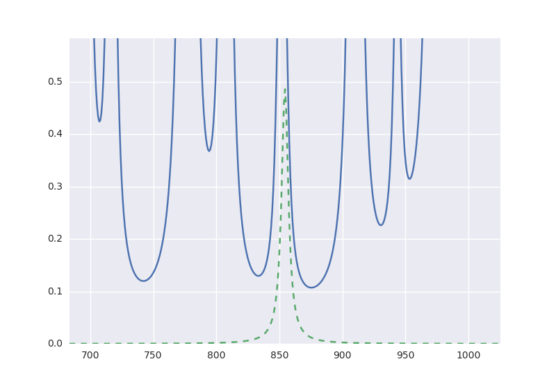

| Atom # | Element | Sum of vibrational eigenvalues |
|--------|---------|--------------------------------|
| 37 | 1 | 0.4702127178203499 |
| 34 | 1 | 0.4221374183841087 |
| 36 | 1 | 0.40890096600521747 |
| 35 | 1 | 0.40074929819027755 |
| 23 | 6 | 0.23685438564654024 |
| 25 | 1 | 0.22715633383201095 |
| 8 | 1 | 0.1407124727947029 |
| 16 | 6 | 0.11090536506409418 |
| 33 | 1 | 0.11 |
| 14 | 6 | 0.06 |
| 17 | 6 | 0.05830951894845301 |
| 22 | 1 | 0.057445626465380296 |
| 45 | 1 | 0.05744562646538029 |
| 31 | 1 | 0.048989794855663564 |
| 24 | 8 | 0.04690415759823429 |
| 6 | 6 | 0.04358898943540673 |
| 39 | 1 | 0.034641016151377546 |
| 42 | 1 | 0.033166247903554 |
| 41 | 1 | 0.033166247903554 |
| 28 | 6 | 0.033166247903554 |
| 44 | 1 | 0.03 |
| 43 | 1 | 0.03 |
| 27 | 8 | 0.03 |
| 19 | 1 | 0.03 |
| 15 | 8 | 0.03 |
| 26 | 6 | 0.0282842712474619 |
| 20 | 6 | 0.0282842712474619 |
| 40 | 1 | 0.024494897427831782 |
| 30 | 1 | 0.017320508075688773 |
| 21 | 8 | 0.017320508075688773 |
| 18 | 8 | 0.017320508075688773 |
| 9 | 6 | 0.017320508075688773 |
| 4 | 8 | 0.017320508075688773 |
| 3 | 6 | 0.017320508075688773 |
| 12 | 6 | 0.01414213562373095 |
| 11 | 1 | 0.01414213562373095 |
| 5 | 1 | 0.01414213562373095 |
| 32 | 1 | 0.01 |
| 29 | 8 | 0.01 |
| 7 | 8 | 0.01 |
| 2 | 6 | 0.01 |

## Peak #50: 910.1591 1/cm   
Raman activity: 3.264  
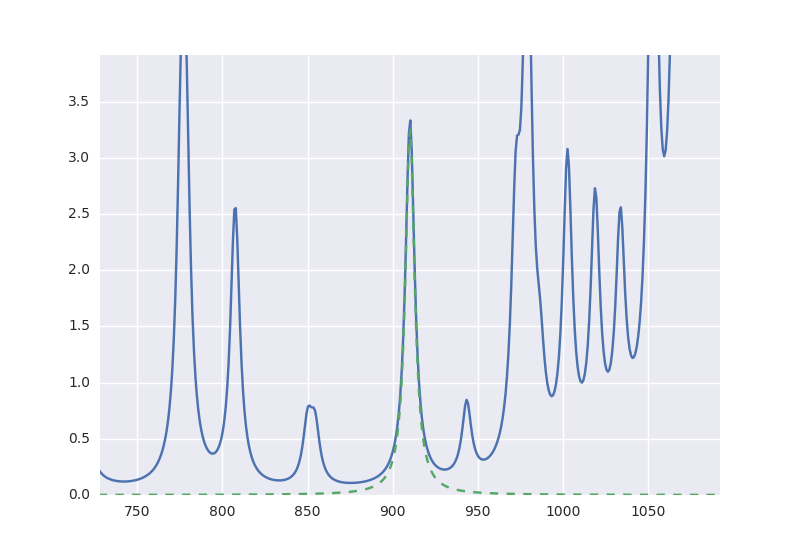

| Atom # | Element | Sum of vibrational eigenvalues |
|--------|---------|--------------------------------|
| 14 | 6 | 0.4988987873306569 |
| 44 | 1 | 0.3277193921634788 |
| 45 | 1 | 0.28053520278211075 |
| 28 | 6 | 0.24879710609249459 |
| 19 | 1 | 0.23388031127053 |
| 41 | 1 | 0.22825424421026658 |
| 8 | 1 | 0.2264950330581225 |
| 31 | 1 | 0.19339079605813717 |
| 4 | 8 | 0.1849324200890693 |
| 15 | 8 | 0.1835755975068582 |
| 43 | 1 | 0.17972200755611428 |
| 16 | 6 | 0.17233687939614084 |
| 6 | 6 | 0.16340134638368192 |
| 3 | 6 | 0.15524174696260024 |
| 33 | 1 | 0.13856406460551018 |
| 5 | 1 | 0.13674794331177342 |
| 30 | 1 | 0.12767145334803703 |
| 17 | 6 | 0.12369316876852982 |
| 35 | 1 | 0.11575836902790226 |
| 38 | 1 | 0.11357816691600547 |
| 13 | 8 | 0.09797958971132713 |
| 39 | 1 | 0.09433981132056603 |
| 26 | 6 | 0.09380831519646858 |
| 12 | 6 | 0.09380831519646858 |
| 27 | 8 | 0.09055385138137417 |
| 29 | 8 | 0.08717797887081347 |
| 22 | 1 | 0.08124038404635961 |
| 42 | 1 | 0.07348469228349534 |
| 36 | 1 | 0.07 |
| 2 | 6 | 0.066332495807108 |
| 21 | 8 | 0.06403124237432849 |
| 34 | 1 | 0.057445626465380296 |
| 10 | 8 | 0.04690415759823429 |
| 24 | 8 | 0.04358898943540673 |
| 23 | 6 | 0.04358898943540673 |
| 1 | 8 | 0.04358898943540673 |
| 37 | 1 | 0.0412310562561766 |
| 32 | 1 | 0.0412310562561766 |
| 11 | 1 | 0.034641016151377546 |
| 20 | 6 | 0.033166247903554 |
| 25 | 1 | 0.03 |
| 9 | 6 | 0.0282842712474619 |
| 40 | 1 | 0.024494897427831782 |
| 18 | 8 | 0.017320508075688773 |
| 7 | 8 | 0.017320508075688773 |

## Peak #51: 943.465 1/cm   
Raman activity: 0.6708  
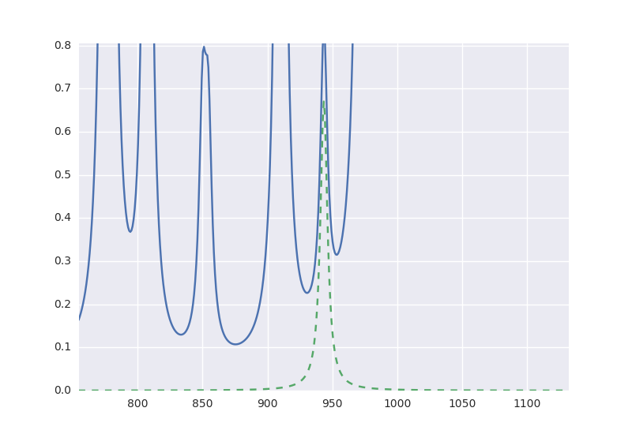

| Atom # | Element | Sum of vibrational eigenvalues |
|--------|---------|--------------------------------|
| 28 | 6 | 0.4579301256742125 |
| 31 | 1 | 0.38392707640904933 |
| 32 | 1 | 0.37107950630558945 |
| 35 | 1 | 0.2968164415931166 |
| 14 | 6 | 0.21610182784974308 |
| 37 | 1 | 0.212602916254693 |
| 26 | 6 | 0.17972200755611428 |
| 18 | 8 | 0.17320508075688776 |
| 29 | 8 | 0.15684387141358122 |
| 30 | 1 | 0.15362291495737218 |
| 17 | 6 | 0.150996688705415 |
| 45 | 1 | 0.15066519173319362 |
| 34 | 1 | 0.15066519173319362 |
| 27 | 8 | 0.14696938456699069 |
| 19 | 1 | 0.14177446878757827 |
| 15 | 8 | 0.14177446878757827 |
| 22 | 1 | 0.1307669683062202 |
| 41 | 1 | 0.12369316876852982 |
| 39 | 1 | 0.11489125293076059 |
| 12 | 6 | 0.10392304845413264 |
| 25 | 1 | 0.08660254037844388 |
| 24 | 8 | 0.08660254037844388 |
| 3 | 6 | 0.08124038404635961 |
| 38 | 1 | 0.07141428428542851 |
| 33 | 1 | 0.07071067811865477 |
| 42 | 1 | 0.07 |
| 13 | 8 | 0.07 |
| 4 | 8 | 0.06928203230275509 |
| 11 | 1 | 0.06403124237432849 |
| 10 | 8 | 0.06403124237432849 |
| 23 | 6 | 0.06 |
| 16 | 6 | 0.06 |
| 9 | 6 | 0.05744562646538029 |
| 8 | 1 | 0.05744562646538029 |
| 44 | 1 | 0.048989794855663564 |
| 20 | 6 | 0.04690415759823429 |
| 5 | 1 | 0.04358898943540673 |
| 6 | 6 | 0.042426406871192854 |
| 43 | 1 | 0.03 |
| 36 | 1 | 0.03 |
| 21 | 8 | 0.03 |
| 2 | 6 | 0.03 |
| 40 | 1 | 0.024494897427831782 |
| 7 | 8 | 0.02 |
| 1 | 8 | 0.01414213562373095 |

## Peak #52: 972.3639 1/cm   
Raman activity: 2.0125  
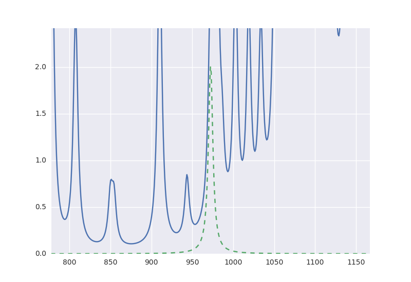

| Atom # | Element | Sum of vibrational eigenvalues |
|--------|---------|--------------------------------|
| 5 | 1 | 0.3189043743820395 |
| 32 | 1 | 0.27331300737432895 |
| 3 | 6 | 0.2473863375370596 |
| 14 | 6 | 0.23 |
| 12 | 6 | 0.2264950330581225 |
| 33 | 1 | 0.21748563170931548 |
| 2 | 6 | 0.21307275752662516 |
| 6 | 6 | 0.2080865204668481 |
| 38 | 1 | 0.20049937655763422 |
| 42 | 1 | 0.19595917942265426 |
| 8 | 1 | 0.18867962264113206 |
| 9 | 6 | 0.1881488772222678 |
| 7 | 8 | 0.1841195263952197 |
| 16 | 6 | 0.18384776310850237 |
| 1 | 8 | 0.1769180601295413 |
| 35 | 1 | 0.16970562748477142 |
| 45 | 1 | 0.16822603841260722 |
| 10 | 8 | 0.157797338380595 |
| 41 | 1 | 0.15684387141358122 |
| 43 | 1 | 0.15588457268119896 |
| 31 | 1 | 0.1407124727947029 |
| 13 | 8 | 0.1392838827718412 |
| 17 | 6 | 0.13341664064126332 |
| 39 | 1 | 0.13304134695650072 |
| 28 | 6 | 0.13304134695650072 |
| 11 | 1 | 0.12806248474865697 |
| 21 | 8 | 0.09797958971132713 |
| 20 | 6 | 0.09273618495495704 |
| 44 | 1 | 0.09000000000000001 |
| 19 | 1 | 0.07681145747868609 |
| 34 | 1 | 0.07549834435270751 |
| 40 | 1 | 0.07141428428542851 |
| 15 | 8 | 0.07071067811865477 |
| 27 | 8 | 0.06403124237432849 |
| 18 | 8 | 0.06 |
| 22 | 1 | 0.057445626465380296 |
| 29 | 8 | 0.05744562646538029 |
| 25 | 1 | 0.04358898943540673 |
| 36 | 1 | 0.033166247903554 |
| 30 | 1 | 0.033166247903554 |
| 26 | 6 | 0.033166247903554 |
| 24 | 8 | 0.03 |
| 23 | 6 | 0.0282842712474619 |
| 37 | 1 | 0.024494897427831782 |
| 4 | 8 | 0.01414213562373095 |

## Peak #53: 978.9826 1/cm   
Raman activity: 4.3148  
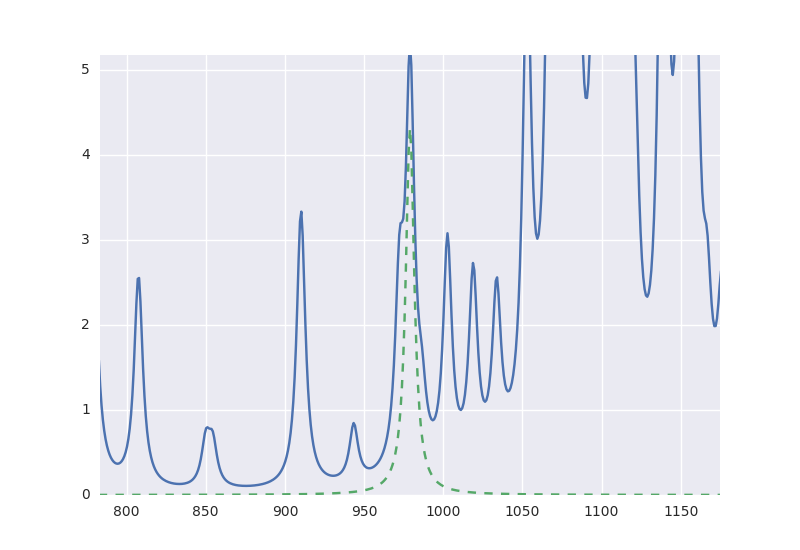

| Atom # | Element | Sum of vibrational eigenvalues |
|--------|---------|--------------------------------|
| 30 | 1 | 0.38652296180175383 |
| 20 | 6 | 0.26608269391300143 |
| 33 | 1 | 0.2437211521390788 |
| 26 | 6 | 0.24248711305964282 |
| 22 | 1 | 0.20223748416156684 |
| 37 | 1 | 0.19672315572906005 |
| 29 | 8 | 0.1841195263952197 |
| 31 | 1 | 0.16673332000533067 |
| 28 | 6 | 0.15588457268119896 |
| 42 | 1 | 0.15099668870541502 |
| 17 | 6 | 0.14798648586948743 |
| 18 | 8 | 0.1452583904633395 |
| 32 | 1 | 0.1407124727947029 |
| 23 | 6 | 0.13341664064126332 |
| 24 | 8 | 0.12806248474865697 |
| 25 | 1 | 0.11575836902790226 |
| 44 | 1 | 0.10677078252031312 |
| 5 | 1 | 0.1063014581273465 |
| 27 | 8 | 0.10392304845413264 |
| 39 | 1 | 0.099498743710662 |
| 43 | 1 | 0.08660254037844388 |
| 45 | 1 | 0.08485281374238571 |
| 19 | 1 | 0.08124038404635961 |
| 2 | 6 | 0.07681145747868609 |
| 1 | 8 | 0.07348469228349536 |
| 8 | 1 | 0.07141428428542851 |
| 3 | 6 | 0.066332495807108 |
| 12 | 6 | 0.06403124237432849 |
| 21 | 8 | 0.06 |
| 35 | 1 | 0.05196152422706632 |
| 11 | 1 | 0.04690415759823429 |
| 16 | 6 | 0.04358898943540673 |
| 41 | 1 | 0.042426406871192854 |
| 7 | 8 | 0.0412310562561766 |
| 38 | 1 | 0.034641016151377546 |
| 14 | 6 | 0.033166247903554 |
| 6 | 6 | 0.033166247903554 |
| 40 | 1 | 0.03 |
| 36 | 1 | 0.03 |
| 10 | 8 | 0.03 |
| 9 | 6 | 0.0282842712474619 |
| 13 | 8 | 0.024494897427831782 |
| 34 | 1 | 0.017320508075688773 |
| 15 | 8 | 0.017320508075688773 |
| 4 | 8 | 0.017320508075688773 |

## Peak #54: 980.1232 1/cm   
Raman activity: 0.3567  
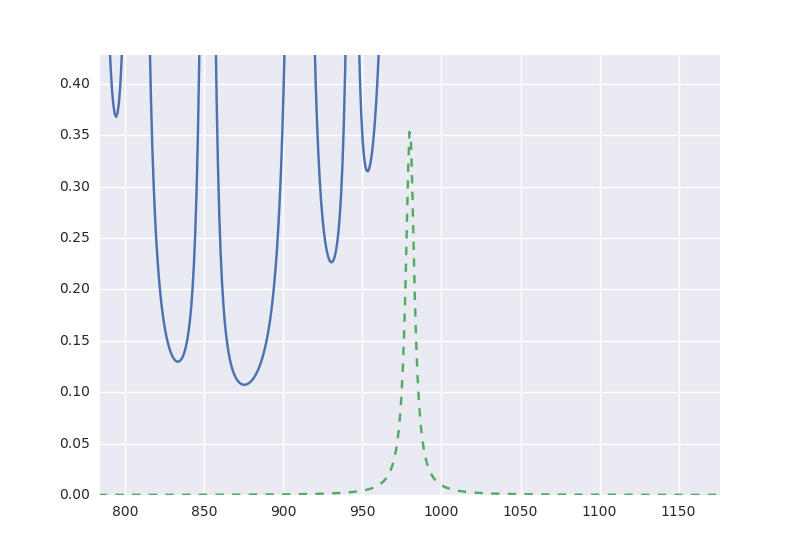

| Atom # | Element | Sum of vibrational eigenvalues |
|--------|---------|--------------------------------|
| 44 | 1 | 0.51 |
| 42 | 1 | 0.431161222746202 |
| 43 | 1 | 0.3003331483536242 |
| 39 | 1 | 0.2609597670139978 |
| 5 | 1 | 0.23853720883753127 |
| 2 | 6 | 0.21236760581595301 |
| 3 | 6 | 0.21000000000000002 |
| 1 | 8 | 0.20199009876724155 |
| 12 | 6 | 0.18 |
| 38 | 1 | 0.17435595774162693 |
| 45 | 1 | 0.16970562748477142 |
| 6 | 6 | 0.15588457268119896 |
| 35 | 1 | 0.15033296378372907 |
| 37 | 1 | 0.13379088160259653 |
| 7 | 8 | 0.1236931687685298 |
| 41 | 1 | 0.12 |
| 40 | 1 | 0.10099504938362078 |
| 14 | 6 | 0.10099504938362078 |
| 13 | 8 | 0.09273618495495704 |
| 26 | 6 | 0.08660254037844388 |
| 30 | 1 | 0.08544003745317531 |
| 10 | 8 | 0.08124038404635961 |
| 34 | 1 | 0.07348469228349536 |
| 4 | 8 | 0.06928203230275509 |
| 9 | 6 | 0.06557438524302 |
| 25 | 1 | 0.06403124237432849 |
| 16 | 6 | 0.06 |
| 20 | 6 | 0.057445626465380296 |
| 32 | 1 | 0.0565685424949238 |
| 24 | 8 | 0.05196152422706632 |
| 17 | 6 | 0.05196152422706632 |
| 31 | 1 | 0.05 |
| 28 | 6 | 0.05 |
| 22 | 1 | 0.048989794855663564 |
| 23 | 6 | 0.04690415759823429 |
| 19 | 1 | 0.04690415759823429 |
| 21 | 8 | 0.042426406871192854 |
| 8 | 1 | 0.033166247903554 |
| 29 | 8 | 0.0282842712474619 |
| 15 | 8 | 0.0282842712474619 |
| 33 | 1 | 0.02 |
| 27 | 8 | 0.02 |
| 11 | 1 | 0.02 |
| 18 | 8 | 0.017320508075688773 |

## Peak #55: 986.4872 1/cm   
Raman activity: 0.6253  
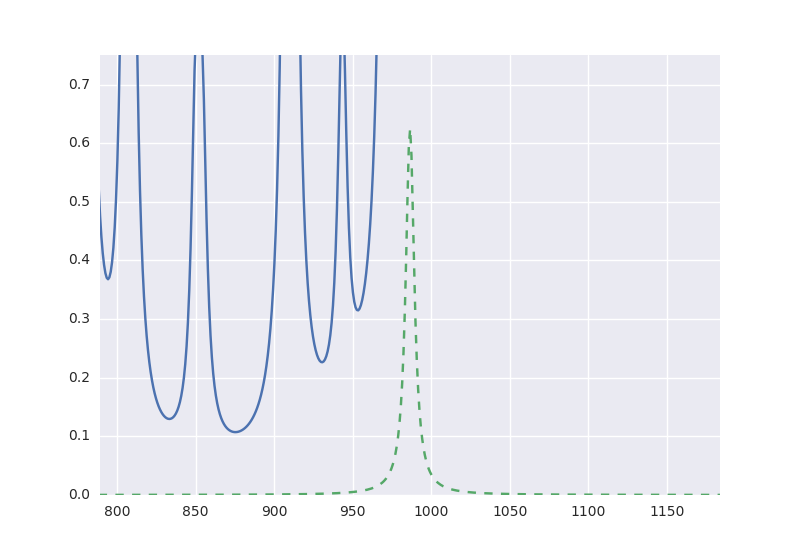

| Atom # | Element | Sum of vibrational eigenvalues |
|--------|---------|--------------------------------|
| 15 | 8 | 0.38820097887563343 |
| 33 | 1 | 0.33734255586865997 |
| 32 | 1 | 0.3327160951922825 |
| 17 | 6 | 0.28583211855912904 |
| 16 | 6 | 0.28442925306655786 |
| 34 | 1 | 0.27331300737432895 |
| 12 | 6 | 0.25337718918639857 |
| 20 | 6 | 0.21610182784974308 |
| 44 | 1 | 0.19672315572906005 |
| 21 | 8 | 0.19672315572906002 |
| 19 | 1 | 0.19339079605813717 |
| 13 | 8 | 0.17088007490635063 |
| 6 | 6 | 0.1649242250247064 |
| 42 | 1 | 0.15556349186104046 |
| 9 | 6 | 0.13304134695650072 |
| 30 | 1 | 0.12884098726725124 |
| 3 | 6 | 0.12727922061357855 |
| 38 | 1 | 0.12369316876852982 |
| 37 | 1 | 0.12369316876852982 |
| 36 | 1 | 0.11661903789690602 |
| 31 | 1 | 0.11489125293076058 |
| 23 | 6 | 0.11357816691600547 |
| 5 | 1 | 0.10392304845413264 |
| 25 | 1 | 0.10099504938362078 |
| 8 | 1 | 0.09848857801796104 |
| 35 | 1 | 0.09797958971132713 |
| 10 | 8 | 0.09380831519646858 |
| 4 | 8 | 0.08660254037844388 |
| 22 | 1 | 0.08 |
| 14 | 6 | 0.07681145747868609 |
| 45 | 1 | 0.06928203230275509 |
| 39 | 1 | 0.06164414002968976 |
| 7 | 8 | 0.06164414002968976 |
| 18 | 8 | 0.06 |
| 26 | 6 | 0.057445626465380296 |
| 43 | 1 | 0.048989794855663564 |
| 11 | 1 | 0.04690415759823429 |
| 29 | 8 | 0.04358898943540673 |
| 24 | 8 | 0.04358898943540673 |
| 2 | 6 | 0.042426406871192854 |
| 27 | 8 | 0.034641016151377546 |
| 28 | 6 | 0.033166247903554 |
| 40 | 1 | 0.03 |
| 1 | 8 | 0.02 |
| 41 | 1 | 0.01414213562373095 |

## Peak #56: 1002.6739 1/cm   
Raman activity: 2.6782  
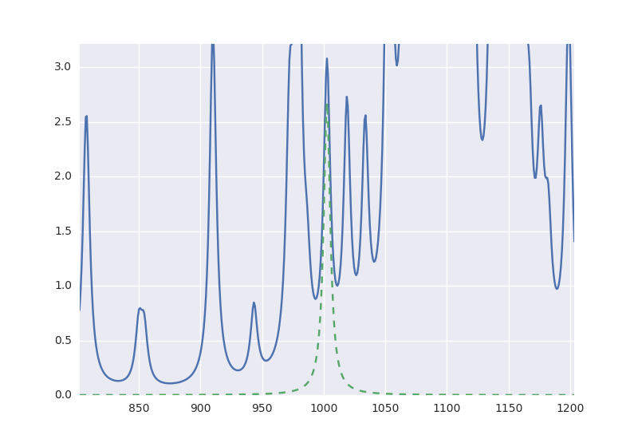

| Atom # | Element | Sum of vibrational eigenvalues |
|--------|---------|--------------------------------|
| 45 | 1 | 0.38379682124790976 |
| 11 | 1 | 0.378549864614954 |
| 3 | 6 | 0.35818989377144633 |
| 14 | 6 | 0.31559467676119 |
| 38 | 1 | 0.27037011669191546 |
| 4 | 8 | 0.2598076211353316 |
| 2 | 6 | 0.21213203435596428 |
| 39 | 1 | 0.196468827043885 |
| 9 | 6 | 0.1835755975068582 |
| 13 | 8 | 0.18193405398660253 |
| 43 | 1 | 0.18 |
| 17 | 6 | 0.18 |
| 8 | 1 | 0.17233687939614087 |
| 6 | 6 | 0.17233687939614084 |
| 25 | 1 | 0.16340134638368192 |
| 33 | 1 | 0.16248076809271922 |
| 37 | 1 | 0.1445683229480096 |
| 40 | 1 | 0.1392838827718412 |
| 12 | 6 | 0.1392838827718412 |
| 31 | 1 | 0.1307669683062202 |
| 18 | 8 | 0.12124355652982141 |
| 28 | 6 | 0.11489125293076058 |
| 44 | 1 | 0.11357816691600547 |
| 5 | 1 | 0.11357816691600547 |
| 16 | 6 | 0.10392304845413264 |
| 19 | 1 | 0.09949874371066199 |
| 15 | 8 | 0.09899494936611666 |
| 41 | 1 | 0.09055385138137417 |
| 10 | 8 | 0.09 |
| 35 | 1 | 0.08660254037844388 |
| 26 | 6 | 0.0824621125123532 |
| 34 | 1 | 0.0754983443527075 |
| 23 | 6 | 0.06 |
| 42 | 1 | 0.05830951894845301 |
| 27 | 8 | 0.05830951894845301 |
| 24 | 8 | 0.04690415759823429 |
| 1 | 8 | 0.04690415759823429 |
| 32 | 1 | 0.042426406871192854 |
| 29 | 8 | 0.042426406871192854 |
| 36 | 1 | 0.0412310562561766 |
| 7 | 8 | 0.033166247903554 |
| 30 | 1 | 0.03 |
| 20 | 6 | 0.0282842712474619 |
| 22 | 1 | 0.024494897427831782 |
| 21 | 8 | 0.017320508075688773 |

## Peak #57: 1018.9049 1/cm   
Raman activity: 2.2525  
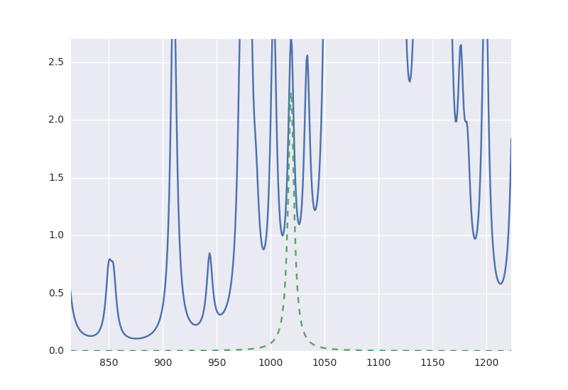

| Atom # | Element | Sum of vibrational eigenvalues |
|--------|---------|--------------------------------|
| 25 | 1 | 0.360416425818802 |
| 33 | 1 | 0.3466987164671943 |
| 31 | 1 | 0.32542280190545964 |
| 17 | 6 | 0.30066592756745814 |
| 28 | 6 | 0.2833725463060951 |
| 18 | 8 | 0.24248711305964282 |
| 34 | 1 | 0.2080865204668481 |
| 37 | 1 | 0.20784609690826528 |
| 32 | 1 | 0.19209372712298547 |
| 16 | 6 | 0.19 |
| 19 | 1 | 0.18761663039293716 |
| 14 | 6 | 0.1835755975068582 |
| 11 | 1 | 0.1606237840420901 |
| 23 | 6 | 0.157797338380595 |
| 30 | 1 | 0.15684387141358122 |
| 45 | 1 | 0.15588457268119896 |
| 22 | 1 | 0.15264337522473748 |
| 20 | 6 | 0.15000000000000002 |
| 27 | 8 | 0.14798648586948743 |
| 43 | 1 | 0.1452583904633395 |
| 8 | 1 | 0.13379088160259653 |
| 44 | 1 | 0.13341664064126332 |
| 36 | 1 | 0.13114877048604 |
| 39 | 1 | 0.12806248474865697 |
| 3 | 6 | 0.12124355652982141 |
| 26 | 6 | 0.11090536506409417 |
| 42 | 1 | 0.09055385138137417 |
| 2 | 6 | 0.08 |
| 4 | 8 | 0.0754983443527075 |
| 24 | 8 | 0.07348469228349536 |
| 35 | 1 | 0.07348469228349534 |
| 15 | 8 | 0.06928203230275509 |
| 5 | 1 | 0.06928203230275509 |
| 13 | 8 | 0.066332495807108 |
| 9 | 6 | 0.06403124237432849 |
| 29 | 8 | 0.05744562646538029 |
| 41 | 1 | 0.05 |
| 6 | 6 | 0.04690415759823429 |
| 12 | 6 | 0.042426406871192854 |
| 40 | 1 | 0.033166247903554 |
| 21 | 8 | 0.03 |
| 10 | 8 | 0.03 |
| 7 | 8 | 0.02 |
| 38 | 1 | 0.01414213562373095 |
| 1 | 8 | 0.01 |

## Peak #58: 1033.6893 1/cm   
Raman activity: 1.9587  
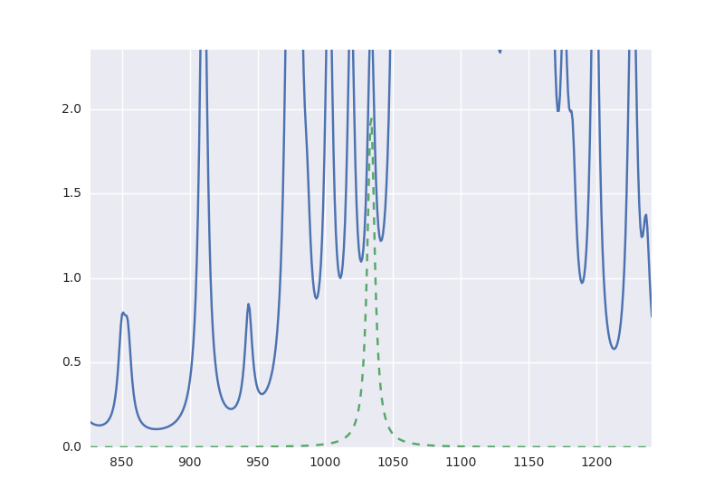

| Atom # | Element | Sum of vibrational eigenvalues |
|--------|---------|--------------------------------|
| 13 | 8 | 0.30724582991474436 |
| 12 | 6 | 0.2976575213227443 |
| 30 | 1 | 0.27037011669191546 |
| 31 | 1 | 0.2609597670139978 |
| 42 | 1 | 0.23685438564654024 |
| 27 | 8 | 0.23685438564654024 |
| 11 | 1 | 0.22825424421026658 |
| 43 | 1 | 0.22516660498395408 |
| 34 | 1 | 0.22045407685048604 |
| 44 | 1 | 0.21794494717703367 |
| 19 | 1 | 0.20445048300260873 |
| 26 | 6 | 0.20199009876724155 |
| 38 | 1 | 0.19339079605813717 |
| 39 | 1 | 0.17435595774162693 |
| 2 | 6 | 0.16186414056238646 |
| 45 | 1 | 0.15264337522473748 |
| 16 | 6 | 0.14456832294800961 |
| 33 | 1 | 0.12884098726725124 |
| 17 | 6 | 0.11661903789690602 |
| 20 | 6 | 0.11357816691600547 |
| 14 | 6 | 0.1 |
| 41 | 1 | 0.099498743710662 |
| 6 | 6 | 0.099498743710662 |
| 35 | 1 | 0.09848857801796104 |
| 9 | 6 | 0.09055385138137417 |
| 22 | 1 | 0.08 |
| 29 | 8 | 0.07681145747868609 |
| 23 | 6 | 0.0754983443527075 |
| 21 | 8 | 0.0754983443527075 |
| 5 | 1 | 0.07348469228349534 |
| 25 | 1 | 0.07141428428542851 |
| 1 | 8 | 0.05744562646538029 |
| 3 | 6 | 0.05196152422706632 |
| 28 | 6 | 0.04690415759823429 |
| 24 | 8 | 0.04690415759823429 |
| 10 | 8 | 0.04690415759823429 |
| 37 | 1 | 0.042426406871192854 |
| 4 | 8 | 0.033166247903554 |
| 15 | 8 | 0.03 |
| 8 | 1 | 0.03 |
| 7 | 8 | 0.03 |
| 40 | 1 | 0.024494897427831782 |
| 18 | 8 | 0.02 |
| 32 | 1 | 0.017320508075688773 |
| 36 | 1 | 0.01 |

## Peak #59: 1052.8917 1/cm   
Raman activity: 5.4463  
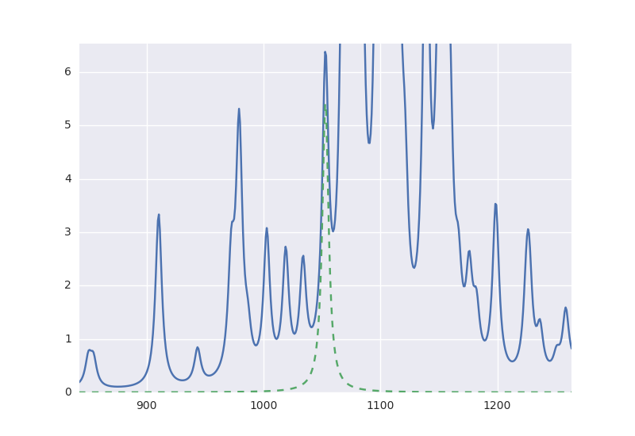

| Atom # | Element | Sum of vibrational eigenvalues |
|--------|---------|--------------------------------|
| 31 | 1 | 0.3690528417449187 |
| 32 | 1 | 0.3464101615137755 |
| 30 | 1 | 0.3277193921634788 |
| 26 | 6 | 0.24556058315617352 |
| 45 | 1 | 0.23043437243605827 |
| 27 | 8 | 0.23043437243605824 |
| 38 | 1 | 0.20420577856662137 |
| 13 | 8 | 0.19672315572906005 |
| 43 | 1 | 0.1854723699099141 |
| 23 | 6 | 0.17492855684535902 |
| 39 | 1 | 0.17233687939614084 |
| 12 | 6 | 0.16999999999999998 |
| 20 | 6 | 0.1655294535724685 |
| 11 | 1 | 0.1584297951775486 |
| 42 | 1 | 0.157797338380595 |
| 15 | 8 | 0.14177446878757827 |
| 24 | 8 | 0.12369316876852982 |
| 2 | 6 | 0.11661903789690602 |
| 37 | 1 | 0.10677078252031312 |
| 6 | 6 | 0.10677078252031312 |
| 44 | 1 | 0.10344080432788601 |
| 41 | 1 | 0.09273618495495704 |
| 8 | 1 | 0.09110433579144298 |
| 16 | 6 | 0.09000000000000001 |
| 33 | 1 | 0.08660254037844388 |
| 25 | 1 | 0.07681145747868609 |
| 28 | 6 | 0.07348469228349536 |
| 17 | 6 | 0.07348469228349536 |
| 19 | 1 | 0.07141428428542851 |
| 21 | 8 | 0.066332495807108 |
| 29 | 8 | 0.06403124237432849 |
| 14 | 6 | 0.057445626465380296 |
| 5 | 1 | 0.057445626465380296 |
| 22 | 1 | 0.04690415759823429 |
| 1 | 8 | 0.04358898943540673 |
| 9 | 6 | 0.042426406871192854 |
| 18 | 8 | 0.0412310562561766 |
| 35 | 1 | 0.04 |
| 7 | 8 | 0.03 |
| 3 | 6 | 0.03 |
| 36 | 1 | 0.024494897427831782 |
| 34 | 1 | 0.024494897427831782 |
| 40 | 1 | 0.017320508075688773 |
| 4 | 8 | 0.017320508075688773 |
| 10 | 8 | 0.01414213562373095 |

## Peak #60: 1068.0444 1/cm   
Raman activity: 7.126  
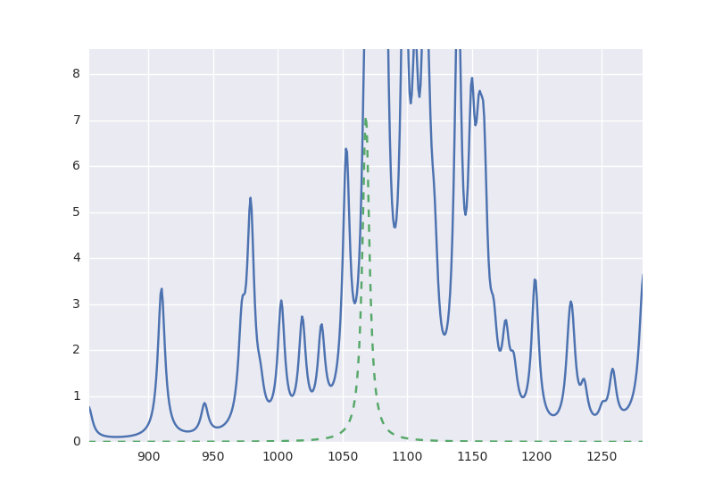

| Atom # | Element | Sum of vibrational eigenvalues |
|--------|---------|--------------------------------|
| 38 | 1 | 0.6554387843269576 |
| 42 | 1 | 0.29137604568666936 |
| 39 | 1 | 0.27331300737432895 |
| 31 | 1 | 0.2340939982143925 |
| 44 | 1 | 0.19672315572906005 |
| 43 | 1 | 0.19209372712298547 |
| 32 | 1 | 0.17492855684535902 |
| 5 | 1 | 0.17146428199482247 |
| 37 | 1 | 0.15684387141358122 |
| 45 | 1 | 0.15033296378372907 |
| 34 | 1 | 0.14798648586948743 |
| 6 | 6 | 0.14696938456699069 |
| 23 | 6 | 0.1407124727947029 |
| 25 | 1 | 0.12369316876852982 |
| 17 | 6 | 0.12 |
| 33 | 1 | 0.11445523142259598 |
| 36 | 1 | 0.10392304845413264 |
| 41 | 1 | 0.10099504938362078 |
| 30 | 1 | 0.099498743710662 |
| 27 | 8 | 0.099498743710662 |
| 26 | 6 | 0.099498743710662 |
| 24 | 8 | 0.09380831519646858 |
| 9 | 6 | 0.09273618495495704 |
| 16 | 6 | 0.08717797887081347 |
| 40 | 1 | 0.08544003745317531 |
| 8 | 1 | 0.08485281374238571 |
| 7 | 8 | 0.0818535277187245 |
| 10 | 8 | 0.08124038404635961 |
| 35 | 1 | 0.06928203230275509 |
| 20 | 6 | 0.066332495807108 |
| 3 | 6 | 0.066332495807108 |
| 18 | 8 | 0.06403124237432849 |
| 28 | 6 | 0.05830951894845301 |
| 12 | 6 | 0.0565685424949238 |
| 22 | 1 | 0.048989794855663564 |
| 1 | 8 | 0.04358898943540673 |
| 19 | 1 | 0.042426406871192854 |
| 11 | 1 | 0.0412310562561766 |
| 13 | 8 | 0.034641016151377546 |
| 2 | 6 | 0.03 |
| 21 | 8 | 0.024494897427831782 |
| 14 | 6 | 0.017320508075688773 |
| 29 | 8 | 0.01414213562373095 |
| 15 | 8 | 0.01 |
| 4 | 8 | 0.01 |

## Peak #61: 1072.8387 1/cm   
Raman activity: 3.919  
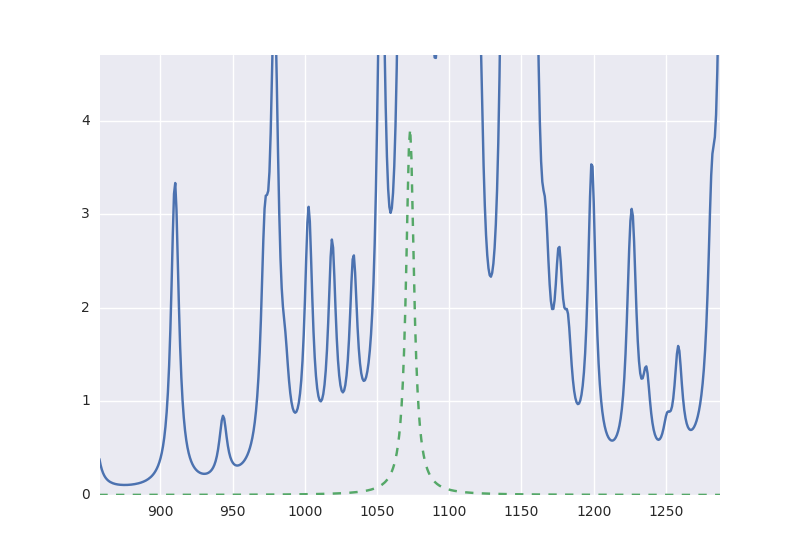

| Atom # | Element | Sum of vibrational eigenvalues |
|--------|---------|--------------------------------|
| 38 | 1 | 0.4394314508543966 |
| 43 | 1 | 0.2833725463060951 |
| 23 | 6 | 0.2833725463060951 |
| 36 | 1 | 0.2803569153775237 |
| 9 | 6 | 0.2437211521390788 |
| 34 | 1 | 0.24062418831031931 |
| 32 | 1 | 0.2211334438749598 |
| 16 | 6 | 0.2142428528562855 |
| 35 | 1 | 0.20688160865577201 |
| 26 | 6 | 0.20199009876724155 |
| 15 | 8 | 0.18493242008906932 |
| 33 | 1 | 0.1849324200890693 |
| 17 | 6 | 0.16999999999999998 |
| 25 | 1 | 0.16673332000533067 |
| 45 | 1 | 0.163707055437449 |
| 24 | 8 | 0.16340134638368192 |
| 20 | 6 | 0.16248076809271922 |
| 22 | 1 | 0.15684387141358122 |
| 10 | 8 | 0.15362291495737218 |
| 42 | 1 | 0.1407124727947029 |
| 41 | 1 | 0.12806248474865697 |
| 13 | 8 | 0.1236931687685298 |
| 37 | 1 | 0.12247448713915891 |
| 6 | 6 | 0.11489125293076059 |
| 21 | 8 | 0.11445523142259598 |
| 39 | 1 | 0.1131370849898476 |
| 2 | 6 | 0.10677078252031312 |
| 19 | 1 | 0.10099504938362078 |
| 31 | 1 | 0.09949874371066199 |
| 27 | 8 | 0.09848857801796104 |
| 44 | 1 | 0.08544003745317531 |
| 8 | 1 | 0.07549834435270751 |
| 14 | 6 | 0.06928203230275509 |
| 40 | 1 | 0.06403124237432849 |
| 12 | 6 | 0.06403124237432849 |
| 18 | 8 | 0.0412310562561766 |
| 28 | 6 | 0.033166247903554 |
| 11 | 1 | 0.033166247903554 |
| 7 | 8 | 0.03 |
| 1 | 8 | 0.03 |
| 30 | 1 | 0.0282842712474619 |
| 3 | 6 | 0.02 |
| 5 | 1 | 0.017320508075688773 |
| 29 | 8 | 0.01 |
| 4 | 8 | 0.01 |

## Peak #62: 1079.309 1/cm   
Raman activity: 13.6566  
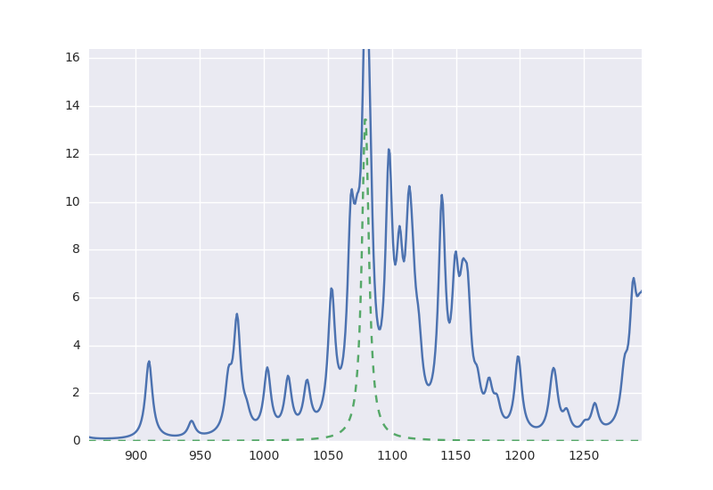

| Atom # | Element | Sum of vibrational eigenvalues |
|--------|---------|--------------------------------|
| 31 | 1 | 0.36769552621700474 |
| 38 | 1 | 0.31368774282716244 |
| 33 | 1 | 0.28879058156387305 |
| 44 | 1 | 0.265329983228432 |
| 32 | 1 | 0.24372115213907883 |
| 25 | 1 | 0.23173260452512934 |
| 37 | 1 | 0.2262741699796952 |
| 42 | 1 | 0.2195449840010015 |
| 6 | 6 | 0.1841195263952197 |
| 40 | 1 | 0.17233687939614084 |
| 34 | 1 | 0.1705872210923198 |
| 27 | 8 | 0.16673332000533067 |
| 2 | 6 | 0.16673332000533067 |
| 26 | 6 | 0.15684387141358122 |
| 39 | 1 | 0.15000000000000002 |
| 12 | 6 | 0.14456832294800961 |
| 45 | 1 | 0.1307669683062202 |
| 9 | 6 | 0.1307669683062202 |
| 35 | 1 | 0.12884098726725124 |
| 30 | 1 | 0.12884098726725124 |
| 22 | 1 | 0.12 |
| 19 | 1 | 0.11661903789690602 |
| 28 | 6 | 0.10392304845413264 |
| 1 | 8 | 0.10099504938362078 |
| 5 | 1 | 0.099498743710662 |
| 7 | 8 | 0.09949874371066199 |
| 3 | 6 | 0.09848857801796104 |
| 13 | 8 | 0.08485281374238571 |
| 17 | 6 | 0.0824621125123532 |
| 8 | 1 | 0.08124038404635961 |
| 41 | 1 | 0.0754983443527075 |
| 10 | 8 | 0.07348469228349536 |
| 16 | 6 | 0.07141428428542851 |
| 23 | 6 | 0.07071067811865477 |
| 36 | 1 | 0.06928203230275509 |
| 18 | 8 | 0.06403124237432849 |
| 24 | 8 | 0.06 |
| 11 | 1 | 0.06 |
| 21 | 8 | 0.048989794855663564 |
| 43 | 1 | 0.033166247903554 |
| 20 | 6 | 0.033166247903554 |
| 4 | 8 | 0.03 |
| 15 | 8 | 0.02 |
| 14 | 6 | 0.02 |
| 29 | 8 | 0.01414213562373095 |

## Peak #63: 1082.2722 1/cm   
Raman activity: 6.7455  
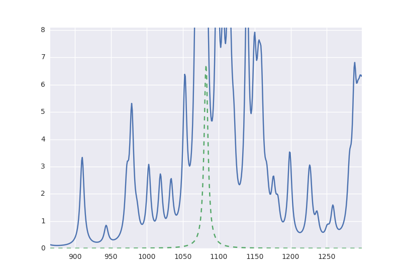

| Atom # | Element | Sum of vibrational eigenvalues |
|--------|---------|--------------------------------|
| 43 | 1 | 0.4918333050943175 |
| 38 | 1 | 0.3407345007480164 |
| 2 | 6 | 0.30773365106858236 |
| 9 | 6 | 0.29849623113198603 |
| 42 | 1 | 0.2803569153775238 |
| 31 | 1 | 0.2753179979587241 |
| 33 | 1 | 0.2628687885618983 |
| 40 | 1 | 0.19672315572906005 |
| 10 | 8 | 0.18 |
| 37 | 1 | 0.17435595774162693 |
| 12 | 6 | 0.17088007490635063 |
| 3 | 6 | 0.16340134638368192 |
| 32 | 1 | 0.1452583904633395 |
| 1 | 8 | 0.14282856857085702 |
| 41 | 1 | 0.14177446878757827 |
| 34 | 1 | 0.1407124727947029 |
| 16 | 6 | 0.13379088160259653 |
| 22 | 1 | 0.13304134695650072 |
| 13 | 8 | 0.1307669683062202 |
| 5 | 1 | 0.1307669683062202 |
| 20 | 6 | 0.10099504938362078 |
| 19 | 1 | 0.09949874371066199 |
| 36 | 1 | 0.08717797887081347 |
| 15 | 8 | 0.08544003745317531 |
| 8 | 1 | 0.08485281374238571 |
| 27 | 8 | 0.0824621125123532 |
| 45 | 1 | 0.0818535277187245 |
| 23 | 6 | 0.08124038404635961 |
| 6 | 6 | 0.08 |
| 21 | 8 | 0.07348469228349534 |
| 39 | 1 | 0.07141428428542851 |
| 30 | 1 | 0.07141428428542851 |
| 28 | 6 | 0.07141428428542851 |
| 25 | 1 | 0.07071067811865477 |
| 11 | 1 | 0.057445626465380296 |
| 7 | 8 | 0.057445626465380296 |
| 14 | 6 | 0.04690415759823429 |
| 44 | 1 | 0.04358898943540673 |
| 24 | 8 | 0.04358898943540673 |
| 17 | 6 | 0.0412310562561766 |
| 4 | 8 | 0.034641016151377546 |
| 18 | 8 | 0.03 |
| 35 | 1 | 0.017320508075688773 |
| 26 | 6 | 0.017320508075688773 |
| 29 | 8 | 0.01 |

## Peak #64: 1097.7484 1/cm   
Raman activity: 10.0386  
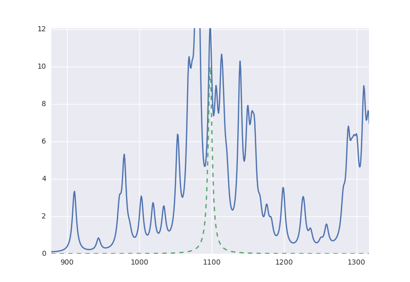

| Atom # | Element | Sum of vibrational eigenvalues |
|--------|---------|--------------------------------|
| 43 | 1 | 0.575065213693195 |
| 45 | 1 | 0.45 |
| 44 | 1 | 0.3682390527904394 |
| 42 | 1 | 0.33481338085566414 |
| 6 | 6 | 0.21000000000000002 |
| 5 | 1 | 0.20615528128088303 |
| 41 | 1 | 0.20445048300260873 |
| 39 | 1 | 0.198997487421324 |
| 14 | 6 | 0.19209372712298547 |
| 32 | 1 | 0.19052558883257653 |
| 33 | 1 | 0.18761663039293716 |
| 31 | 1 | 0.18 |
| 3 | 6 | 0.1606237840420901 |
| 20 | 6 | 0.15524174696260024 |
| 38 | 1 | 0.14177446878757827 |
| 2 | 6 | 0.1407124727947029 |
| 8 | 1 | 0.12328828005937952 |
| 35 | 1 | 0.11704699910719625 |
| 19 | 1 | 0.09000000000000001 |
| 23 | 6 | 0.07681145747868609 |
| 11 | 1 | 0.07681145747868609 |
| 9 | 6 | 0.07681145747868609 |
| 16 | 6 | 0.07348469228349536 |
| 21 | 8 | 0.07348469228349534 |
| 22 | 1 | 0.07141428428542851 |
| 28 | 6 | 0.066332495807108 |
| 13 | 8 | 0.06164414002968976 |
| 17 | 6 | 0.05744562646538029 |
| 37 | 1 | 0.048989794855663564 |
| 10 | 8 | 0.04690415759823429 |
| 4 | 8 | 0.04690415759823429 |
| 36 | 1 | 0.04358898943540673 |
| 30 | 1 | 0.04358898943540673 |
| 7 | 8 | 0.042426406871192854 |
| 40 | 1 | 0.034641016151377546 |
| 26 | 6 | 0.034641016151377546 |
| 12 | 6 | 0.034641016151377546 |
| 34 | 1 | 0.033166247903554 |
| 24 | 8 | 0.03 |
| 27 | 8 | 0.024494897427831782 |
| 18 | 8 | 0.024494897427831782 |
| 29 | 8 | 0.017320508075688773 |
| 25 | 1 | 0.017320508075688773 |
| 15 | 8 | 0.017320508075688773 |
| 1 | 8 | 0.017320508075688773 |

## Peak #65: 1106.0222 1/cm   
Raman activity: 5.4335  
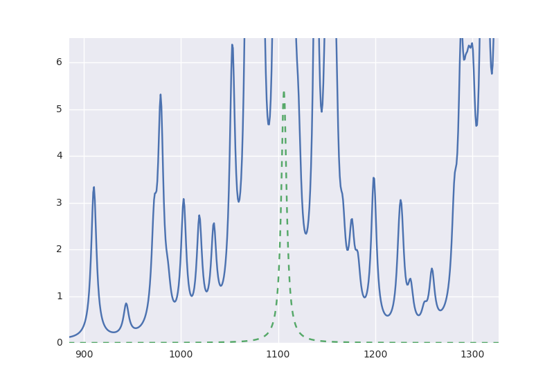

| Atom # | Element | Sum of vibrational eigenvalues |
|--------|---------|--------------------------------|
| 33 | 1 | 0.5028916384272063 |
| 32 | 1 | 0.40236799077461416 |
| 31 | 1 | 0.30528675044947495 |
| 43 | 1 | 0.29393876913398137 |
| 42 | 1 | 0.24166091947189142 |
| 20 | 6 | 0.220454076850486 |
| 23 | 6 | 0.19697715603592209 |
| 35 | 1 | 0.1881488772222678 |
| 19 | 1 | 0.17233687939614084 |
| 44 | 1 | 0.1705872210923198 |
| 45 | 1 | 0.16999999999999998 |
| 28 | 6 | 0.16583123951777 |
| 5 | 1 | 0.16340134638368192 |
| 36 | 1 | 0.16248076809271922 |
| 22 | 1 | 0.1407124727947029 |
| 30 | 1 | 0.12884098726725124 |
| 6 | 6 | 0.1236931687685298 |
| 24 | 8 | 0.12 |
| 17 | 6 | 0.11704699910719625 |
| 39 | 1 | 0.11489125293076058 |
| 16 | 6 | 0.10099504938362078 |
| 3 | 6 | 0.1 |
| 15 | 8 | 0.099498743710662 |
| 41 | 1 | 0.09949874371066199 |
| 27 | 8 | 0.09797958971132713 |
| 37 | 1 | 0.09055385138137417 |
| 21 | 8 | 0.09000000000000001 |
| 14 | 6 | 0.07681145747868609 |
| 38 | 1 | 0.07141428428542851 |
| 2 | 6 | 0.07 |
| 34 | 1 | 0.05744562646538029 |
| 29 | 8 | 0.04358898943540673 |
| 25 | 1 | 0.042426406871192854 |
| 7 | 8 | 0.042426406871192854 |
| 18 | 8 | 0.034641016151377546 |
| 12 | 6 | 0.034641016151377546 |
| 9 | 6 | 0.034641016151377546 |
| 8 | 1 | 0.033166247903554 |
| 40 | 1 | 0.03 |
| 13 | 8 | 0.03 |
| 10 | 8 | 0.03 |
| 4 | 8 | 0.03 |
| 26 | 6 | 0.02 |
| 11 | 1 | 0.017320508075688773 |
| 1 | 8 | 0.017320508075688773 |

## Peak #66: 1113.2987 1/cm   
Raman activity: 6.6733  
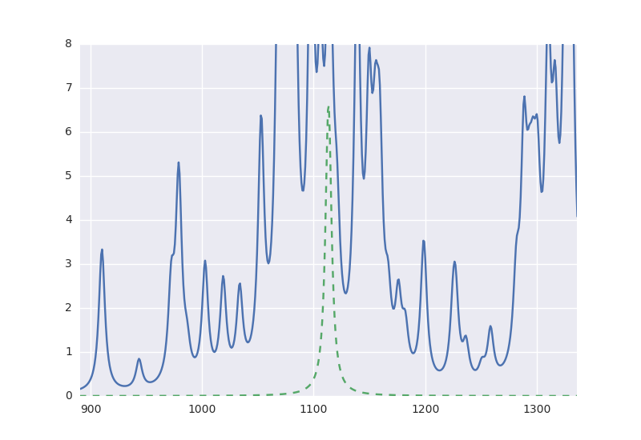

| Atom # | Element | Sum of vibrational eigenvalues |
|--------|---------|--------------------------------|
| 38 | 1 | 0.6261788881781307 |
| 32 | 1 | 0.41388404173149757 |
| 44 | 1 | 0.38301436004411116 |
| 41 | 1 | 0.37027017163147236 |
| 33 | 1 | 0.286705423736629 |
| 40 | 1 | 0.2640075756488817 |
| 2 | 6 | 0.20199009876724155 |
| 42 | 1 | 0.18493242008906927 |
| 12 | 6 | 0.17435595774162693 |
| 9 | 6 | 0.17088007490635063 |
| 31 | 1 | 0.16822603841260722 |
| 6 | 6 | 0.16186414056238646 |
| 11 | 1 | 0.1606237840420901 |
| 22 | 1 | 0.15684387141358122 |
| 20 | 6 | 0.14177446878757827 |
| 39 | 1 | 0.1407124727947029 |
| 3 | 6 | 0.1407124727947029 |
| 43 | 1 | 0.13674794331177345 |
| 45 | 1 | 0.12328828005937952 |
| 35 | 1 | 0.11 |
| 28 | 6 | 0.10677078252031312 |
| 8 | 1 | 0.10099504938362078 |
| 10 | 8 | 0.08717797887081347 |
| 1 | 8 | 0.08717797887081347 |
| 34 | 1 | 0.07141428428542851 |
| 30 | 1 | 0.07141428428542851 |
| 4 | 8 | 0.06928203230275509 |
| 7 | 8 | 0.066332495807108 |
| 19 | 1 | 0.057445626465380296 |
| 17 | 6 | 0.0565685424949238 |
| 27 | 8 | 0.048989794855663564 |
| 26 | 6 | 0.04690415759823429 |
| 37 | 1 | 0.04358898943540673 |
| 25 | 1 | 0.04358898943540673 |
| 36 | 1 | 0.034641016151377546 |
| 16 | 6 | 0.034641016151377546 |
| 21 | 8 | 0.033166247903554 |
| 5 | 1 | 0.033166247903554 |
| 13 | 8 | 0.03 |
| 14 | 6 | 0.0282842712474619 |
| 23 | 6 | 0.024494897427831782 |
| 18 | 8 | 0.017320508075688773 |
| 29 | 8 | 0.01414213562373095 |

## Peak #67: 1116.157 1/cm   
Raman activity: 2.8469  
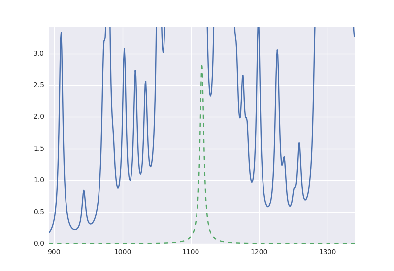

| Atom # | Element | Sum of vibrational eigenvalues |
|--------|---------|--------------------------------|
| 32 | 1 | 0.7078841713161836 |
| 33 | 1 | 0.5967411499134277 |
| 31 | 1 | 0.3290896534380867 |
| 22 | 1 | 0.29274562336608895 |
| 38 | 1 | 0.28442925306655786 |
| 20 | 6 | 0.2563201123595259 |
| 28 | 6 | 0.17492855684535902 |
| 41 | 1 | 0.17435595774162693 |
| 44 | 1 | 0.1469693845669907 |
| 40 | 1 | 0.1307669683062202 |
| 17 | 6 | 0.12727922061357855 |
| 19 | 1 | 0.11489125293076059 |
| 30 | 1 | 0.11357816691600547 |
| 2 | 6 | 0.10099504938362078 |
| 35 | 1 | 0.09273618495495704 |
| 9 | 6 | 0.08717797887081347 |
| 12 | 6 | 0.08544003745317531 |
| 45 | 1 | 0.07549834435270751 |
| 6 | 6 | 0.0754983443527075 |
| 11 | 1 | 0.07348469228349536 |
| 43 | 1 | 0.07141428428542851 |
| 34 | 1 | 0.07141428428542851 |
| 3 | 6 | 0.06928203230275509 |
| 42 | 1 | 0.066332495807108 |
| 39 | 1 | 0.06403124237432849 |
| 23 | 6 | 0.06403124237432849 |
| 27 | 8 | 0.06164414002968976 |
| 21 | 8 | 0.057445626465380296 |
| 37 | 1 | 0.05196152422706632 |
| 10 | 8 | 0.04358898943540673 |
| 1 | 8 | 0.04358898943540673 |
| 36 | 1 | 0.034641016151377546 |
| 4 | 8 | 0.034641016151377546 |
| 7 | 8 | 0.033166247903554 |
| 24 | 8 | 0.03 |
| 15 | 8 | 0.0282842712474619 |
| 18 | 8 | 0.024494897427831782 |
| 8 | 1 | 0.02 |
| 25 | 1 | 0.017320508075688773 |
| 16 | 6 | 0.017320508075688773 |
| 29 | 8 | 0.01414213562373095 |
| 14 | 6 | 0.01414213562373095 |
| 13 | 8 | 0.01414213562373095 |
| 5 | 1 | 0.01414213562373095 |
| 26 | 6 | 0.01 |

## Peak #68: 1120.8841 1/cm   
Raman activity: 2.3506  
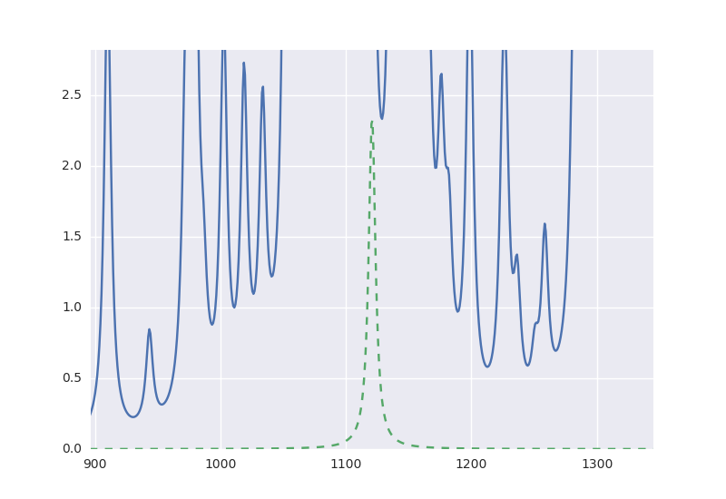

| Atom # | Element | Sum of vibrational eigenvalues |
|--------|---------|--------------------------------|
| 35 | 1 | 0.4950757517794625 |
| 33 | 1 | 0.4874423042781576 |
| 34 | 1 | 0.40828911325187206 |
| 31 | 1 | 0.3541186241925155 |
| 17 | 6 | 0.29597297173897485 |
| 16 | 6 | 0.23108440016582688 |
| 36 | 1 | 0.1854723699099141 |
| 22 | 1 | 0.18493242008906927 |
| 32 | 1 | 0.17492855684535902 |
| 37 | 1 | 0.16673332000533067 |
| 26 | 6 | 0.1407124727947029 |
| 23 | 6 | 0.13379088160259653 |
| 25 | 1 | 0.12767145334803703 |
| 28 | 6 | 0.1236931687685298 |
| 18 | 8 | 0.11575836902790226 |
| 27 | 8 | 0.099498743710662 |
| 44 | 1 | 0.09848857801796104 |
| 30 | 1 | 0.08485281374238571 |
| 24 | 8 | 0.07348469228349536 |
| 19 | 1 | 0.07141428428542851 |
| 45 | 1 | 0.06928203230275509 |
| 14 | 6 | 0.05744562646538029 |
| 29 | 8 | 0.0565685424949238 |
| 41 | 1 | 0.042426406871192854 |
| 6 | 6 | 0.034641016151377546 |
| 43 | 1 | 0.0282842712474619 |
| 38 | 1 | 0.0282842712474619 |
| 5 | 1 | 0.024494897427831782 |
| 15 | 8 | 0.02 |
| 8 | 1 | 0.02 |
| 40 | 1 | 0.017320508075688773 |
| 39 | 1 | 0.01414213562373095 |
| 21 | 8 | 0.01414213562373095 |
| 20 | 6 | 0.01414213562373095 |
| 12 | 6 | 0.01414213562373095 |
| 2 | 6 | 0.01414213562373095 |

## Peak #69: 1139.0881 1/cm   
Raman activity: 9.0143  
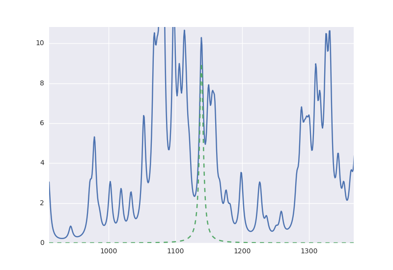

| Atom # | Element | Sum of vibrational eigenvalues |
|--------|---------|--------------------------------|
| 44 | 1 | 0.5201922721455982 |
| 45 | 1 | 0.46647615158762407 |
| 43 | 1 | 0.4543126676640219 |
| 42 | 1 | 0.402119385257662 |
| 39 | 1 | 0.25534290669607407 |
| 40 | 1 | 0.22671568097509268 |
| 3 | 6 | 0.22516660498395408 |
| 6 | 6 | 0.21748563170931548 |
| 8 | 1 | 0.21047565179849187 |
| 36 | 1 | 0.17492855684535902 |
| 14 | 6 | 0.17320508075688776 |
| 33 | 1 | 0.16248076809271922 |
| 34 | 1 | 0.1452583904633395 |
| 35 | 1 | 0.13674794331177342 |
| 37 | 1 | 0.12767145334803703 |
| 16 | 6 | 0.12767145334803703 |
| 9 | 6 | 0.12 |
| 2 | 6 | 0.11090536506409418 |
| 25 | 1 | 0.10099504938362078 |
| 41 | 1 | 0.09380831519646858 |
| 5 | 1 | 0.09273618495495704 |
| 26 | 6 | 0.08717797887081347 |
| 31 | 1 | 0.08660254037844388 |
| 15 | 8 | 0.08544003745317531 |
| 12 | 6 | 0.08485281374238571 |
| 4 | 8 | 0.06928203230275509 |
| 10 | 8 | 0.05744562646538029 |
| 23 | 6 | 0.0565685424949238 |
| 38 | 1 | 0.04358898943540673 |
| 13 | 8 | 0.042426406871192854 |
| 11 | 1 | 0.042426406871192854 |
| 19 | 1 | 0.0412310562561766 |
| 32 | 1 | 0.033166247903554 |
| 24 | 8 | 0.0282842712474619 |
| 1 | 8 | 0.0282842712474619 |
| 22 | 1 | 0.024494897427831782 |
| 20 | 6 | 0.02 |
| 21 | 8 | 0.017320508075688773 |
| 17 | 6 | 0.017320508075688773 |
| 30 | 1 | 0.01414213562373095 |
| 27 | 8 | 0.01414213562373095 |
| 7 | 8 | 0.01414213562373095 |

## Peak #70: 1149.6123 1/cm   
Raman activity: 5.3342  
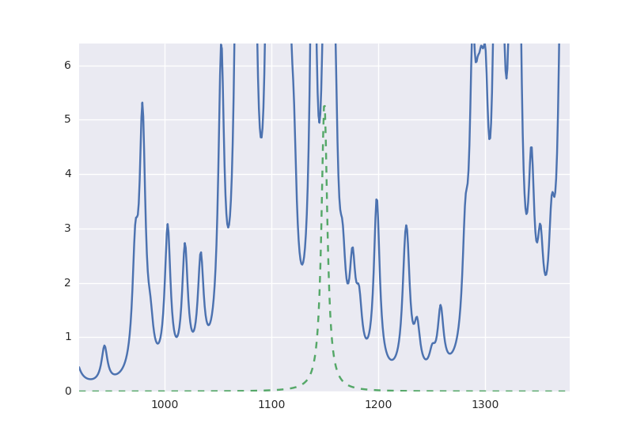

| Atom # | Element | Sum of vibrational eigenvalues |
|--------|---------|--------------------------------|
| 41 | 1 | 0.51 |
| 45 | 1 | 0.473392015141785 |
| 42 | 1 | 0.46669047558312143 |
| 44 | 1 | 0.4496665431183423 |
| 5 | 1 | 0.3690528417449187 |
| 43 | 1 | 0.25729360660537215 |
| 3 | 6 | 0.20420577856662137 |
| 2 | 6 | 0.20199009876724155 |
| 36 | 1 | 0.1407124727947029 |
| 34 | 1 | 0.13304134695650072 |
| 35 | 1 | 0.1307669683062202 |
| 37 | 1 | 0.12884098726725124 |
| 32 | 1 | 0.1236931687685298 |
| 12 | 6 | 0.11575836902790226 |
| 14 | 6 | 0.11 |
| 6 | 6 | 0.10392304845413264 |
| 33 | 1 | 0.09797958971132713 |
| 13 | 8 | 0.09273618495495704 |
| 40 | 1 | 0.08660254037844388 |
| 9 | 6 | 0.08660254037844388 |
| 19 | 1 | 0.07348469228349534 |
| 17 | 6 | 0.07348469228349534 |
| 38 | 1 | 0.07141428428542851 |
| 1 | 8 | 0.07071067811865477 |
| 39 | 1 | 0.07 |
| 31 | 1 | 0.06403124237432849 |
| 16 | 6 | 0.06403124237432849 |
| 26 | 6 | 0.05744562646538029 |
| 23 | 6 | 0.05744562646538029 |
| 15 | 8 | 0.0565685424949238 |
| 11 | 1 | 0.0565685424949238 |
| 4 | 8 | 0.04690415759823429 |
| 10 | 8 | 0.04358898943540673 |
| 22 | 1 | 0.033166247903554 |
| 20 | 6 | 0.033166247903554 |
| 7 | 8 | 0.03 |
| 24 | 8 | 0.0282842712474619 |
| 8 | 1 | 0.024494897427831782 |
| 27 | 8 | 0.017320508075688773 |
| 30 | 1 | 0.01414213562373095 |
| 25 | 1 | 0.01414213562373095 |
| 28 | 6 | 0.01 |
| 21 | 8 | 0.01 |
| 18 | 8 | 0.01 |

## Peak #71: 1155.314 1/cm   
Raman activity: 3.6473  
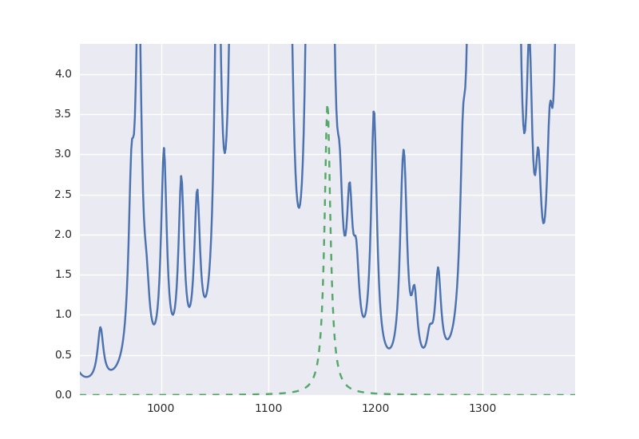

| Atom # | Element | Sum of vibrational eigenvalues |
|--------|---------|--------------------------------|
| 33 | 1 | 0.45099889135118726 |
| 35 | 1 | 0.446318272088428 |
| 37 | 1 | 0.41315856520227195 |
| 36 | 1 | 0.35818989377144633 |
| 42 | 1 | 0.30199337741083 |
| 16 | 6 | 0.24738633753705963 |
| 43 | 1 | 0.22671568097509268 |
| 34 | 1 | 0.19672315572906005 |
| 23 | 6 | 0.16340134638368192 |
| 32 | 1 | 0.15684387141358122 |
| 8 | 1 | 0.15066519173319362 |
| 5 | 1 | 0.14798648586948743 |
| 3 | 6 | 0.14282856857085702 |
| 26 | 6 | 0.1407124727947029 |
| 45 | 1 | 0.13856406460551018 |
| 41 | 1 | 0.13304134695650072 |
| 39 | 1 | 0.12767145334803703 |
| 40 | 1 | 0.12369316876852982 |
| 6 | 6 | 0.11575836902790226 |
| 15 | 8 | 0.11489125293076058 |
| 17 | 6 | 0.099498743710662 |
| 44 | 1 | 0.09848857801796104 |
| 19 | 1 | 0.09055385138137417 |
| 12 | 6 | 0.09 |
| 2 | 6 | 0.07681145747868609 |
| 11 | 1 | 0.07141428428542851 |
| 24 | 8 | 0.07071067811865477 |
| 14 | 6 | 0.06557438524302 |
| 28 | 6 | 0.057445626465380296 |
| 13 | 8 | 0.05196152422706632 |
| 31 | 1 | 0.048989794855663564 |
| 38 | 1 | 0.04358898943540673 |
| 25 | 1 | 0.04358898943540673 |
| 4 | 8 | 0.034641016151377546 |
| 27 | 8 | 0.033166247903554 |
| 30 | 1 | 0.0282842712474619 |
| 9 | 6 | 0.024494897427831782 |
| 7 | 8 | 0.02 |
| 29 | 8 | 0.01414213562373095 |
| 20 | 6 | 0.01414213562373095 |
| 1 | 8 | 0.01414213562373095 |
| 22 | 1 | 0.01 |
| 21 | 8 | 0.01 |
| 18 | 8 | 0.01 |

## Peak #72: 1159.1402 1/cm   
Raman activity: 4.2799  
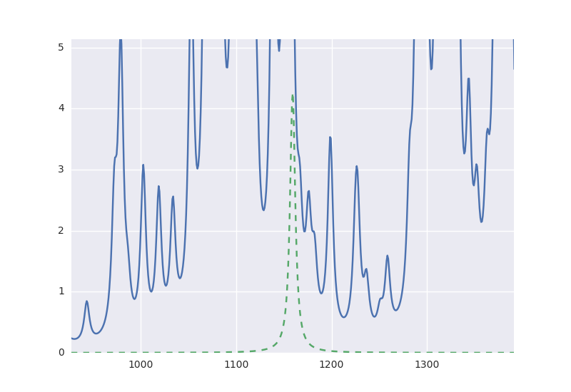

| Atom # | Element | Sum of vibrational eigenvalues |
|--------|---------|--------------------------------|
| 34 | 1 | 0.5327288240746881 |
| 31 | 1 | 0.503189825016365 |
| 32 | 1 | 0.3839270764090494 |
| 35 | 1 | 0.33481338085566414 |
| 33 | 1 | 0.32542280190545964 |
| 42 | 1 | 0.26608269391300143 |
| 43 | 1 | 0.22 |
| 44 | 1 | 0.17233687939614084 |
| 25 | 1 | 0.14177446878757827 |
| 30 | 1 | 0.14142135623730953 |
| 41 | 1 | 0.1407124727947029 |
| 37 | 1 | 0.1407124727947029 |
| 19 | 1 | 0.13892443989449804 |
| 22 | 1 | 0.1063014581273465 |
| 26 | 6 | 0.09949874371066199 |
| 20 | 6 | 0.09797958971132713 |
| 17 | 6 | 0.09000000000000001 |
| 39 | 1 | 0.08124038404635961 |
| 23 | 6 | 0.07549834435270751 |
| 45 | 1 | 0.07141428428542851 |
| 11 | 1 | 0.07141428428542851 |
| 8 | 1 | 0.07 |
| 6 | 6 | 0.06403124237432849 |
| 36 | 1 | 0.05744562646538029 |
| 38 | 1 | 0.0565685424949238 |
| 12 | 6 | 0.05 |
| 40 | 1 | 0.04358898943540673 |
| 27 | 8 | 0.034641016151377546 |
| 9 | 6 | 0.033166247903554 |
| 28 | 6 | 0.03 |
| 24 | 8 | 0.03 |
| 16 | 6 | 0.03 |
| 14 | 6 | 0.03 |
| 3 | 6 | 0.024494897427831782 |
| 21 | 8 | 0.02 |
| 29 | 8 | 0.017320508075688773 |
| 13 | 8 | 0.017320508075688773 |
| 10 | 8 | 0.017320508075688773 |
| 5 | 1 | 0.017320508075688773 |
| 2 | 6 | 0.01414213562373095 |
| 1 | 8 | 0.01414213562373095 |
| 7 | 8 | 0.01 |
| 4 | 8 | 0.01 |

## Peak #73: 1166.6813 1/cm   
Raman activity: 1.3649  
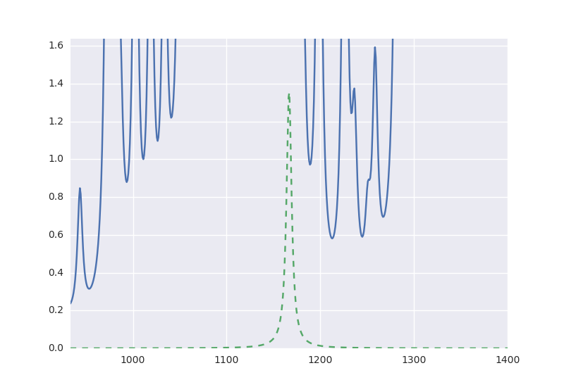

| Atom # | Element | Sum of vibrational eigenvalues |
|--------|---------|--------------------------------|
| 42 | 1 | 0.4373785545725808 |
| 41 | 1 | 0.43497126341863085 |
| 31 | 1 | 0.32496153618543844 |
| 32 | 1 | 0.30724582991474436 |
| 33 | 1 | 0.3011644069275119 |
| 11 | 1 | 0.3011644069275119 |
| 35 | 1 | 0.2643860813280457 |
| 37 | 1 | 0.2576819745345025 |
| 34 | 1 | 0.2455605831561735 |
| 36 | 1 | 0.19209372712298547 |
| 12 | 6 | 0.15264337522473748 |
| 45 | 1 | 0.13304134695650072 |
| 44 | 1 | 0.1307669683062202 |
| 9 | 6 | 0.12247448713915891 |
| 38 | 1 | 0.11489125293076058 |
| 43 | 1 | 0.11445523142259598 |
| 30 | 1 | 0.11357816691600547 |
| 8 | 1 | 0.11 |
| 5 | 1 | 0.09797958971132713 |
| 39 | 1 | 0.09000000000000001 |
| 19 | 1 | 0.09000000000000001 |
| 6 | 6 | 0.08485281374238571 |
| 20 | 6 | 0.06928203230275509 |
| 23 | 6 | 0.05744562646538029 |
| 10 | 8 | 0.04358898943540673 |
| 26 | 6 | 0.042426406871192854 |
| 3 | 6 | 0.042426406871192854 |
| 22 | 1 | 0.0412310562561766 |
| 14 | 6 | 0.0412310562561766 |
| 2 | 6 | 0.033166247903554 |
| 16 | 6 | 0.03 |
| 40 | 1 | 0.0282842712474619 |
| 24 | 8 | 0.0282842712474619 |
| 28 | 6 | 0.02 |
| 13 | 8 | 0.02 |
| 7 | 8 | 0.02 |
| 29 | 8 | 0.017320508075688773 |
| 17 | 6 | 0.017320508075688773 |
| 15 | 8 | 0.017320508075688773 |
| 27 | 8 | 0.01414213562373095 |
| 4 | 8 | 0.01414213562373095 |
| 21 | 8 | 0.01 |
| 1 | 8 | 0.01 |

## Peak #74: 1175.9506 1/cm   
Raman activity: 1.6539  
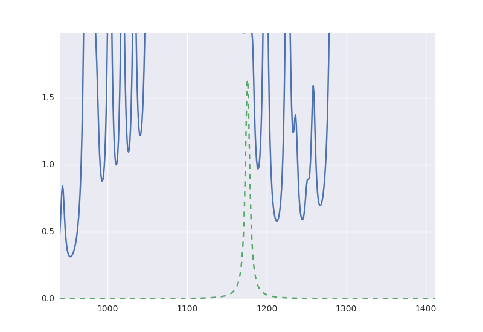

| Atom # | Element | Sum of vibrational eigenvalues |
|--------|---------|--------------------------------|
| 41 | 1 | 0.5450688029964658 |
| 43 | 1 | 0.4167733196834942 |
| 44 | 1 | 0.37027017163147236 |
| 35 | 1 | 0.34985711369071804 |
| 32 | 1 | 0.3167017524422623 |
| 39 | 1 | 0.26870057685088805 |
| 11 | 1 | 0.25942243542145693 |
| 31 | 1 | 0.24879710609249459 |
| 33 | 1 | 0.198997487421324 |
| 25 | 1 | 0.15684387141358122 |
| 34 | 1 | 0.11704699910719625 |
| 42 | 1 | 0.10677078252031312 |
| 16 | 6 | 0.10344080432788601 |
| 12 | 6 | 0.1 |
| 30 | 1 | 0.099498743710662 |
| 19 | 1 | 0.09797958971132713 |
| 14 | 6 | 0.09273618495495704 |
| 40 | 1 | 0.09 |
| 37 | 1 | 0.08544003745317531 |
| 9 | 6 | 0.0824621125123532 |
| 2 | 6 | 0.0818535277187245 |
| 26 | 6 | 0.066332495807108 |
| 45 | 1 | 0.06403124237432849 |
| 8 | 1 | 0.06 |
| 20 | 6 | 0.05830951894845301 |
| 17 | 6 | 0.057445626465380296 |
| 15 | 8 | 0.05744562646538029 |
| 3 | 6 | 0.05196152422706632 |
| 23 | 6 | 0.048989794855663564 |
| 5 | 1 | 0.048989794855663564 |
| 38 | 1 | 0.034641016151377546 |
| 6 | 6 | 0.034641016151377546 |
| 13 | 8 | 0.03 |
| 10 | 8 | 0.0282842712474619 |
| 22 | 1 | 0.024494897427831782 |
| 28 | 6 | 0.02 |
| 27 | 8 | 0.017320508075688773 |
| 4 | 8 | 0.017320508075688773 |
| 24 | 8 | 0.01414213562373095 |
| 1 | 8 | 0.01414213562373095 |
| 21 | 8 | 0.01 |
| 18 | 8 | 0.01 |
| 7 | 8 | 0.01 |

## Peak #75: 1182.1088 1/cm   
Raman activity: 0.9843  
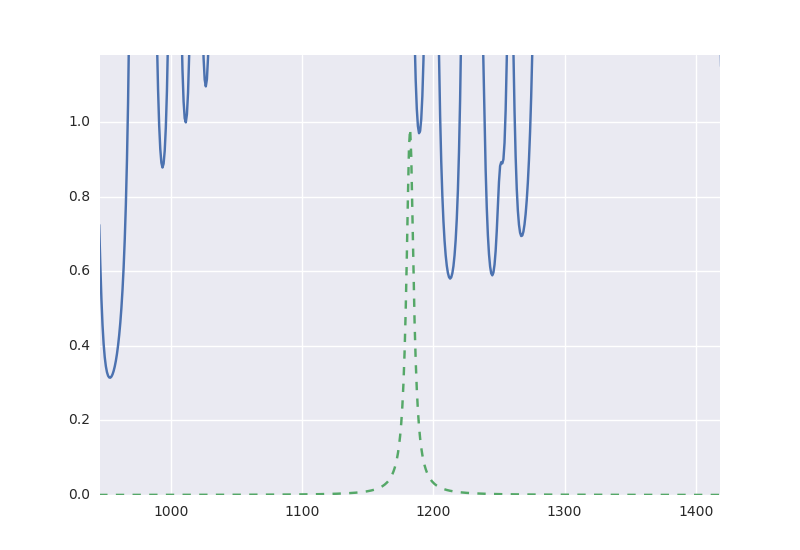

| Atom # | Element | Sum of vibrational eigenvalues |
|--------|---------|--------------------------------|
| 34 | 1 | 0.49668903752750576 |
| 44 | 1 | 0.3971145930332956 |
| 35 | 1 | 0.3940812099047606 |
| 32 | 1 | 0.33496268448888455 |
| 25 | 1 | 0.29966648127543394 |
| 41 | 1 | 0.2944486372867091 |
| 43 | 1 | 0.26888659319497504 |
| 31 | 1 | 0.24738633753705963 |
| 33 | 1 | 0.24062418831031931 |
| 36 | 1 | 0.22649503305812252 |
| 45 | 1 | 0.22181073012818836 |
| 26 | 6 | 0.1649242250247064 |
| 42 | 1 | 0.16031219541881397 |
| 37 | 1 | 0.15588457268119896 |
| 19 | 1 | 0.15524174696260024 |
| 39 | 1 | 0.14456832294800961 |
| 16 | 6 | 0.14282856857085702 |
| 30 | 1 | 0.099498743710662 |
| 14 | 6 | 0.09848857801796104 |
| 17 | 6 | 0.09433981132056603 |
| 11 | 1 | 0.08717797887081347 |
| 23 | 6 | 0.08 |
| 2 | 6 | 0.06557438524302 |
| 8 | 1 | 0.06164414002968976 |
| 6 | 6 | 0.05830951894845301 |
| 20 | 6 | 0.057445626465380296 |
| 40 | 1 | 0.04358898943540673 |
| 38 | 1 | 0.04358898943540673 |
| 22 | 1 | 0.0412310562561766 |
| 5 | 1 | 0.033166247903554 |
| 15 | 8 | 0.03 |
| 3 | 6 | 0.03 |
| 13 | 8 | 0.0282842712474619 |
| 28 | 6 | 0.024494897427831782 |
| 27 | 8 | 0.024494897427831782 |
| 18 | 8 | 0.024494897427831782 |
| 12 | 6 | 0.024494897427831782 |
| 24 | 8 | 0.017320508075688773 |
| 9 | 6 | 0.017320508075688773 |
| 4 | 8 | 0.01414213562373095 |
| 1 | 8 | 0.01414213562373095 |
| 21 | 8 | 0.01 |

## Peak #76: 1198.6989 1/cm   
Raman activity: 3.2084  
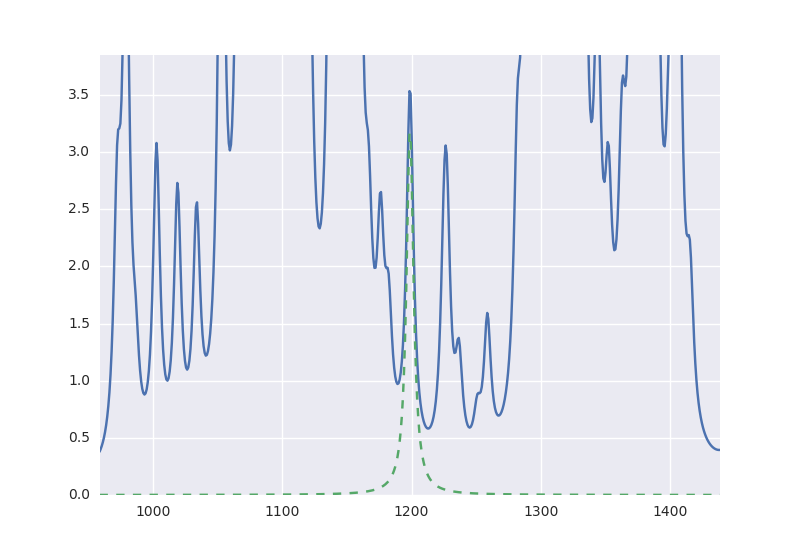

| Atom # | Element | Sum of vibrational eigenvalues |
|--------|---------|--------------------------------|
| 31 | 1 | 0.5713142742834281 |
| 33 | 1 | 0.5241183072551464 |
| 35 | 1 | 0.5139066063011839 |
| 34 | 1 | 0.40890096600521747 |
| 32 | 1 | 0.2118962010041709 |
| 37 | 1 | 0.20049937655763422 |
| 30 | 1 | 0.1841195263952197 |
| 16 | 6 | 0.11575836902790226 |
| 36 | 1 | 0.11090536506409418 |
| 20 | 6 | 0.09380831519646858 |
| 45 | 1 | 0.08717797887081347 |
| 17 | 6 | 0.08124038404635961 |
| 43 | 1 | 0.05 |
| 44 | 1 | 0.04690415759823429 |
| 41 | 1 | 0.0412310562561766 |
| 19 | 1 | 0.0412310562561766 |
| 42 | 1 | 0.04 |
| 27 | 8 | 0.03 |
| 23 | 6 | 0.0282842712474619 |
| 18 | 8 | 0.0282842712474619 |
| 28 | 6 | 0.024494897427831782 |
| 39 | 1 | 0.017320508075688773 |
| 25 | 1 | 0.017320508075688773 |
| 22 | 1 | 0.017320508075688773 |
| 15 | 8 | 0.017320508075688773 |
| 6 | 6 | 0.017320508075688773 |
| 40 | 1 | 0.01414213562373095 |
| 38 | 1 | 0.01414213562373095 |
| 21 | 8 | 0.01414213562373095 |
| 14 | 6 | 0.01414213562373095 |
| 3 | 6 | 0.01414213562373095 |
| 8 | 1 | 0.01 |
| 5 | 1 | 0.01 |
| 2 | 6 | 0.01 |

## Peak #77: 1225.103 1/cm   
Raman activity: 1.3452  
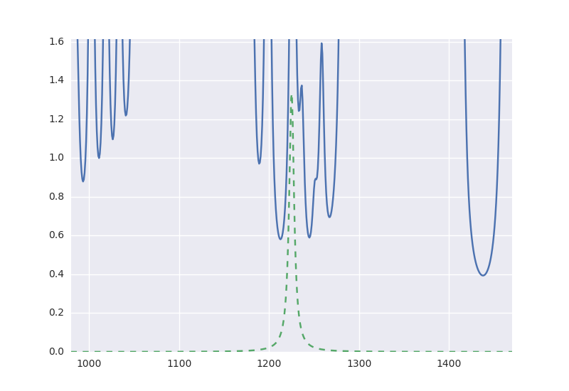

| Atom # | Element | Sum of vibrational eigenvalues |
|--------|---------|--------------------------------|
| 42 | 1 | 0.722841614740048 |
| 41 | 1 | 0.5469917732470937 |
| 38 | 1 | 0.4595650117230423 |
| 44 | 1 | 0.44249293779675175 |
| 39 | 1 | 0.32031234756093935 |
| 43 | 1 | 0.3111269837220809 |
| 40 | 1 | 0.290516780926679 |
| 45 | 1 | 0.2603843313258308 |
| 8 | 1 | 0.1307669683062202 |
| 11 | 1 | 0.11489125293076058 |
| 5 | 1 | 0.11445523142259598 |
| 34 | 1 | 0.10099504938362078 |
| 3 | 6 | 0.08485281374238571 |
| 2 | 6 | 0.08124038404635961 |
| 33 | 1 | 0.06557438524302 |
| 12 | 6 | 0.06557438524302 |
| 32 | 1 | 0.057445626465380296 |
| 6 | 6 | 0.0565685424949238 |
| 35 | 1 | 0.04690415759823429 |
| 36 | 1 | 0.0412310562561766 |
| 9 | 6 | 0.0412310562561766 |
| 31 | 1 | 0.034641016151377546 |
| 37 | 1 | 0.03 |
| 14 | 6 | 0.03 |
| 4 | 8 | 0.03 |
| 1 | 8 | 0.03 |
| 13 | 8 | 0.024494897427831782 |
| 25 | 1 | 0.017320508075688773 |
| 17 | 6 | 0.017320508075688773 |
| 30 | 1 | 0.01414213562373095 |
| 20 | 6 | 0.01414213562373095 |
| 16 | 6 | 0.01414213562373095 |
| 22 | 1 | 0.01 |
| 10 | 8 | 0.01 |

## Peak #78: 1227.218 1/cm   
Raman activity: 1.6534  
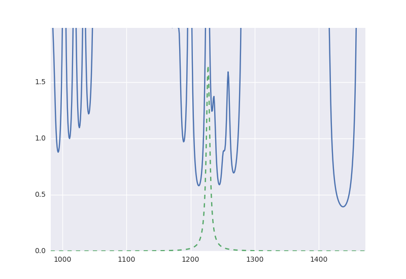

| Atom # | Element | Sum of vibrational eigenvalues |
|--------|---------|--------------------------------|
| 31 | 1 | 0.8529947244854448 |
| 35 | 1 | 0.48031239834091316 |
| 32 | 1 | 0.2603843313258308 |
| 37 | 1 | 0.2437211521390788 |
| 34 | 1 | 0.19467922333931784 |
| 33 | 1 | 0.1769180601295413 |
| 28 | 6 | 0.10099504938362078 |
| 30 | 1 | 0.07141428428542851 |
| 36 | 1 | 0.06 |
| 16 | 6 | 0.05196152422706632 |
| 27 | 8 | 0.04358898943540673 |
| 26 | 6 | 0.0412310562561766 |
| 22 | 1 | 0.03 |
| 20 | 6 | 0.024494897427831782 |
| 23 | 6 | 0.02 |
| 45 | 1 | 0.017320508075688773 |
| 42 | 1 | 0.017320508075688773 |
| 24 | 8 | 0.017320508075688773 |
| 19 | 1 | 0.017320508075688773 |
| 43 | 1 | 0.01414213562373095 |
| 21 | 8 | 0.01414213562373095 |
| 18 | 8 | 0.01414213562373095 |
| 17 | 6 | 0.01414213562373095 |
| 44 | 1 | 0.01 |
| 41 | 1 | 0.01 |
| 29 | 8 | 0.01 |
| 25 | 1 | 0.01 |

## Peak #79: 1236.522 1/cm   
Raman activity: 0.8119  
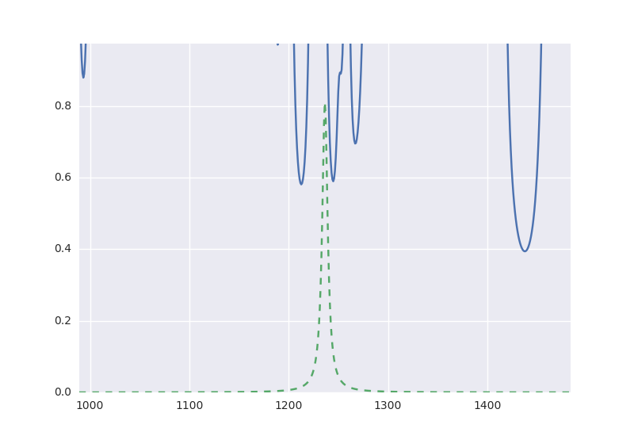

| Atom # | Element | Sum of vibrational eigenvalues |
|--------|---------|--------------------------------|
| 45 | 1 | 0.6014981296729026 |
| 44 | 1 | 0.597829407105405 |
| 41 | 1 | 0.32496153618543844 |
| 42 | 1 | 0.3111269837220809 |
| 43 | 1 | 0.27166155414412246 |
| 38 | 1 | 0.2142428528562855 |
| 34 | 1 | 0.16999999999999998 |
| 33 | 1 | 0.16248076809271922 |
| 32 | 1 | 0.13114877048604 |
| 5 | 1 | 0.11489125293076059 |
| 6 | 6 | 0.08717797887081347 |
| 14 | 6 | 0.0818535277187245 |
| 39 | 1 | 0.08124038404635961 |
| 35 | 1 | 0.07141428428542851 |
| 31 | 1 | 0.06928203230275509 |
| 37 | 1 | 0.06403124237432849 |
| 36 | 1 | 0.05196152422706632 |
| 2 | 6 | 0.05196152422706632 |
| 13 | 8 | 0.04358898943540673 |
| 3 | 6 | 0.042426406871192854 |
| 17 | 6 | 0.034641016151377546 |
| 19 | 1 | 0.033166247903554 |
| 12 | 6 | 0.03 |
| 8 | 1 | 0.03 |
| 30 | 1 | 0.0282842712474619 |
| 40 | 1 | 0.024494897427831782 |
| 22 | 1 | 0.024494897427831782 |
| 4 | 8 | 0.024494897427831782 |
| 26 | 6 | 0.017320508075688773 |
| 11 | 1 | 0.017320508075688773 |
| 9 | 6 | 0.017320508075688773 |
| 7 | 8 | 0.017320508075688773 |
| 25 | 1 | 0.01414213562373095 |
| 20 | 6 | 0.01414213562373095 |
| 10 | 8 | 0.01414213562373095 |
| 1 | 8 | 0.01414213562373095 |
| 15 | 8 | 0.01 |

## Peak #80: 1250.735 1/cm   
Raman activity: 0.3432  
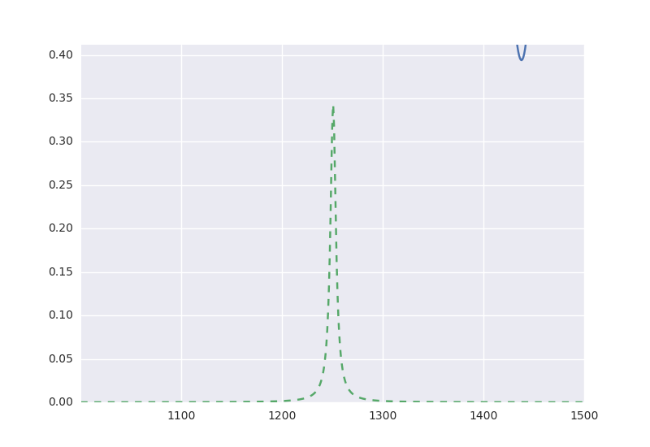

| Atom # | Element | Sum of vibrational eigenvalues |
|--------|---------|--------------------------------|
| 33 | 1 | 0.7001428425685718 |
| 32 | 1 | 0.5264028875300742 |
| 45 | 1 | 0.45727453460694706 |
| 34 | 1 | 0.3538361202590826 |
| 31 | 1 | 0.3258834147360065 |
| 41 | 1 | 0.2142428528562855 |
| 37 | 1 | 0.1905255888325765 |
| 35 | 1 | 0.17521415467935234 |
| 19 | 1 | 0.16340134638368192 |
| 39 | 1 | 0.1452583904633395 |
| 42 | 1 | 0.1307669683062202 |
| 38 | 1 | 0.11489125293076058 |
| 30 | 1 | 0.11357816691600547 |
| 43 | 1 | 0.10677078252031312 |
| 36 | 1 | 0.08660254037844388 |
| 17 | 6 | 0.08544003745317531 |
| 22 | 1 | 0.08485281374238571 |
| 40 | 1 | 0.06928203230275509 |
| 20 | 6 | 0.06403124237432849 |
| 14 | 6 | 0.05 |
| 44 | 1 | 0.0412310562561766 |
| 16 | 6 | 0.034641016151377546 |
| 21 | 8 | 0.03 |
| 12 | 6 | 0.024494897427831782 |
| 8 | 1 | 0.02 |
| 6 | 6 | 0.02 |
| 3 | 6 | 0.02 |
| 2 | 6 | 0.02 |
| 28 | 6 | 0.017320508075688773 |
| 26 | 6 | 0.017320508075688773 |
| 15 | 8 | 0.017320508075688773 |
| 27 | 8 | 0.01414213562373095 |
| 13 | 8 | 0.01414213562373095 |
| 11 | 1 | 0.01414213562373095 |
| 25 | 1 | 0.01 |
| 23 | 6 | 0.01 |
| 18 | 8 | 0.01 |
| 10 | 8 | 0.01 |
| 9 | 6 | 0.01 |

## Peak #81: 1258.5554 1/cm   
Raman activity: 1.1616  
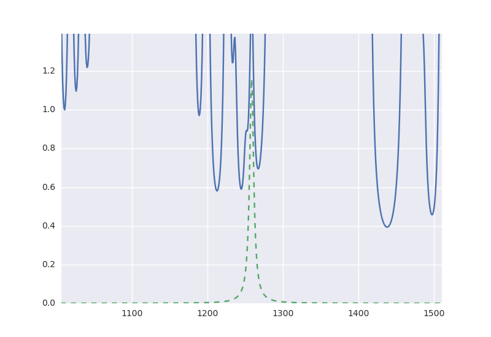

| Atom # | Element | Sum of vibrational eigenvalues |
|--------|---------|--------------------------------|
| 45 | 1 | 0.7533923280734945 |
| 44 | 1 | 0.49020403915104577 |
| 33 | 1 | 0.4144876355212541 |
| 41 | 1 | 0.37669616403674727 |
| 32 | 1 | 0.27147743920996453 |
| 42 | 1 | 0.2576819745345025 |
| 38 | 1 | 0.2576819745345025 |
| 43 | 1 | 0.23173260452512934 |
| 39 | 1 | 0.2092844953645635 |
| 31 | 1 | 0.189208879284245 |
| 34 | 1 | 0.17492855684535902 |
| 19 | 1 | 0.1063014581273465 |
| 5 | 1 | 0.09000000000000001 |
| 35 | 1 | 0.0824621125123532 |
| 40 | 1 | 0.08124038404635961 |
| 6 | 6 | 0.08124038404635961 |
| 30 | 1 | 0.07071067811865477 |
| 37 | 1 | 0.05196152422706632 |
| 17 | 6 | 0.04358898943540673 |
| 22 | 1 | 0.042426406871192854 |
| 14 | 6 | 0.042426406871192854 |
| 20 | 6 | 0.03 |
| 13 | 8 | 0.03 |
| 12 | 6 | 0.024494897427831782 |
| 3 | 6 | 0.024494897427831782 |
| 9 | 6 | 0.02 |
| 2 | 6 | 0.02 |
| 36 | 1 | 0.017320508075688773 |
| 28 | 6 | 0.017320508075688773 |
| 10 | 8 | 0.017320508075688773 |
| 8 | 1 | 0.017320508075688773 |
| 26 | 6 | 0.01414213562373095 |
| 21 | 8 | 0.01414213562373095 |
| 15 | 8 | 0.01414213562373095 |
| 11 | 1 | 0.01414213562373095 |
| 4 | 8 | 0.01 |

## Peak #82: 1281.7167 1/cm   
Raman activity: 1.9211  
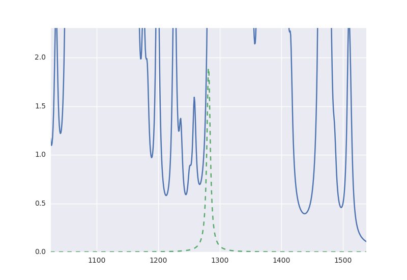

| Atom # | Element | Sum of vibrational eigenvalues |
|--------|---------|--------------------------------|
| 32 | 1 | 0.6295236294214857 |
| 33 | 1 | 0.46776062254106 |
| 30 | 1 | 0.33941125496954283 |
| 31 | 1 | 0.24879710609249459 |
| 34 | 1 | 0.23685438564654024 |
| 37 | 1 | 0.23323807579381203 |
| 44 | 1 | 0.21307275752662516 |
| 35 | 1 | 0.18193405398660253 |
| 22 | 1 | 0.11445523142259598 |
| 36 | 1 | 0.11 |
| 20 | 6 | 0.08717797887081347 |
| 43 | 1 | 0.0754983443527075 |
| 45 | 1 | 0.07348469228349534 |
| 17 | 6 | 0.066332495807108 |
| 16 | 6 | 0.05830951894845301 |
| 38 | 1 | 0.05744562646538029 |
| 42 | 1 | 0.05196152422706632 |
| 26 | 6 | 0.05196152422706632 |
| 5 | 1 | 0.048989794855663564 |
| 25 | 1 | 0.042426406871192854 |
| 8 | 1 | 0.04 |
| 28 | 6 | 0.033166247903554 |
| 6 | 6 | 0.0282842712474619 |
| 27 | 8 | 0.02 |
| 41 | 1 | 0.017320508075688773 |
| 40 | 1 | 0.017320508075688773 |
| 39 | 1 | 0.01414213562373095 |
| 29 | 8 | 0.01414213562373095 |
| 11 | 1 | 0.01414213562373095 |
| 24 | 8 | 0.01 |
| 23 | 6 | 0.01 |
| 21 | 8 | 0.01 |
| 19 | 1 | 0.01 |
| 4 | 8 | 0.01 |

## Peak #83: 1288.4681 1/cm   
Raman activity: 4.6987  

| Atom # | Element | Sum of vibrational eigenvalues |
|--------|---------|--------------------------------|
| 44 | 1 | 0.7237402849088892 |
| 41 | 1 | 0.5579426493825329 |
| 45 | 1 | 0.3298484500494128 |
| 42 | 1 | 0.32031234756093935 |
| 43 | 1 | 0.3112876483254676 |
| 38 | 1 | 0.2576819745345025 |
| 34 | 1 | 0.2002498439450079 |
| 35 | 1 | 0.1905255888325765 |
| 8 | 1 | 0.17058722109231983 |
| 39 | 1 | 0.150996688705415 |
| 40 | 1 | 0.1236931687685298 |
| 32 | 1 | 0.11 |
| 11 | 1 | 0.10099504938362078 |
| 12 | 6 | 0.07348469228349536 |
| 33 | 1 | 0.06 |
| 36 | 1 | 0.05830951894845301 |
| 25 | 1 | 0.05744562646538029 |
| 30 | 1 | 0.0565685424949238 |
| 37 | 1 | 0.05196152422706632 |
| 2 | 6 | 0.04690415759823429 |
| 31 | 1 | 0.042426406871192854 |
| 14 | 6 | 0.0412310562561766 |
| 6 | 6 | 0.033166247903554 |
| 26 | 6 | 0.03 |
| 22 | 1 | 0.024494897427831782 |
| 19 | 1 | 0.024494897427831782 |
| 5 | 1 | 0.024494897427831782 |
| 20 | 6 | 0.017320508075688773 |
| 10 | 8 | 0.017320508075688773 |
| 9 | 6 | 0.017320508075688773 |
| 15 | 8 | 0.01414213562373095 |
| 7 | 8 | 0.01414213562373095 |
| 3 | 6 | 0.01414213562373095 |
| 1 | 8 | 0.01414213562373095 |
| 17 | 6 | 0.01 |
| 16 | 6 | 0.01 |
| 4 | 8 | 0.01 |

## Peak #84: 1293.2812 1/cm   
Raman activity: 2.1825  
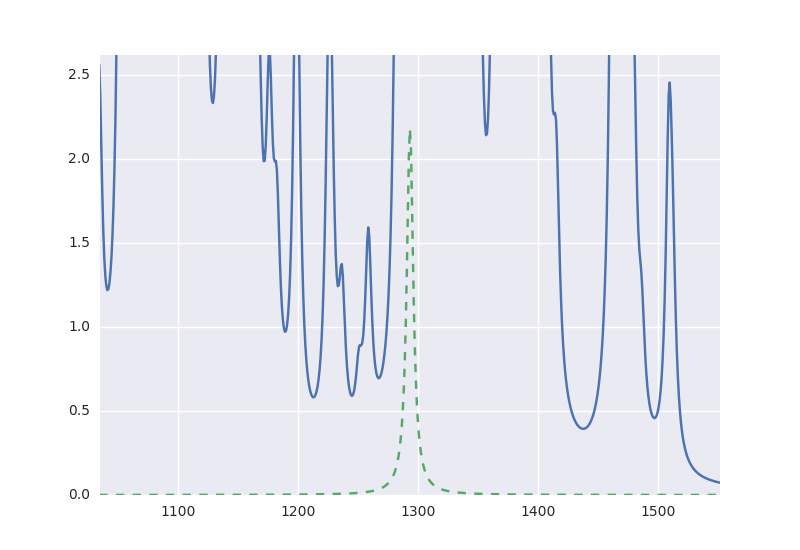

| Atom # | Element | Sum of vibrational eigenvalues |
|--------|---------|--------------------------------|
| 35 | 1 | 0.8111103500757464 |
| 36 | 1 | 0.5045790324617145 |
| 33 | 1 | 0.4246174749112429 |
| 34 | 1 | 0.2545584412271571 |
| 32 | 1 | 0.232163735324878 |
| 25 | 1 | 0.22825424421026658 |
| 41 | 1 | 0.2002498439450079 |
| 37 | 1 | 0.196468827043885 |
| 44 | 1 | 0.17320508075688776 |
| 30 | 1 | 0.12727922061357855 |
| 31 | 1 | 0.1 |
| 19 | 1 | 0.09797958971132713 |
| 43 | 1 | 0.09055385138137417 |
| 5 | 1 | 0.0818535277187245 |
| 42 | 1 | 0.08 |
| 39 | 1 | 0.05830951894845301 |
| 20 | 6 | 0.05196152422706632 |
| 17 | 6 | 0.048989794855663564 |
| 16 | 6 | 0.04690415759823429 |
| 45 | 1 | 0.042426406871192854 |
| 22 | 1 | 0.034641016151377546 |
| 26 | 6 | 0.03 |
| 12 | 6 | 0.03 |
| 11 | 1 | 0.03 |
| 6 | 6 | 0.03 |
| 38 | 1 | 0.0282842712474619 |
| 40 | 1 | 0.024494897427831782 |
| 3 | 6 | 0.017320508075688773 |
| 2 | 6 | 0.017320508075688773 |
| 28 | 6 | 0.01414213562373095 |
| 24 | 8 | 0.01414213562373095 |
| 21 | 8 | 0.01414213562373095 |
| 18 | 8 | 0.01414213562373095 |
| 27 | 8 | 0.01 |
| 23 | 6 | 0.01 |
| 15 | 8 | 0.01 |
| 13 | 8 | 0.01 |
| 8 | 1 | 0.01 |
| 4 | 8 | 0.01 |

## Peak #85: 1296.6373 1/cm   
Raman activity: 2.3577  
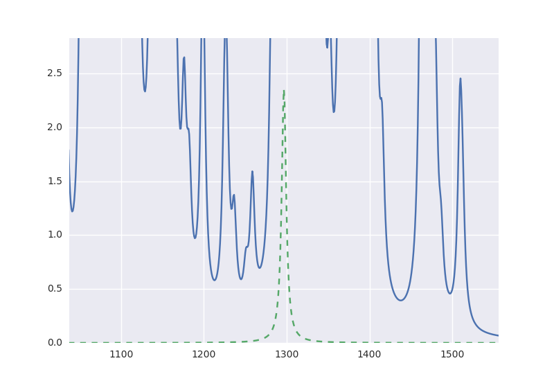

| Atom # | Element | Sum of vibrational eigenvalues |
|--------|---------|--------------------------------|
| 35 | 1 | 0.6641535966928133 |
| 37 | 1 | 0.5801723881744115 |
| 31 | 1 | 0.37429934544425797 |
| 33 | 1 | 0.2939387691339814 |
| 32 | 1 | 0.28478061731796284 |
| 36 | 1 | 0.2744084546802449 |
| 34 | 1 | 0.26999999999999996 |
| 43 | 1 | 0.150996688705415 |
| 41 | 1 | 0.14456832294800961 |
| 26 | 6 | 0.13856406460551018 |
| 5 | 1 | 0.11445523142259598 |
| 25 | 1 | 0.11357816691600547 |
| 42 | 1 | 0.11 |
| 19 | 1 | 0.09797958971132713 |
| 40 | 1 | 0.0824621125123532 |
| 45 | 1 | 0.0818535277187245 |
| 44 | 1 | 0.07348469228349536 |
| 20 | 6 | 0.06557438524302 |
| 28 | 6 | 0.06164414002968976 |
| 38 | 1 | 0.05744562646538029 |
| 17 | 6 | 0.05744562646538029 |
| 11 | 1 | 0.05744562646538029 |
| 22 | 1 | 0.048989794855663564 |
| 30 | 1 | 0.042426406871192854 |
| 16 | 6 | 0.042426406871192854 |
| 39 | 1 | 0.033166247903554 |
| 23 | 6 | 0.033166247903554 |
| 2 | 6 | 0.024494897427831782 |
| 8 | 1 | 0.02 |
| 27 | 8 | 0.017320508075688773 |
| 24 | 8 | 0.017320508075688773 |
| 14 | 6 | 0.017320508075688773 |
| 12 | 6 | 0.01414213562373095 |
| 6 | 6 | 0.01414213562373095 |
| 18 | 8 | 0.01 |
| 15 | 8 | 0.01 |
| 4 | 8 | 0.01 |
| 3 | 6 | 0.01 |

## Peak #86: 1300.568 1/cm   
Raman activity: 3.3463  
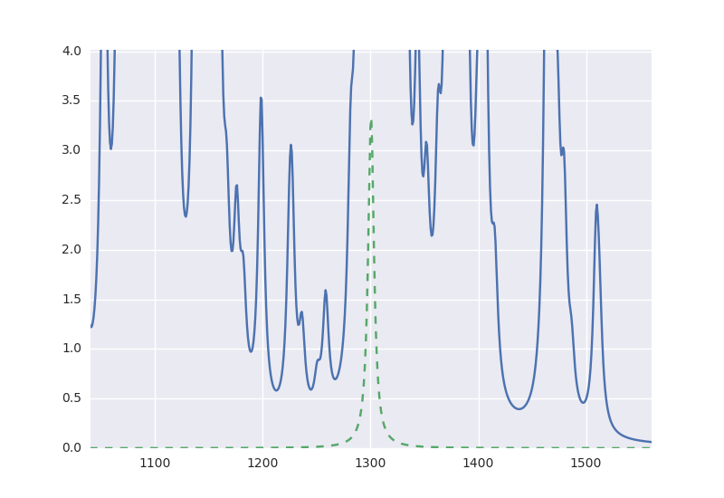

| Atom # | Element | Sum of vibrational eigenvalues |
|--------|---------|--------------------------------|
| 43 | 1 | 0.49020403915104577 |
| 44 | 1 | 0.4446346815083142 |
| 5 | 1 | 0.4246174749112429 |
| 45 | 1 | 0.3411744421846396 |
| 35 | 1 | 0.32542280190545964 |
| 42 | 1 | 0.3 |
| 34 | 1 | 0.2716615541441225 |
| 36 | 1 | 0.23790754506740638 |
| 41 | 1 | 0.1881488772222678 |
| 40 | 1 | 0.18193405398660253 |
| 25 | 1 | 0.17233687939614084 |
| 11 | 1 | 0.17233687939614084 |
| 38 | 1 | 0.16999999999999998 |
| 33 | 1 | 0.1584297951775486 |
| 32 | 1 | 0.150996688705415 |
| 31 | 1 | 0.13304134695650072 |
| 8 | 1 | 0.1307669683062202 |
| 37 | 1 | 0.0824621125123532 |
| 2 | 6 | 0.0818535277187245 |
| 6 | 6 | 0.05744562646538029 |
| 39 | 1 | 0.05196152422706632 |
| 12 | 6 | 0.04690415759823429 |
| 30 | 1 | 0.042426406871192854 |
| 14 | 6 | 0.042426406871192854 |
| 3 | 6 | 0.042426406871192854 |
| 19 | 1 | 0.0412310562561766 |
| 20 | 6 | 0.034641016151377546 |
| 17 | 6 | 0.034641016151377546 |
| 22 | 1 | 0.033166247903554 |
| 4 | 8 | 0.03 |
| 26 | 6 | 0.024494897427831782 |
| 28 | 6 | 0.02 |
| 16 | 6 | 0.017320508075688773 |
| 15 | 8 | 0.01414213562373095 |
| 13 | 8 | 0.01 |
| 9 | 6 | 0.01 |

## Peak #87: 1310.0913 1/cm   
Raman activity: 6.6355  
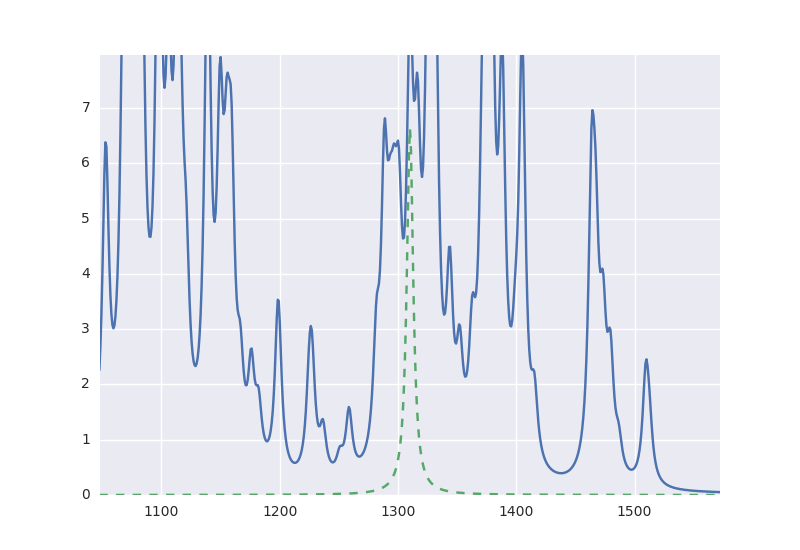

| Atom # | Element | Sum of vibrational eigenvalues |
|--------|---------|--------------------------------|
| 41 | 1 | 0.5501817881391567 |
| 39 | 1 | 0.4446346815083142 |
| 34 | 1 | 0.43335897360040904 |
| 36 | 1 | 0.37841775856849 |
| 40 | 1 | 0.33645207682521444 |
| 33 | 1 | 0.2778488797889961 |
| 45 | 1 | 0.2609597670139978 |
| 25 | 1 | 0.24372115213907883 |
| 42 | 1 | 0.24124676163629638 |
| 5 | 1 | 0.220454076850486 |
| 43 | 1 | 0.22 |
| 11 | 1 | 0.1862793601019716 |
| 38 | 1 | 0.1841195263952197 |
| 32 | 1 | 0.163707055437449 |
| 35 | 1 | 0.10099504938362078 |
| 12 | 6 | 0.09000000000000001 |
| 31 | 1 | 0.0818535277187245 |
| 30 | 1 | 0.07071067811865477 |
| 37 | 1 | 0.06928203230275509 |
| 2 | 6 | 0.06164414002968976 |
| 16 | 6 | 0.057445626465380296 |
| 17 | 6 | 0.05196152422706632 |
| 8 | 1 | 0.042426406871192854 |
| 22 | 1 | 0.0412310562561766 |
| 20 | 6 | 0.033166247903554 |
| 9 | 6 | 0.033166247903554 |
| 28 | 6 | 0.024494897427831782 |
| 19 | 1 | 0.024494897427831782 |
| 14 | 6 | 0.024494897427831782 |
| 4 | 8 | 0.02 |
| 44 | 1 | 0.017320508075688773 |
| 23 | 6 | 0.017320508075688773 |
| 15 | 8 | 0.017320508075688773 |
| 13 | 8 | 0.017320508075688773 |
| 10 | 8 | 0.017320508075688773 |
| 6 | 6 | 0.017320508075688773 |
| 3 | 6 | 0.017320508075688773 |
| 26 | 6 | 0.01414213562373095 |

## Peak #88: 1316.399 1/cm   
Raman activity: 4.4327  
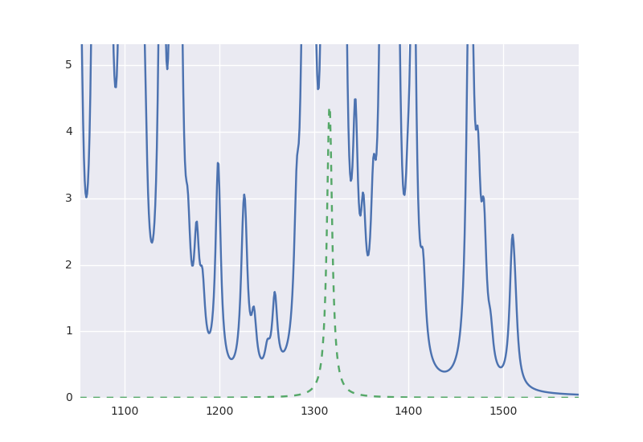

| Atom # | Element | Sum of vibrational eigenvalues |
|--------|---------|--------------------------------|
| 44 | 1 | 0.44317039612320674 |
| 39 | 1 | 0.3983716857408418 |
| 33 | 1 | 0.36304269721342697 |
| 36 | 1 | 0.3541186241925155 |
| 34 | 1 | 0.34727510708370674 |
| 41 | 1 | 0.32832910318764 |
| 45 | 1 | 0.32264531609803354 |
| 40 | 1 | 0.24372115213907883 |
| 32 | 1 | 0.22045407685048604 |
| 25 | 1 | 0.2002498439450079 |
| 42 | 1 | 0.1676305461424021 |
| 31 | 1 | 0.11445523142259598 |
| 37 | 1 | 0.11 |
| 43 | 1 | 0.09797958971132713 |
| 5 | 1 | 0.09797958971132713 |
| 11 | 1 | 0.08544003745317531 |
| 30 | 1 | 0.08485281374238571 |
| 35 | 1 | 0.08124038404635961 |
| 16 | 6 | 0.07549834435270751 |
| 12 | 6 | 0.0754983443527075 |
| 17 | 6 | 0.07141428428542851 |
| 8 | 1 | 0.07 |
| 38 | 1 | 0.0565685424949238 |
| 6 | 6 | 0.05 |
| 20 | 6 | 0.042426406871192854 |
| 14 | 6 | 0.042426406871192854 |
| 28 | 6 | 0.034641016151377546 |
| 2 | 6 | 0.03 |
| 19 | 1 | 0.024494897427831782 |
| 9 | 6 | 0.024494897427831782 |
| 26 | 6 | 0.017320508075688773 |
| 23 | 6 | 0.017320508075688773 |
| 22 | 1 | 0.017320508075688773 |
| 10 | 8 | 0.017320508075688773 |
| 3 | 6 | 0.017320508075688773 |
| 13 | 8 | 0.01 |
| 4 | 8 | 0.01 |

## Peak #89: 1325.4022 1/cm   
Raman activity: 7.3238  
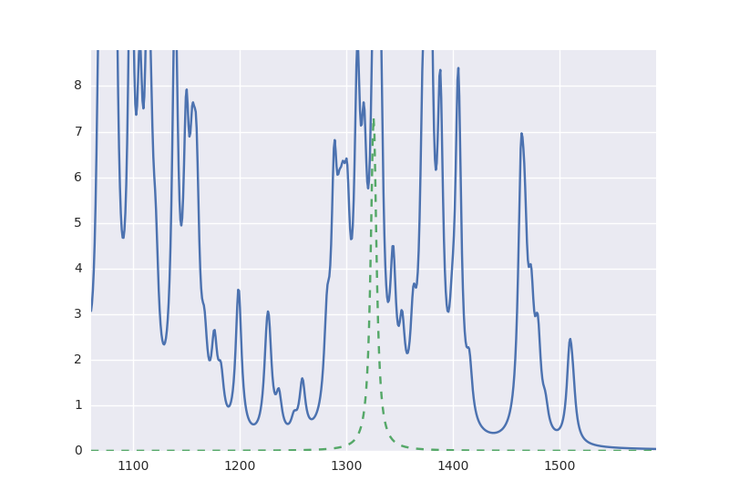

| Atom # | Element | Sum of vibrational eigenvalues |
|--------|---------|--------------------------------|
| 41 | 1 | 0.6805879810869423 |
| 40 | 1 | 0.6071243694664216 |
| 42 | 1 | 0.5126402247190518 |
| 38 | 1 | 0.3725587202039432 |
| 43 | 1 | 0.33271609519228257 |
| 11 | 1 | 0.33075670817082453 |
| 39 | 1 | 0.19697715603592209 |
| 45 | 1 | 0.17916472867168917 |
| 44 | 1 | 0.12369316876852982 |
| 5 | 1 | 0.1063014581273465 |
| 34 | 1 | 0.042426406871192854 |
| 33 | 1 | 0.042426406871192854 |
| 6 | 6 | 0.034641016151377546 |
| 2 | 6 | 0.033166247903554 |
| 32 | 1 | 0.03 |
| 3 | 6 | 0.0282842712474619 |
| 37 | 1 | 0.024494897427831782 |
| 14 | 6 | 0.024494897427831782 |
| 36 | 1 | 0.017320508075688773 |
| 35 | 1 | 0.01414213562373095 |
| 25 | 1 | 0.01414213562373095 |
| 13 | 8 | 0.01414213562373095 |
| 12 | 6 | 0.01414213562373095 |
| 10 | 8 | 0.01414213562373095 |
| 22 | 1 | 0.01 |
| 19 | 1 | 0.01 |
| 17 | 6 | 0.01 |
| 16 | 6 | 0.01 |
| 9 | 6 | 0.01 |
| 8 | 1 | 0.01 |
| 4 | 8 | 0.01 |

## Peak #90: 1331.251 1/cm   
Raman activity: 7.9522  
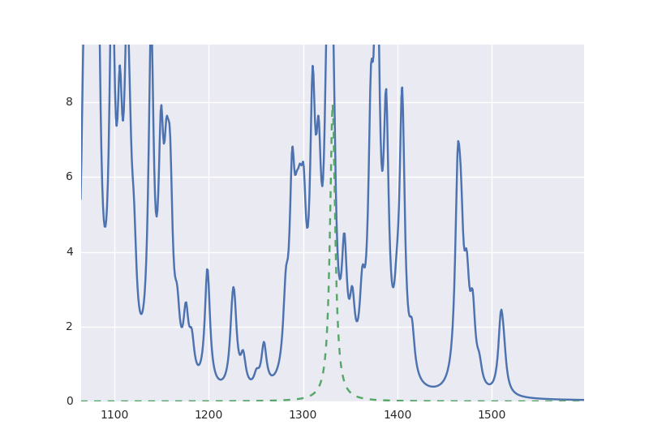

| Atom # | Element | Sum of vibrational eigenvalues |
|--------|---------|--------------------------------|
| 32 | 1 | 0.739053448676075 |
| 33 | 1 | 0.49477267507411926 |
| 34 | 1 | 0.41400483088968904 |
| 45 | 1 | 0.3889730067755345 |
| 44 | 1 | 0.3277193921634788 |
| 19 | 1 | 0.220454076850486 |
| 22 | 1 | 0.19899748742132398 |
| 31 | 1 | 0.17233687939614084 |
| 5 | 1 | 0.12247448713915891 |
| 20 | 6 | 0.09848857801796104 |
| 30 | 1 | 0.08485281374238571 |
| 17 | 6 | 0.08124038404635961 |
| 14 | 6 | 0.06928203230275509 |
| 36 | 1 | 0.06557438524302 |
| 6 | 6 | 0.06557438524302 |
| 41 | 1 | 0.06403124237432849 |
| 28 | 6 | 0.05196152422706632 |
| 16 | 6 | 0.048989794855663564 |
| 25 | 1 | 0.04358898943540673 |
| 37 | 1 | 0.0412310562561766 |
| 43 | 1 | 0.04 |
| 39 | 1 | 0.034641016151377546 |
| 11 | 1 | 0.03 |
| 40 | 1 | 0.024494897427831782 |
| 26 | 6 | 0.024494897427831782 |
| 8 | 1 | 0.02 |
| 42 | 1 | 0.017320508075688773 |
| 21 | 8 | 0.017320508075688773 |
| 38 | 1 | 0.01414213562373095 |
| 35 | 1 | 0.01414213562373095 |
| 3 | 6 | 0.01414213562373095 |
| 18 | 8 | 0.01 |
| 13 | 8 | 0.01 |
| 4 | 8 | 0.01 |

## Peak #91: 1343.6574 1/cm   
Raman activity: 3.0327  
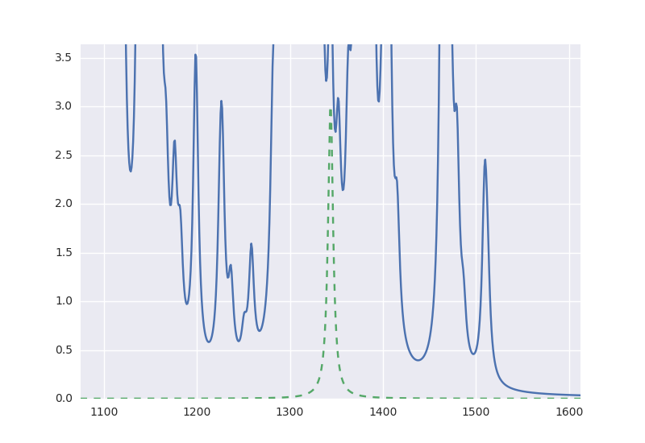

| Atom # | Element | Sum of vibrational eigenvalues |
|--------|---------|--------------------------------|
| 32 | 1 | 0.6184658438426491 |
| 45 | 1 | 0.5367494760127857 |
| 33 | 1 | 0.49244289008980524 |
| 34 | 1 | 0.43220365569948616 |
| 44 | 1 | 0.3167017524422623 |
| 37 | 1 | 0.3056141357987225 |
| 22 | 1 | 0.19000000000000003 |
| 25 | 1 | 0.1862793601019716 |
| 35 | 1 | 0.16248076809271922 |
| 5 | 1 | 0.1063014581273465 |
| 14 | 6 | 0.09380831519646858 |
| 31 | 1 | 0.0818535277187245 |
| 19 | 1 | 0.0818535277187245 |
| 40 | 1 | 0.0754983443527075 |
| 6 | 6 | 0.0754983443527075 |
| 11 | 1 | 0.07348469228349536 |
| 17 | 6 | 0.06403124237432849 |
| 20 | 6 | 0.06 |
| 41 | 1 | 0.0565685424949238 |
| 8 | 1 | 0.05196152422706632 |
| 16 | 6 | 0.04 |
| 30 | 1 | 0.0282842712474619 |
| 43 | 1 | 0.024494897427831782 |
| 39 | 1 | 0.017320508075688773 |
| 36 | 1 | 0.017320508075688773 |
| 28 | 6 | 0.017320508075688773 |
| 24 | 8 | 0.017320508075688773 |
| 23 | 6 | 0.017320508075688773 |
| 21 | 8 | 0.017320508075688773 |
| 13 | 8 | 0.017320508075688773 |
| 42 | 1 | 0.01414213562373095 |
| 12 | 6 | 0.01414213562373095 |
| 3 | 6 | 0.01414213562373095 |
| 26 | 6 | 0.01 |
| 15 | 8 | 0.01 |
| 4 | 8 | 0.01 |

## Peak #92: 1352.0824 1/cm   
Raman activity: 1.6385  
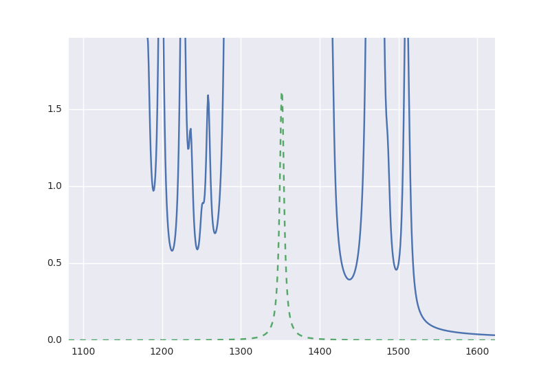

| Atom # | Element | Sum of vibrational eigenvalues |
|--------|---------|--------------------------------|
| 37 | 1 | 0.7421590126111789 |
| 25 | 1 | 0.645832795698701 |
| 35 | 1 | 0.42473521163190603 |
| 45 | 1 | 0.3212475680841802 |
| 36 | 1 | 0.189208879284245 |
| 32 | 1 | 0.157797338380595 |
| 34 | 1 | 0.14177446878757827 |
| 44 | 1 | 0.12124355652982141 |
| 31 | 1 | 0.09949874371066199 |
| 33 | 1 | 0.08485281374238571 |
| 43 | 1 | 0.07348469228349536 |
| 23 | 6 | 0.06403124237432849 |
| 41 | 1 | 0.06 |
| 14 | 6 | 0.06 |
| 26 | 6 | 0.05830951894845301 |
| 6 | 6 | 0.04358898943540673 |
| 22 | 1 | 0.042426406871192854 |
| 40 | 1 | 0.0412310562561766 |
| 42 | 1 | 0.03 |
| 24 | 8 | 0.03 |
| 8 | 1 | 0.03 |
| 38 | 1 | 0.0282842712474619 |
| 11 | 1 | 0.0282842712474619 |
| 39 | 1 | 0.024494897427831782 |
| 20 | 6 | 0.024494897427831782 |
| 28 | 6 | 0.02 |
| 19 | 1 | 0.017320508075688773 |
| 16 | 6 | 0.017320508075688773 |
| 17 | 6 | 0.01414213562373095 |
| 12 | 6 | 0.01414213562373095 |
| 5 | 1 | 0.01 |

## Peak #93: 1362.7136 1/cm   
Raman activity: 1.8151  
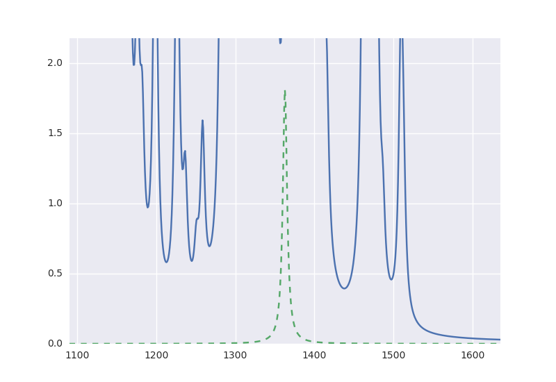

| Atom # | Element | Sum of vibrational eigenvalues |
|--------|---------|--------------------------------|
| 39 | 1 | 0.7991870869827665 |
| 11 | 1 | 0.637808748764079 |
| 41 | 1 | 0.4050925820105819 |
| 43 | 1 | 0.3167017524422623 |
| 38 | 1 | 0.18493242008906932 |
| 40 | 1 | 0.18193405398660253 |
| 42 | 1 | 0.17492855684535902 |
| 5 | 1 | 0.11445523142259598 |
| 44 | 1 | 0.09848857801796104 |
| 45 | 1 | 0.08124038404635961 |
| 12 | 6 | 0.04690415759823429 |
| 9 | 6 | 0.04358898943540673 |
| 2 | 6 | 0.0282842712474619 |
| 10 | 8 | 0.024494897427831782 |
| 8 | 1 | 0.02 |
| 37 | 1 | 0.017320508075688773 |
| 34 | 1 | 0.01414213562373095 |
| 31 | 1 | 0.01414213562373095 |
| 25 | 1 | 0.01414213562373095 |
| 6 | 6 | 0.01414213562373095 |
| 4 | 8 | 0.01414213562373095 |
| 3 | 6 | 0.01414213562373095 |
| 35 | 1 | 0.01 |
| 14 | 6 | 0.01 |

## Peak #94: 1371.818 1/cm   
Raman activity: 5.8261  
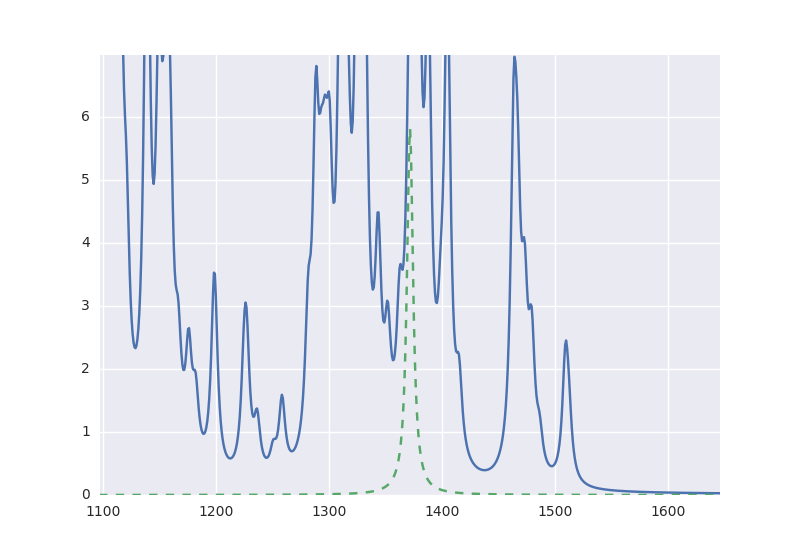

| Atom # | Element | Sum of vibrational eigenvalues |
|--------|---------|--------------------------------|
| 31 | 1 | 0.8135723692456621 |
| 35 | 1 | 0.33645207682521444 |
| 30 | 1 | 0.32542280190545964 |
| 36 | 1 | 0.2716615541441225 |
| 32 | 1 | 0.2515949125081825 |
| 34 | 1 | 0.2211334438749598 |
| 28 | 6 | 0.20199009876724155 |
| 45 | 1 | 0.16999999999999998 |
| 25 | 1 | 0.12884098726725124 |
| 33 | 1 | 0.1131370849898476 |
| 26 | 6 | 0.09273618495495704 |
| 22 | 1 | 0.08485281374238571 |
| 20 | 6 | 0.07348469228349534 |
| 19 | 1 | 0.06557438524302 |
| 37 | 1 | 0.06 |
| 44 | 1 | 0.05196152422706632 |
| 41 | 1 | 0.05196152422706632 |
| 16 | 6 | 0.05196152422706632 |
| 29 | 8 | 0.042426406871192854 |
| 40 | 1 | 0.0412310562561766 |
| 42 | 1 | 0.034641016151377546 |
| 14 | 6 | 0.03 |
| 38 | 1 | 0.0282842712474619 |
| 23 | 6 | 0.017320508075688773 |
| 12 | 6 | 0.017320508075688773 |
| 6 | 6 | 0.017320508075688773 |
| 5 | 1 | 0.017320508075688773 |
| 43 | 1 | 0.01414213562373095 |
| 24 | 8 | 0.01414213562373095 |
| 11 | 1 | 0.01414213562373095 |
| 39 | 1 | 0.01 |
| 17 | 6 | 0.01 |
| 2 | 6 | 0.01 |

## Peak #95: 1377.8222 1/cm   
Raman activity: 7.836  
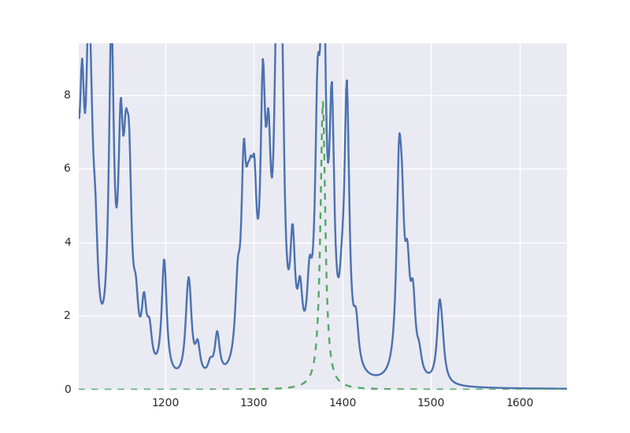

| Atom # | Element | Sum of vibrational eigenvalues |
|--------|---------|--------------------------------|
| 35 | 1 | 0.51 |
| 36 | 1 | 0.5095095681142798 |
| 31 | 1 | 0.4439594576084623 |
| 34 | 1 | 0.43335897360040904 |
| 45 | 1 | 0.3266496594212215 |
| 32 | 1 | 0.17972200755611428 |
| 26 | 6 | 0.17233687939614084 |
| 30 | 1 | 0.15588457268119896 |
| 43 | 1 | 0.1452583904633395 |
| 44 | 1 | 0.12806248474865697 |
| 28 | 6 | 0.11704699910719625 |
| 41 | 1 | 0.11489125293076059 |
| 22 | 1 | 0.10862780491200216 |
| 37 | 1 | 0.10392304845413264 |
| 16 | 6 | 0.10099504938362078 |
| 33 | 1 | 0.08 |
| 40 | 1 | 0.0754983443527075 |
| 39 | 1 | 0.06557438524302 |
| 14 | 6 | 0.06 |
| 38 | 1 | 0.05744562646538029 |
| 20 | 6 | 0.048989794855663564 |
| 19 | 1 | 0.048989794855663564 |
| 42 | 1 | 0.04690415759823429 |
| 25 | 1 | 0.04358898943540673 |
| 17 | 6 | 0.03 |
| 8 | 1 | 0.03 |
| 6 | 6 | 0.03 |
| 24 | 8 | 0.0282842712474619 |
| 27 | 8 | 0.024494897427831782 |
| 23 | 6 | 0.024494897427831782 |
| 12 | 6 | 0.024494897427831782 |
| 5 | 1 | 0.024494897427831782 |
| 2 | 6 | 0.017320508075688773 |
| 29 | 8 | 0.01414213562373095 |
| 15 | 8 | 0.01414213562373095 |
| 11 | 1 | 0.01414213562373095 |
| 3 | 6 | 0.01414213562373095 |
| 18 | 8 | 0.01 |

## Peak #96: 1379.0807 1/cm   
Raman activity: 2.8368  
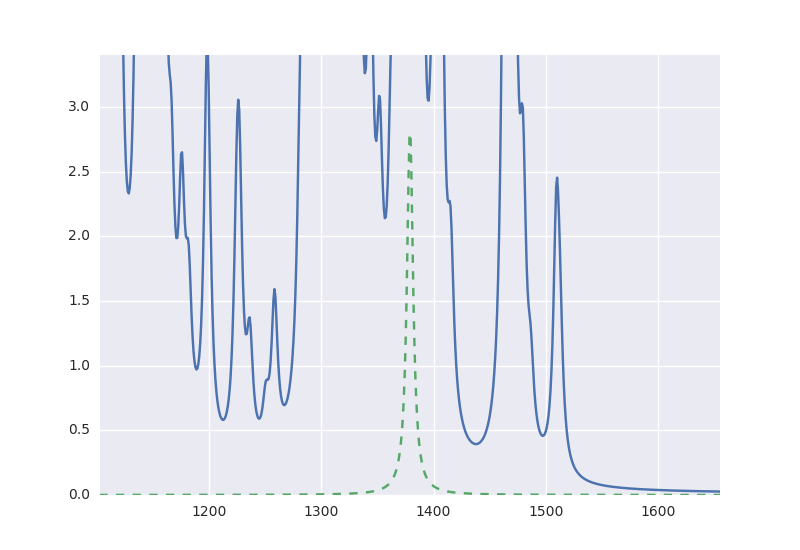

| Atom # | Element | Sum of vibrational eigenvalues |
|--------|---------|--------------------------------|
| 43 | 1 | 1.1090536506409416 |
| 44 | 1 | 0.30512292604784713 |
| 39 | 1 | 0.22 |
| 11 | 1 | 0.1881488772222678 |
| 42 | 1 | 0.15684387141358122 |
| 41 | 1 | 0.1392838827718412 |
| 5 | 1 | 0.1236931687685298 |
| 45 | 1 | 0.10344080432788601 |
| 40 | 1 | 0.099498743710662 |
| 3 | 6 | 0.09848857801796104 |
| 8 | 1 | 0.09110433579144298 |
| 35 | 1 | 0.066332495807108 |
| 6 | 6 | 0.06 |
| 31 | 1 | 0.04358898943540673 |
| 2 | 6 | 0.042426406871192854 |
| 34 | 1 | 0.034641016151377546 |
| 37 | 1 | 0.033166247903554 |
| 12 | 6 | 0.03 |
| 4 | 8 | 0.03 |
| 36 | 1 | 0.024494897427831782 |
| 26 | 6 | 0.024494897427831782 |
| 32 | 1 | 0.017320508075688773 |
| 16 | 6 | 0.017320508075688773 |
| 30 | 1 | 0.01414213562373095 |
| 28 | 6 | 0.01414213562373095 |
| 25 | 1 | 0.01414213562373095 |
| 9 | 6 | 0.01414213562373095 |
| 38 | 1 | 0.01 |
| 23 | 6 | 0.01 |
| 22 | 1 | 0.01 |
| 14 | 6 | 0.01 |
| 10 | 8 | 0.01 |

## Peak #97: 1387.9248 1/cm   
Raman activity: 6.4668  
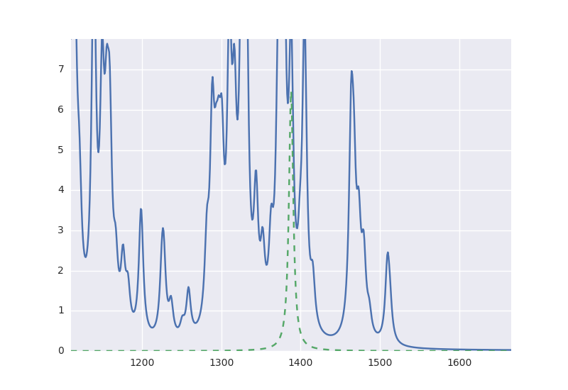

| Atom # | Element | Sum of vibrational eigenvalues |
|--------|---------|--------------------------------|
| 42 | 1 | 0.7292461861401813 |
| 41 | 1 | 0.5256424640380569 |
| 38 | 1 | 0.4595650117230423 |
| 40 | 1 | 0.45628938186199336 |
| 39 | 1 | 0.16970562748477142 |
| 12 | 6 | 0.12727922061357855 |
| 36 | 1 | 0.1236931687685298 |
| 35 | 1 | 0.11661903789690602 |
| 2 | 6 | 0.11661903789690602 |
| 34 | 1 | 0.11357816691600547 |
| 5 | 1 | 0.09000000000000001 |
| 43 | 1 | 0.0818535277187245 |
| 44 | 1 | 0.07681145747868609 |
| 8 | 1 | 0.06 |
| 37 | 1 | 0.04358898943540673 |
| 25 | 1 | 0.04358898943540673 |
| 26 | 6 | 0.0412310562561766 |
| 33 | 1 | 0.034641016151377546 |
| 45 | 1 | 0.0282842712474619 |
| 10 | 8 | 0.0282842712474619 |
| 9 | 6 | 0.02 |
| 3 | 6 | 0.02 |
| 31 | 1 | 0.017320508075688773 |
| 19 | 1 | 0.017320508075688773 |
| 16 | 6 | 0.017320508075688773 |
| 13 | 8 | 0.017320508075688773 |
| 23 | 6 | 0.01414213562373095 |
| 17 | 6 | 0.01414213562373095 |
| 14 | 6 | 0.01414213562373095 |
| 11 | 1 | 0.01414213562373095 |
| 1 | 8 | 0.01414213562373095 |
| 22 | 1 | 0.01 |

## Peak #98: 1399.1324 1/cm   
Raman activity: 1.1404  
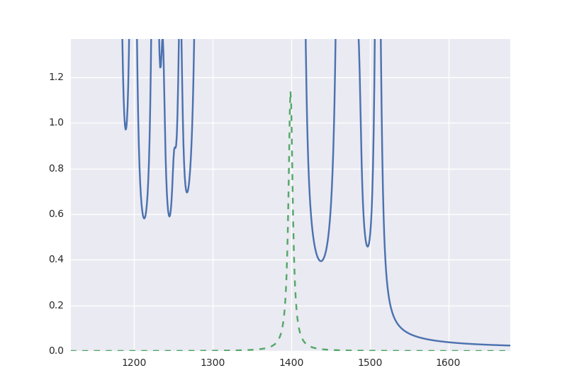

| Atom # | Element | Sum of vibrational eigenvalues |
|--------|---------|--------------------------------|
| 42 | 1 | 0.637102817447859 |
| 34 | 1 | 0.5762811813689565 |
| 5 | 1 | 0.5062608023538856 |
| 40 | 1 | 0.3397057550292606 |
| 38 | 1 | 0.3011644069275119 |
| 45 | 1 | 0.28442925306655786 |
| 41 | 1 | 0.2503996805109783 |
| 35 | 1 | 0.2027313493271329 |
| 11 | 1 | 0.20199009876724155 |
| 43 | 1 | 0.16248076809271922 |
| 44 | 1 | 0.14456832294800961 |
| 39 | 1 | 0.12884098726725124 |
| 36 | 1 | 0.12247448713915891 |
| 2 | 6 | 0.11704699910719625 |
| 8 | 1 | 0.11090536506409417 |
| 33 | 1 | 0.10392304845413264 |
| 12 | 6 | 0.099498743710662 |
| 16 | 6 | 0.08544003745317531 |
| 3 | 6 | 0.07681145747868609 |
| 26 | 6 | 0.05830951894845301 |
| 25 | 1 | 0.05744562646538029 |
| 32 | 1 | 0.05196152422706632 |
| 37 | 1 | 0.04690415759823429 |
| 14 | 6 | 0.042426406871192854 |
| 9 | 6 | 0.034641016151377546 |
| 19 | 1 | 0.033166247903554 |
| 4 | 8 | 0.033166247903554 |
| 6 | 6 | 0.03 |
| 17 | 6 | 0.024494897427831782 |
| 31 | 1 | 0.017320508075688773 |
| 23 | 6 | 0.017320508075688773 |
| 22 | 1 | 0.01 |
| 13 | 8 | 0.01 |

## Peak #99: 1404.8601 1/cm   
Raman activity: 7.429  
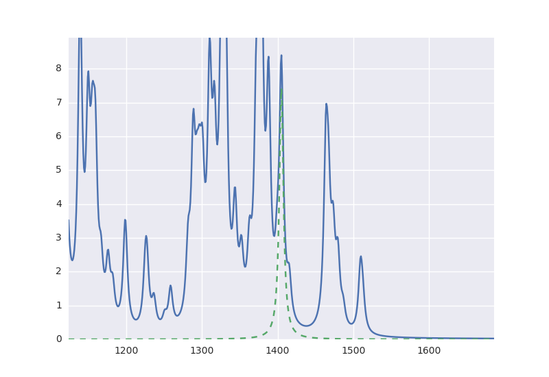

| Atom # | Element | Sum of vibrational eigenvalues |
|--------|---------|--------------------------------|
| 34 | 1 | 0.8397618710086806 |
| 45 | 1 | 0.5448853090330111 |
| 42 | 1 | 0.4102438299353203 |
| 40 | 1 | 0.33271609519228257 |
| 35 | 1 | 0.2598076211353316 |
| 41 | 1 | 0.232163735324878 |
| 36 | 1 | 0.18000000000000002 |
| 38 | 1 | 0.17088007490635063 |
| 44 | 1 | 0.15588457268119896 |
| 5 | 1 | 0.14696938456699069 |
| 33 | 1 | 0.14 |
| 39 | 1 | 0.11704699910719625 |
| 43 | 1 | 0.11489125293076058 |
| 11 | 1 | 0.11489125293076058 |
| 16 | 6 | 0.1131370849898476 |
| 14 | 6 | 0.10677078252031312 |
| 19 | 1 | 0.09797958971132713 |
| 12 | 6 | 0.09797958971132713 |
| 25 | 1 | 0.08717797887081347 |
| 2 | 6 | 0.08717797887081347 |
| 37 | 1 | 0.08485281374238571 |
| 32 | 1 | 0.08124038404635961 |
| 26 | 6 | 0.0754983443527075 |
| 6 | 6 | 0.033166247903554 |
| 8 | 1 | 0.03 |
| 3 | 6 | 0.0282842712474619 |
| 31 | 1 | 0.024494897427831782 |
| 17 | 6 | 0.02 |
| 23 | 6 | 0.017320508075688773 |
| 13 | 8 | 0.017320508075688773 |
| 9 | 6 | 0.017320508075688773 |
| 10 | 8 | 0.01414213562373095 |
| 28 | 6 | 0.01 |
| 27 | 8 | 0.01 |
| 22 | 1 | 0.01 |
| 20 | 6 | 0.01 |
| 15 | 8 | 0.01 |
| 4 | 8 | 0.01 |

## Peak #100: 1415.2558 1/cm   
Raman activity: 1.1463  
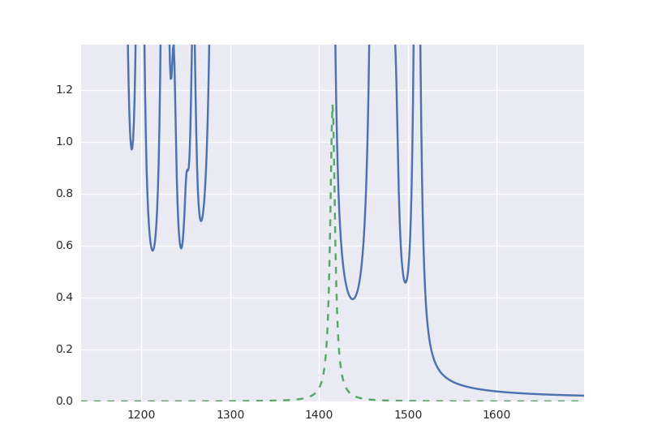

| Atom # | Element | Sum of vibrational eigenvalues |
|--------|---------|--------------------------------|
| 5 | 1 | 0.7920858539325141 |
| 42 | 1 | 0.493254498205541 |
| 43 | 1 | 0.394715087119811 |
| 40 | 1 | 0.2716615541441225 |
| 41 | 1 | 0.23323807579381203 |
| 3 | 6 | 0.1905255888325765 |
| 11 | 1 | 0.17435595774162693 |
| 38 | 1 | 0.15588457268119896 |
| 44 | 1 | 0.14798648586948743 |
| 34 | 1 | 0.14456832294800961 |
| 45 | 1 | 0.1407124727947029 |
| 2 | 6 | 0.10344080432788601 |
| 8 | 1 | 0.09110433579144298 |
| 39 | 1 | 0.0818535277187245 |
| 12 | 6 | 0.08124038404635961 |
| 4 | 8 | 0.07141428428542851 |
| 36 | 1 | 0.06557438524302 |
| 6 | 6 | 0.057445626465380296 |
| 37 | 1 | 0.034641016151377546 |
| 35 | 1 | 0.034641016151377546 |
| 14 | 6 | 0.034641016151377546 |
| 9 | 6 | 0.03 |
| 33 | 1 | 0.02 |
| 26 | 6 | 0.017320508075688773 |
| 32 | 1 | 0.01414213562373095 |
| 25 | 1 | 0.01414213562373095 |
| 16 | 6 | 0.01414213562373095 |
| 15 | 8 | 0.01414213562373095 |
| 7 | 8 | 0.01414213562373095 |
| 1 | 8 | 0.01414213562373095 |
| 22 | 1 | 0.01 |
| 19 | 1 | 0.01 |

## Peak #101: 1463.6816 1/cm   
Raman activity: 4.8872  
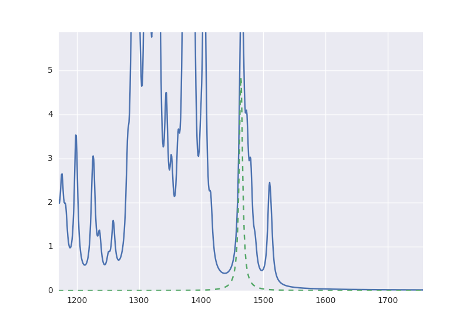

| Atom # | Element | Sum of vibrational eigenvalues |
|--------|---------|--------------------------------|
| 39 | 1 | 0.8658521813797088 |
| 11 | 1 | 0.3189043743820395 |
| 40 | 1 | 0.2547547840571399 |
| 41 | 1 | 0.08485281374238571 |
| 42 | 1 | 0.08124038404635961 |
| 9 | 6 | 0.0565685424949238 |
| 10 | 8 | 0.042426406871192854 |
| 19 | 1 | 0.034641016151377546 |
| 12 | 6 | 0.033166247903554 |
| 25 | 1 | 0.03 |
| 38 | 1 | 0.0282842712474619 |
| 37 | 1 | 0.017320508075688773 |
| 36 | 1 | 0.017320508075688773 |
| 2 | 6 | 0.017320508075688773 |
| 45 | 1 | 0.01414213562373095 |
| 34 | 1 | 0.01414213562373095 |
| 33 | 1 | 0.01414213562373095 |
| 44 | 1 | 0.01 |
| 22 | 1 | 0.01 |
| 8 | 1 | 0.01 |
| 5 | 1 | 0.01 |

## Peak #102: 1467.0853 1/cm   
Raman activity: 3.0027  
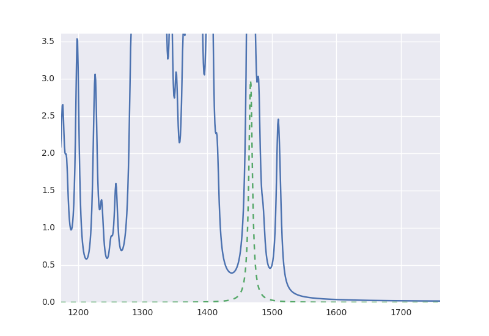

| Atom # | Element | Sum of vibrational eigenvalues |
|--------|---------|--------------------------------|
| 25 | 1 | 0.748598690888516 |
| 37 | 1 | 0.6242595614005444 |
| 36 | 1 | 0.418568990729127 |
| 8 | 1 | 0.21424285285628547 |
| 44 | 1 | 0.10392304845413264 |
| 23 | 6 | 0.09949874371066199 |
| 19 | 1 | 0.09797958971132713 |
| 35 | 1 | 0.09110433579144298 |
| 24 | 8 | 0.08717797887081347 |
| 39 | 1 | 0.05830951894845301 |
| 26 | 6 | 0.05 |
| 6 | 6 | 0.04358898943540673 |
| 45 | 1 | 0.042426406871192854 |
| 22 | 1 | 0.042426406871192854 |
| 5 | 1 | 0.033166247903554 |
| 11 | 1 | 0.03 |
| 43 | 1 | 0.0282842712474619 |
| 33 | 1 | 0.0282842712474619 |
| 3 | 6 | 0.0282842712474619 |
| 34 | 1 | 0.024494897427831782 |
| 42 | 1 | 0.017320508075688773 |
| 31 | 1 | 0.017320508075688773 |
| 7 | 8 | 0.017320508075688773 |
| 38 | 1 | 0.01414213562373095 |
| 17 | 6 | 0.01414213562373095 |
| 14 | 6 | 0.01414213562373095 |
| 41 | 1 | 0.01 |
| 40 | 1 | 0.01 |
| 18 | 8 | 0.01 |
| 16 | 6 | 0.01 |
| 9 | 6 | 0.01 |

## Peak #103: 1473.2524 1/cm   
Raman activity: 2.3151  
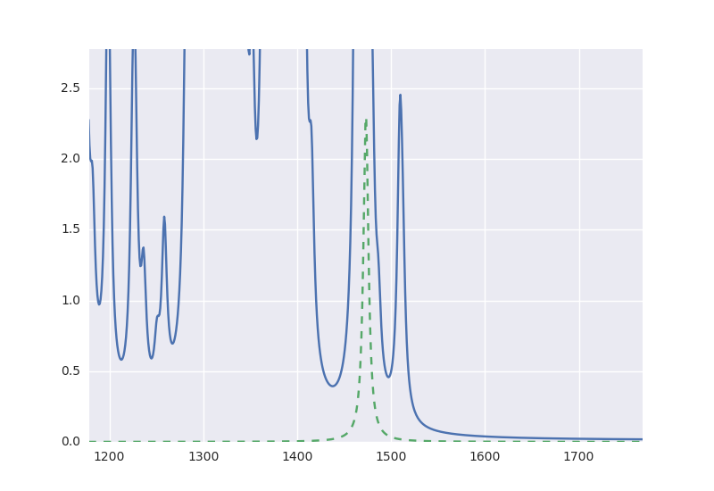

| Atom # | Element | Sum of vibrational eigenvalues |
|--------|---------|--------------------------------|
| 37 | 1 | 0.7936623967405788 |
| 25 | 1 | 0.3446737587922817 |
| 36 | 1 | 0.27166155414412246 |
| 8 | 1 | 0.13304134695650072 |
| 19 | 1 | 0.11445523142259598 |
| 23 | 6 | 0.09433981132056603 |
| 34 | 1 | 0.06403124237432849 |
| 35 | 1 | 0.05744562646538029 |
| 11 | 1 | 0.05744562646538029 |
| 44 | 1 | 0.05196152422706632 |
| 39 | 1 | 0.033166247903554 |
| 22 | 1 | 0.033166247903554 |
| 45 | 1 | 0.03 |
| 24 | 8 | 0.03 |
| 6 | 6 | 0.03 |
| 33 | 1 | 0.0282842712474619 |
| 26 | 6 | 0.0282842712474619 |
| 40 | 1 | 0.024494897427831782 |
| 31 | 1 | 0.017320508075688773 |
| 17 | 6 | 0.017320508075688773 |
| 16 | 6 | 0.017320508075688773 |
| 7 | 8 | 0.017320508075688773 |
| 5 | 1 | 0.017320508075688773 |
| 43 | 1 | 0.01414213562373095 |
| 38 | 1 | 0.01414213562373095 |
| 14 | 6 | 0.01414213562373095 |
| 3 | 6 | 0.01414213562373095 |
| 18 | 8 | 0.01 |
| 9 | 6 | 0.01 |

## Peak #104: 1479.5118 1/cm   
Raman activity: 1.8809  
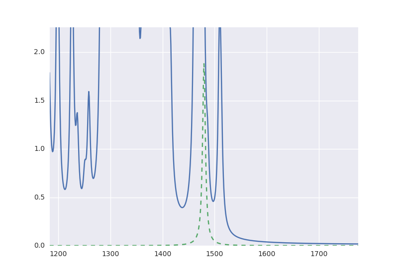

| Atom # | Element | Sum of vibrational eigenvalues |
|--------|---------|--------------------------------|
| 11 | 1 | 0.7823681997627461 |
| 19 | 1 | 0.5146843692983109 |
| 40 | 1 | 0.41194659848091963 |
| 39 | 1 | 0.38105117766515306 |
| 33 | 1 | 0.17088007490635063 |
| 22 | 1 | 0.16583123951777 |
| 9 | 6 | 0.11090536506409417 |
| 25 | 1 | 0.10099504938362078 |
| 36 | 1 | 0.09273618495495704 |
| 17 | 6 | 0.07348469228349536 |
| 10 | 8 | 0.07348469228349536 |
| 37 | 1 | 0.07141428428542851 |
| 41 | 1 | 0.06928203230275509 |
| 34 | 1 | 0.06 |
| 42 | 1 | 0.042426406871192854 |
| 32 | 1 | 0.042426406871192854 |
| 12 | 6 | 0.0412310562561766 |
| 8 | 1 | 0.04 |
| 18 | 8 | 0.033166247903554 |
| 45 | 1 | 0.03 |
| 35 | 1 | 0.03 |
| 31 | 1 | 0.03 |
| 23 | 6 | 0.02 |
| 44 | 1 | 0.017320508075688773 |
| 28 | 6 | 0.017320508075688773 |
| 26 | 6 | 0.017320508075688773 |
| 21 | 8 | 0.017320508075688773 |
| 20 | 6 | 0.017320508075688773 |
| 16 | 6 | 0.017320508075688773 |
| 5 | 1 | 0.017320508075688773 |
| 38 | 1 | 0.01414213562373095 |
| 24 | 8 | 0.01414213562373095 |
| 2 | 6 | 0.01414213562373095 |
| 13 | 8 | 0.01 |

## Peak #105: 1486.5206 1/cm   
Raman activity: 0.5188  
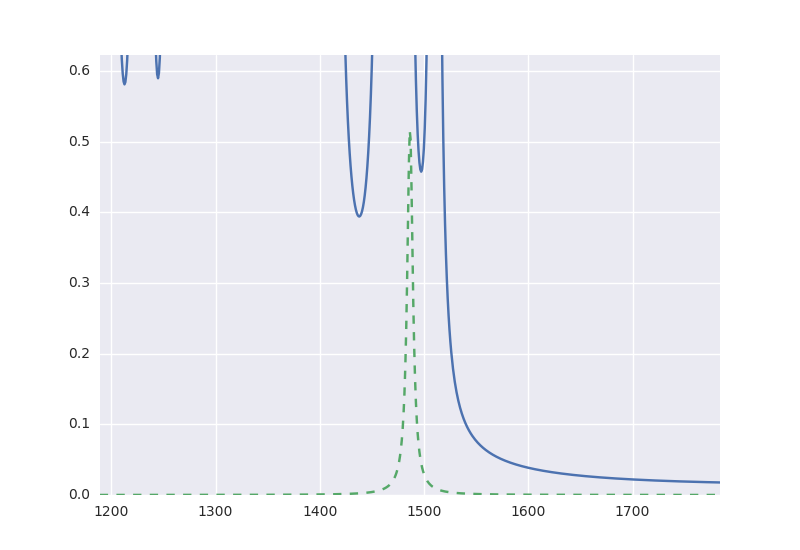

| Atom # | Element | Sum of vibrational eigenvalues |
|--------|---------|--------------------------------|
| 19 | 1 | 0.7595393340703297 |
| 11 | 1 | 0.5070502933634887 |
| 40 | 1 | 0.32999999999999996 |
| 22 | 1 | 0.29597297173897485 |
| 39 | 1 | 0.2368543856465402 |
| 33 | 1 | 0.21307275752662516 |
| 17 | 6 | 0.10677078252031312 |
| 32 | 1 | 0.08717797887081347 |
| 9 | 6 | 0.07141428428542851 |
| 34 | 1 | 0.06 |
| 36 | 1 | 0.05830951894845301 |
| 10 | 8 | 0.05744562646538029 |
| 18 | 8 | 0.05196152422706632 |
| 25 | 1 | 0.04358898943540673 |
| 8 | 1 | 0.04 |
| 31 | 1 | 0.034641016151377546 |
| 20 | 6 | 0.034641016151377546 |
| 37 | 1 | 0.033166247903554 |
| 42 | 1 | 0.03 |
| 41 | 1 | 0.03 |
| 35 | 1 | 0.017320508075688773 |
| 28 | 6 | 0.017320508075688773 |
| 26 | 6 | 0.017320508075688773 |
| 21 | 8 | 0.017320508075688773 |
| 16 | 6 | 0.017320508075688773 |
| 12 | 6 | 0.017320508075688773 |
| 45 | 1 | 0.01414213562373095 |
| 38 | 1 | 0.01414213562373095 |
| 30 | 1 | 0.01414213562373095 |
| 14 | 6 | 0.01414213562373095 |
| 2 | 6 | 0.01414213562373095 |
| 44 | 1 | 0.01 |
| 23 | 6 | 0.01 |

## Peak #106: 1509.4214 1/cm   
Raman activity: 1.8572  
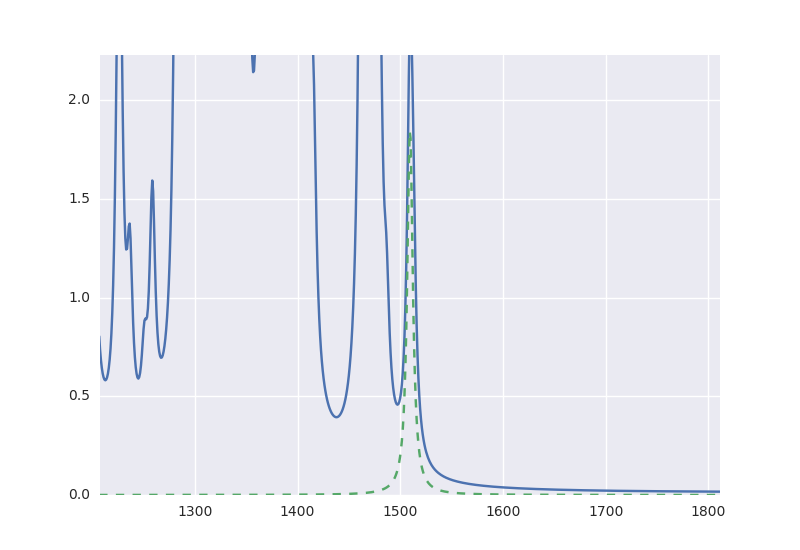

| Atom # | Element | Sum of vibrational eigenvalues |
|--------|---------|--------------------------------|
| 22 | 1 | 0.8416056083463322 |
| 19 | 1 | 0.32680269276736384 |
| 32 | 1 | 0.28583211855912904 |
| 20 | 6 | 0.18493242008906932 |
| 33 | 1 | 0.10677078252031312 |
| 17 | 6 | 0.09899494936611666 |
| 8 | 1 | 0.06 |
| 21 | 8 | 0.05196152422706632 |
| 31 | 1 | 0.042426406871192854 |
| 40 | 1 | 0.034641016151377546 |
| 34 | 1 | 0.03 |
| 28 | 6 | 0.03 |
| 11 | 1 | 0.03 |
| 25 | 1 | 0.0282842712474619 |
| 18 | 8 | 0.02 |
| 44 | 1 | 0.017320508075688773 |
| 30 | 1 | 0.017320508075688773 |
| 16 | 6 | 0.017320508075688773 |
| 37 | 1 | 0.01414213562373095 |
| 6 | 6 | 0.01414213562373095 |
| 39 | 1 | 0.01 |
| 35 | 1 | 0.01 |
| 27 | 8 | 0.01 |

## Peak #107: 1512.3754 1/cm   
Raman activity: 0.7685  
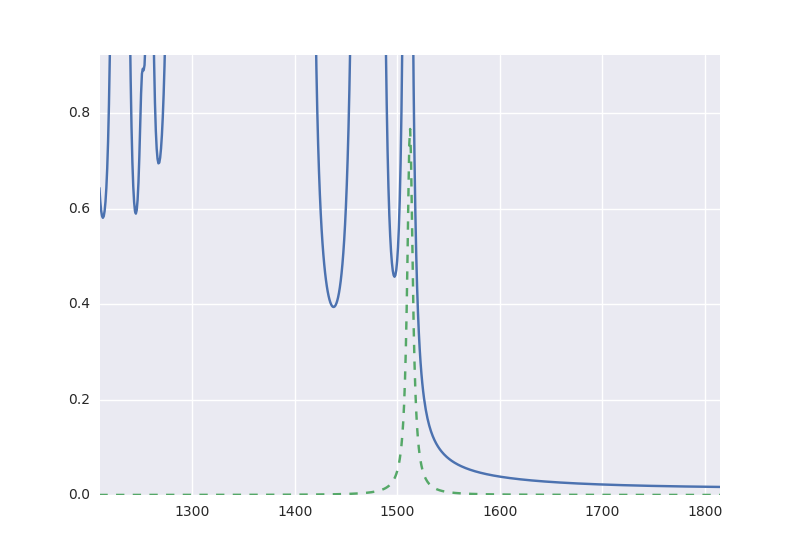

| Atom # | Element | Sum of vibrational eigenvalues |
|--------|---------|--------------------------------|
| 8 | 1 | 0.7945438943192504 |
| 25 | 1 | 0.428485705712571 |
| 44 | 1 | 0.23727621035409344 |
| 6 | 6 | 0.1307669683062202 |
| 36 | 1 | 0.12124355652982141 |
| 37 | 1 | 0.09949874371066199 |
| 45 | 1 | 0.05744562646538029 |
| 7 | 8 | 0.05196152422706632 |
| 22 | 1 | 0.048989794855663564 |
| 3 | 6 | 0.04358898943540673 |
| 23 | 6 | 0.04 |
| 19 | 1 | 0.033166247903554 |
| 5 | 1 | 0.033166247903554 |
| 42 | 1 | 0.03 |
| 38 | 1 | 0.03 |
| 24 | 8 | 0.0282842712474619 |
| 43 | 1 | 0.024494897427831782 |
| 35 | 1 | 0.02 |
| 40 | 1 | 0.017320508075688773 |
| 32 | 1 | 0.017320508075688773 |
| 34 | 1 | 0.01414213562373095 |
| 33 | 1 | 0.01414213562373095 |
| 20 | 6 | 0.01414213562373095 |
| 17 | 6 | 0.01414213562373095 |
| 14 | 6 | 0.01414213562373095 |
| 11 | 1 | 0.01414213562373095 |
| 41 | 1 | 0.01 |
| 39 | 1 | 0.01 |
| 26 | 6 | 0.01 |
| 2 | 6 | 0.01 |

## Peak #108: 3244.7686 1/cm   
Raman activity: 81.7858  
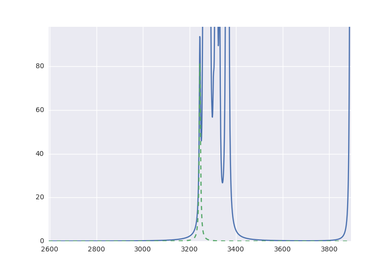

| Atom # | Element | Sum of vibrational eigenvalues |
|--------|---------|--------------------------------|
| 40 | 1 | 0.7855571271397135 |
| 39 | 1 | 0.10392304845413264 |
| 9 | 6 | 0.05196152422706632 |
| 11 | 1 | 0.024494897427831782 |
| 43 | 1 | 0.017320508075688773 |
| 41 | 1 | 0.01414213562373095 |
| 19 | 1 | 0.01414213562373095 |

## Peak #109: 3258.2029 1/cm   
Raman activity: 84.9015  
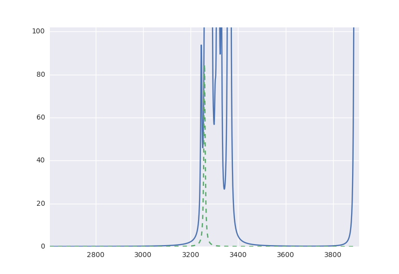

| Atom # | Element | Sum of vibrational eigenvalues |
|--------|---------|--------------------------------|
| 36 | 1 | 0.8101851640211638 |
| 37 | 1 | 0.21236760581595301 |
| 8 | 1 | 0.08717797887081347 |
| 35 | 1 | 0.05744562646538029 |
| 23 | 6 | 0.05196152422706632 |
| 25 | 1 | 0.033166247903554 |
| 33 | 1 | 0.01414213562373095 |

## Peak #110: 3262.5593 1/cm   
Raman activity: 40.3735  
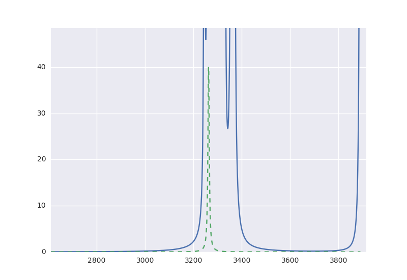

| Atom # | Element | Sum of vibrational eigenvalues |
|--------|---------|--------------------------------|
| 43 | 1 | 0.26570660511172844 |
| 40 | 1 | 0.19209372712298547 |
| 5 | 1 | 0.07348469228349536 |
| 44 | 1 | 0.04358898943540673 |
| 19 | 1 | 0.03 |
| 45 | 1 | 0.0282842712474619 |
| 41 | 1 | 0.0282842712474619 |
| 36 | 1 | 0.017320508075688773 |
| 9 | 6 | 0.017320508075688773 |
| 8 | 1 | 0.017320508075688773 |
| 3 | 6 | 0.017320508075688773 |
| 42 | 1 | 0.01 |
| 11 | 1 | 0.01 |

## Peak #111: 3266.9181 1/cm   
Raman activity: 45.3805  
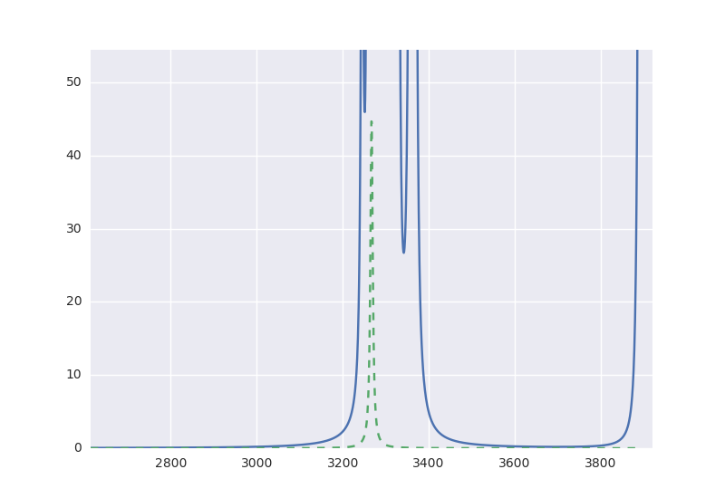

| Atom # | Element | Sum of vibrational eigenvalues |
|--------|---------|--------------------------------|
| 36 | 1 | 0.3112876483254676 |
| 35 | 1 | 0.27331300737432895 |
| 34 | 1 | 0.09899494936611666 |
| 23 | 6 | 0.03 |
| 45 | 1 | 0.0282842712474619 |
| 26 | 6 | 0.0282842712474619 |
| 25 | 1 | 0.02 |
| 32 | 1 | 0.017320508075688773 |
| 44 | 1 | 0.01414213562373095 |
| 33 | 1 | 0.01414213562373095 |
| 31 | 1 | 0.01414213562373095 |
| 19 | 1 | 0.01414213562373095 |
| 16 | 6 | 0.01414213562373095 |

## Peak #112: 3271.9023 1/cm   
Raman activity: 106.1014  
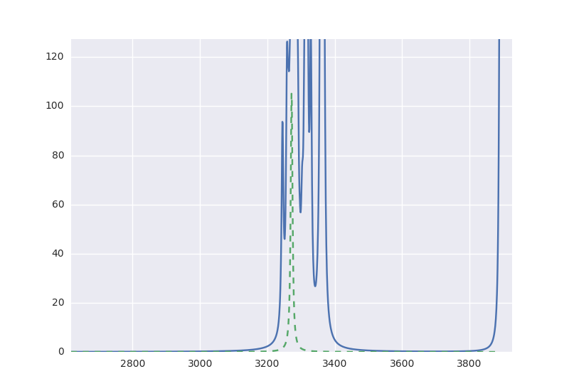

| Atom # | Element | Sum of vibrational eigenvalues |
|--------|---------|--------------------------------|
| 40 | 1 | 0.1407124727947029 |
| 43 | 1 | 0.09273618495495704 |
| 36 | 1 | 0.07681145747868609 |
| 45 | 1 | 0.07071067811865477 |
| 42 | 1 | 0.06164414002968976 |
| 34 | 1 | 0.0565685424949238 |
| 33 | 1 | 0.04690415759823429 |
| 44 | 1 | 0.04358898943540673 |
| 35 | 1 | 0.04358898943540673 |
| 41 | 1 | 0.0282842712474619 |
| 32 | 1 | 0.017320508075688773 |
| 9 | 6 | 0.017320508075688773 |
| 5 | 1 | 0.017320508075688773 |
| 31 | 1 | 0.01414213562373095 |
| 8 | 1 | 0.01414213562373095 |
| 25 | 1 | 0.01 |
| 11 | 1 | 0.01 |

## Peak #113: 3272.4927 1/cm   
Raman activity: 16.5559  
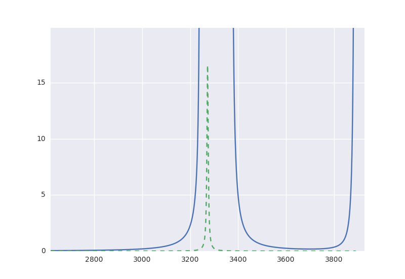

| Atom # | Element | Sum of vibrational eigenvalues |
|--------|---------|--------------------------------|
| 36 | 1 | 0.1407124727947029 |
| 34 | 1 | 0.1131370849898476 |
| 33 | 1 | 0.09380831519646858 |
| 40 | 1 | 0.08124038404635961 |
| 19 | 1 | 0.07141428428542851 |
| 43 | 1 | 0.05196152422706632 |
| 35 | 1 | 0.04358898943540673 |
| 32 | 1 | 0.034641016151377546 |
| 42 | 1 | 0.033166247903554 |
| 31 | 1 | 0.0282842712474619 |
| 45 | 1 | 0.01414213562373095 |
| 41 | 1 | 0.01414213562373095 |
| 37 | 1 | 0.01414213562373095 |
| 23 | 6 | 0.01414213562373095 |
| 16 | 6 | 0.01414213562373095 |
| 5 | 1 | 0.01414213562373095 |
| 25 | 1 | 0.01 |
| 11 | 1 | 0.01 |

## Peak #114: 3278.5755 1/cm   
Raman activity: 157.7644  
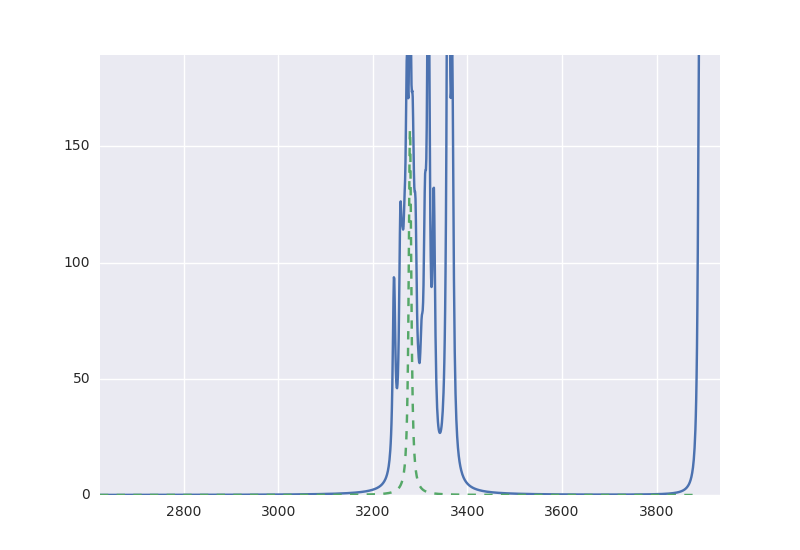

| Atom # | Element | Sum of vibrational eigenvalues |
|--------|---------|--------------------------------|
| 40 | 1 | 0.25612496949731395 |
| 44 | 1 | 0.1469693845669907 |
| 45 | 1 | 0.1131370849898476 |
| 8 | 1 | 0.04690415759823429 |
| 19 | 1 | 0.04358898943540673 |
| 43 | 1 | 0.034641016151377546 |
| 41 | 1 | 0.03 |
| 42 | 1 | 0.02 |
| 11 | 1 | 0.02 |
| 33 | 1 | 0.017320508075688773 |
| 32 | 1 | 0.017320508075688773 |
| 9 | 6 | 0.017320508075688773 |
| 6 | 6 | 0.017320508075688773 |
| 36 | 1 | 0.01414213562373095 |
| 35 | 1 | 0.01414213562373095 |
| 34 | 1 | 0.01414213562373095 |
| 31 | 1 | 0.01414213562373095 |
| 14 | 6 | 0.01414213562373095 |
| 5 | 1 | 0.01414213562373095 |
| 39 | 1 | 0.01 |

## Peak #115: 3284.1337 1/cm   
Raman activity: 86.6714  

| Atom # | Element | Sum of vibrational eigenvalues |
|--------|---------|--------------------------------|
| 36 | 1 | 0.18761663039293716 |
| 32 | 1 | 0.13856406460551018 |
| 40 | 1 | 0.12806248474865697 |
| 35 | 1 | 0.11489125293076058 |
| 45 | 1 | 0.1131370849898476 |
| 34 | 1 | 0.09899494936611666 |
| 33 | 1 | 0.06403124237432849 |
| 31 | 1 | 0.0565685424949238 |
| 19 | 1 | 0.04358898943540673 |
| 42 | 1 | 0.03 |
| 43 | 1 | 0.017320508075688773 |
| 23 | 6 | 0.017320508075688773 |
| 20 | 6 | 0.017320508075688773 |
| 9 | 6 | 0.017320508075688773 |
| 44 | 1 | 0.01414213562373095 |
| 41 | 1 | 0.01414213562373095 |
| 37 | 1 | 0.01414213562373095 |
| 26 | 6 | 0.01414213562373095 |
| 16 | 6 | 0.01414213562373095 |
| 14 | 6 | 0.01414213562373095 |
| 5 | 1 | 0.01414213562373095 |
| 25 | 1 | 0.01 |
| 11 | 1 | 0.01 |

## Peak #116: 3286.4632 1/cm   
Raman activity: 13.225  
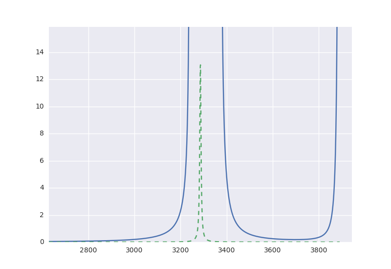

| Atom # | Element | Sum of vibrational eigenvalues |
|--------|---------|--------------------------------|
| 40 | 1 | 0.25612496949731395 |
| 45 | 1 | 0.21213203435596426 |
| 31 | 1 | 0.09899494936611666 |
| 36 | 1 | 0.09380831519646858 |
| 32 | 1 | 0.08660254037844388 |
| 19 | 1 | 0.05744562646538029 |
| 43 | 1 | 0.05196152422706632 |
| 42 | 1 | 0.05196152422706632 |
| 34 | 1 | 0.042426406871192854 |
| 5 | 1 | 0.03 |
| 35 | 1 | 0.0282842712474619 |
| 11 | 1 | 0.02 |
| 44 | 1 | 0.017320508075688773 |
| 39 | 1 | 0.017320508075688773 |
| 33 | 1 | 0.017320508075688773 |
| 9 | 6 | 0.017320508075688773 |
| 41 | 1 | 0.01414213562373095 |
| 28 | 6 | 0.01414213562373095 |
| 23 | 6 | 0.01414213562373095 |
| 22 | 1 | 0.01414213562373095 |
| 14 | 6 | 0.01414213562373095 |
| 25 | 1 | 0.01 |
| 20 | 6 | 0.01 |

## Peak #117: 3290.2493 1/cm   
Raman activity: 72.1286  
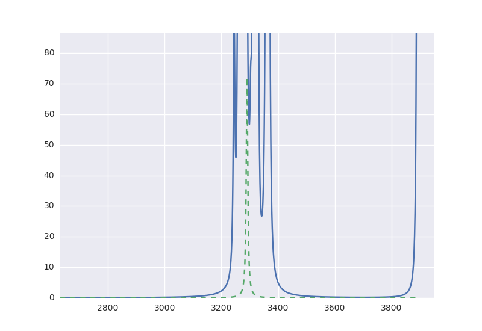

| Atom # | Element | Sum of vibrational eigenvalues |
|--------|---------|--------------------------------|
| 31 | 1 | 0.438520238985614 |
| 36 | 1 | 0.11090536506409418 |
| 32 | 1 | 0.11 |
| 34 | 1 | 0.07071067811865477 |
| 40 | 1 | 0.05196152422706632 |
| 33 | 1 | 0.04690415759823429 |
| 35 | 1 | 0.04358898943540673 |
| 28 | 6 | 0.042426406871192854 |
| 19 | 1 | 0.03 |
| 45 | 1 | 0.0282842712474619 |
| 22 | 1 | 0.0282842712474619 |
| 43 | 1 | 0.017320508075688773 |
| 20 | 6 | 0.017320508075688773 |
| 44 | 1 | 0.01414213562373095 |
| 37 | 1 | 0.01414213562373095 |
| 30 | 1 | 0.01414213562373095 |
| 23 | 6 | 0.01414213562373095 |
| 8 | 1 | 0.01414213562373095 |
| 42 | 1 | 0.01 |
| 25 | 1 | 0.01 |

## Peak #118: 3296.2868 1/cm   
Raman activity: 9.5638  
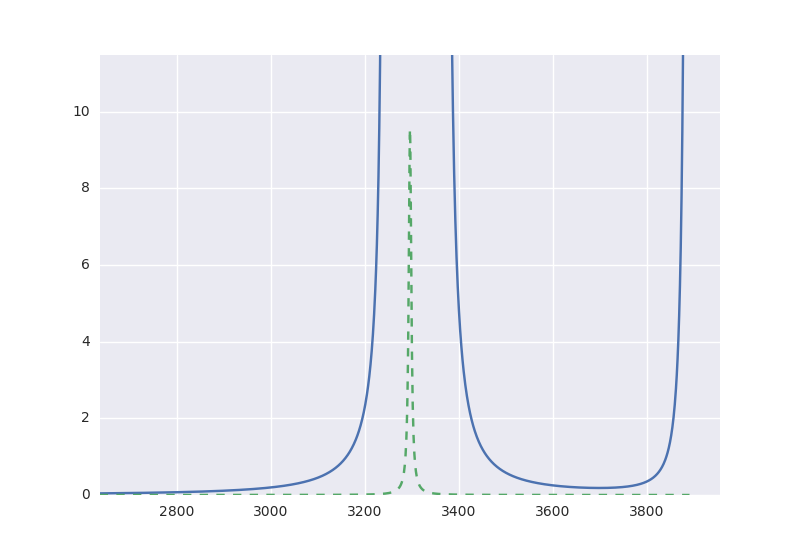

| Atom # | Element | Sum of vibrational eigenvalues |
|--------|---------|--------------------------------|
| 40 | 1 | 0.4310452412450461 |
| 45 | 1 | 0.19798989873223333 |
| 44 | 1 | 0.10344080432788601 |
| 43 | 1 | 0.09273618495495704 |
| 19 | 1 | 0.08717797887081347 |
| 8 | 1 | 0.08717797887081347 |
| 36 | 1 | 0.04690415759823429 |
| 5 | 1 | 0.04358898943540673 |
| 31 | 1 | 0.042426406871192854 |
| 11 | 1 | 0.042426406871192854 |
| 39 | 1 | 0.034641016151377546 |
| 9 | 6 | 0.034641016151377546 |
| 42 | 1 | 0.03 |
| 34 | 1 | 0.01414213562373095 |
| 14 | 6 | 0.01414213562373095 |
| 6 | 6 | 0.01414213562373095 |
| 25 | 1 | 0.01 |

## Peak #119: 3302.2901 1/cm   
Raman activity: 17.8279  
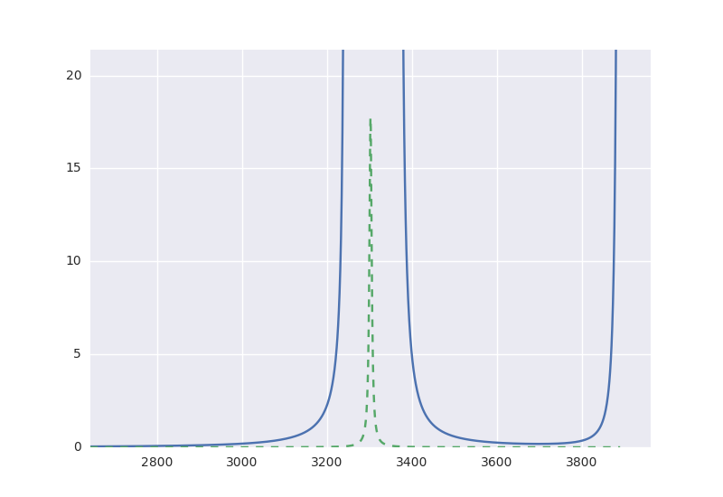

| Atom # | Element | Sum of vibrational eigenvalues |
|--------|---------|--------------------------------|
| 31 | 1 | 0.3678314831549905 |
| 36 | 1 | 0.18761663039293716 |
| 32 | 1 | 0.17916472867168917 |
| 40 | 1 | 0.09380831519646858 |
| 33 | 1 | 0.04690415759823429 |
| 19 | 1 | 0.04358898943540673 |
| 34 | 1 | 0.042426406871192854 |
| 37 | 1 | 0.0282842712474619 |
| 28 | 6 | 0.0282842712474619 |
| 25 | 1 | 0.02 |
| 23 | 6 | 0.017320508075688773 |
| 20 | 6 | 0.017320508075688773 |
| 35 | 1 | 0.01414213562373095 |
| 30 | 1 | 0.01414213562373095 |
| 22 | 1 | 0.01414213562373095 |
| 9 | 6 | 0.01414213562373095 |
| 11 | 1 | 0.01 |

## Peak #120: 3303.9508 1/cm   
Raman activity: 17.4103  
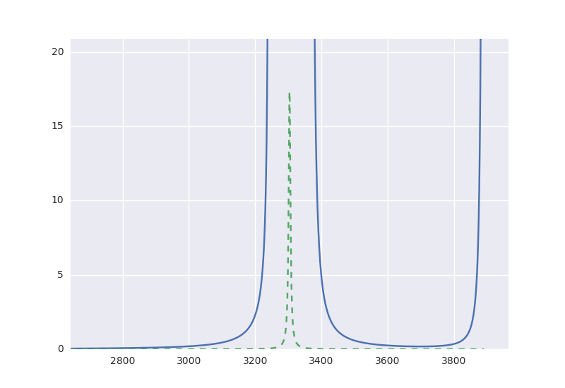

| Atom # | Element | Sum of vibrational eigenvalues |
|--------|---------|--------------------------------|
| 40 | 1 | 0.7090839160494334 |
| 11 | 1 | 0.08124038404635961 |
| 19 | 1 | 0.07141428428542851 |
| 43 | 1 | 0.06928203230275509 |
| 9 | 6 | 0.06403124237432849 |
| 45 | 1 | 0.0565685424949238 |
| 39 | 1 | 0.05196152422706632 |
| 36 | 1 | 0.04690415759823429 |
| 44 | 1 | 0.04358898943540673 |
| 42 | 1 | 0.03 |
| 8 | 1 | 0.03 |
| 5 | 1 | 0.03 |
| 41 | 1 | 0.0282842712474619 |
| 31 | 1 | 0.0282842712474619 |
| 32 | 1 | 0.017320508075688773 |
| 37 | 1 | 0.01414213562373095 |
| 25 | 1 | 0.01 |

## Peak #121: 3310.3008 1/cm   
Raman activity: 77.8471  
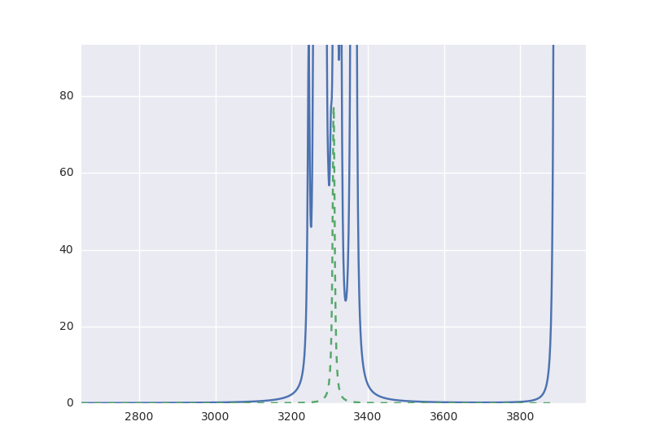

| Atom # | Element | Sum of vibrational eigenvalues |
|--------|---------|--------------------------------|
| 36 | 1 | 0.8613361713059542 |
| 8 | 1 | 0.1881488772222678 |
| 37 | 1 | 0.15684387141358122 |
| 25 | 1 | 0.09110433579144298 |
| 23 | 6 | 0.09 |
| 35 | 1 | 0.08717797887081347 |
| 19 | 1 | 0.07141428428542851 |
| 31 | 1 | 0.042426406871192854 |
| 34 | 1 | 0.0282842712474619 |
| 32 | 1 | 0.024494897427831782 |
| 40 | 1 | 0.017320508075688773 |
| 33 | 1 | 0.017320508075688773 |
| 45 | 1 | 0.01414213562373095 |
| 26 | 6 | 0.01414213562373095 |
| 7 | 8 | 0.01414213562373095 |
| 24 | 8 | 0.01 |

## Peak #122: 3317.3855 1/cm   
Raman activity: 223.4941  
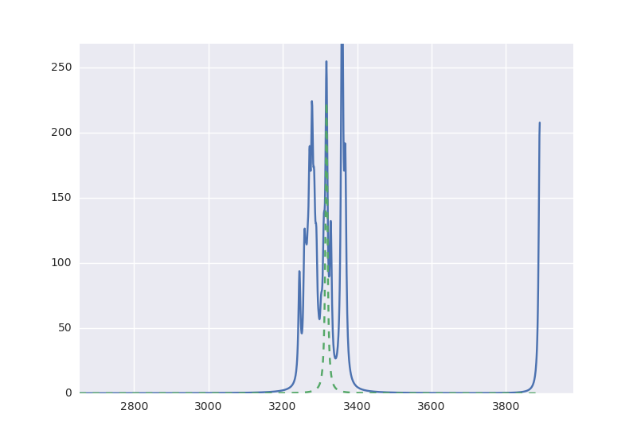

| Atom # | Element | Sum of vibrational eigenvalues |
|--------|---------|--------------------------------|
| 8 | 1 | 1.1150784725749125 |
| 19 | 1 | 0.3029851481508623 |
| 25 | 1 | 0.11090536506409417 |
| 7 | 8 | 0.07348469228349536 |
| 36 | 1 | 0.05196152422706632 |
| 37 | 1 | 0.042426406871192854 |
| 5 | 1 | 0.03 |
| 45 | 1 | 0.01414213562373095 |
| 44 | 1 | 0.01414213562373095 |
| 35 | 1 | 0.01414213562373095 |
| 18 | 8 | 0.01414213562373095 |
| 24 | 8 | 0.01 |

## Peak #123: 3328.9199 1/cm   
Raman activity: 106.0936  
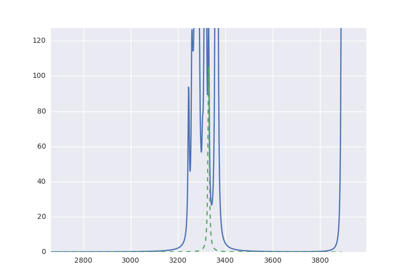

| Atom # | Element | Sum of vibrational eigenvalues |
|--------|---------|--------------------------------|
| 19 | 1 | 1.2396773773849388 |
| 8 | 1 | 0.28913664589601923 |
| 18 | 8 | 0.07141428428542851 |
| 25 | 1 | 0.042426406871192854 |
| 45 | 1 | 0.0282842712474619 |
| 22 | 1 | 0.0282842712474619 |
| 11 | 1 | 0.02 |
| 36 | 1 | 0.017320508075688773 |
| 33 | 1 | 0.01414213562373095 |
| 7 | 8 | 0.01414213562373095 |
| 5 | 1 | 0.01414213562373095 |

## Peak #124: 3358.7347 1/cm   
Raman activity: 12.6392  
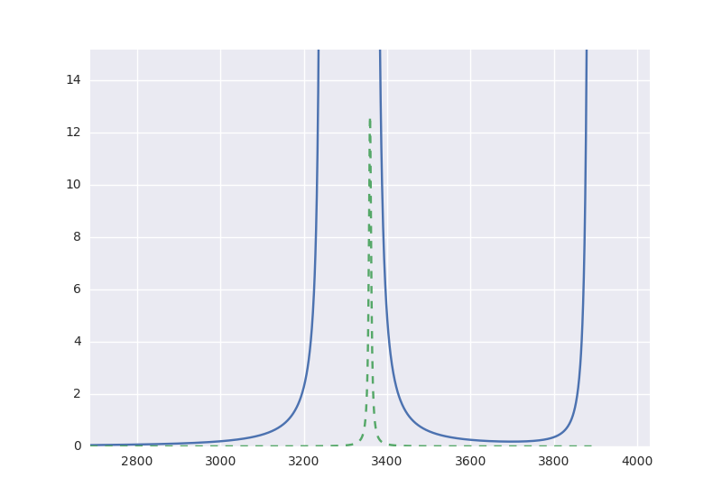

| Atom # | Element | Sum of vibrational eigenvalues |
|--------|---------|--------------------------------|
| 22 | 1 | 0.9483670175622939 |
| 5 | 1 | 0.7975587752636166 |
| 25 | 1 | 0.06164414002968976 |
| 21 | 8 | 0.0565685424949238 |
| 4 | 8 | 0.04358898943540673 |
| 11 | 1 | 0.02 |
| 43 | 1 | 0.017320508075688773 |
| 36 | 1 | 0.01414213562373095 |
| 19 | 1 | 0.01414213562373095 |
| 8 | 1 | 0.01414213562373095 |
| 32 | 1 | 0.01 |

## Peak #125: 3358.8022 1/cm   
Raman activity: 172.732  
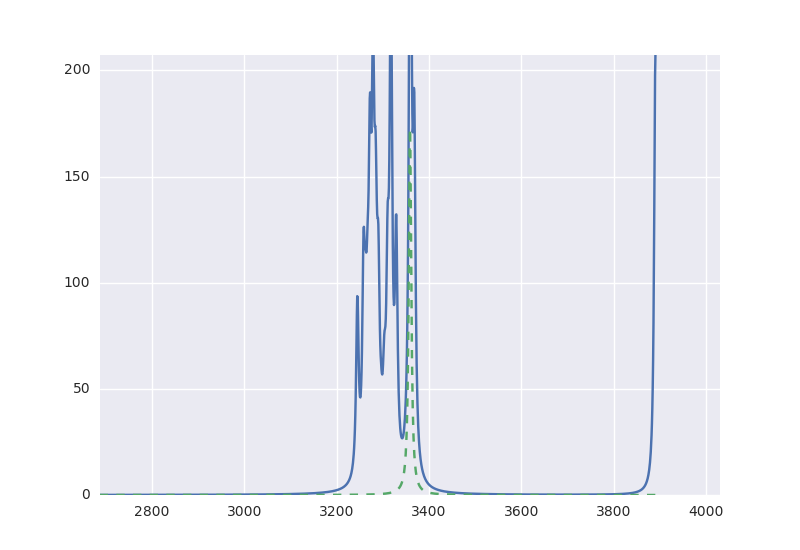

| Atom # | Element | Sum of vibrational eigenvalues |
|--------|---------|--------------------------------|
| 5 | 1 | 1.0643777524920368 |
| 22 | 1 | 0.7077428911688198 |
| 4 | 8 | 0.07348469228349536 |
| 21 | 8 | 0.042426406871192854 |
| 11 | 1 | 0.03 |
| 43 | 1 | 0.017320508075688773 |
| 19 | 1 | 0.01414213562373095 |
| 8 | 1 | 0.01414213562373095 |
| 25 | 1 | 0.01 |

## Peak #126: 3360.341 1/cm   
Raman activity: 139.4546  
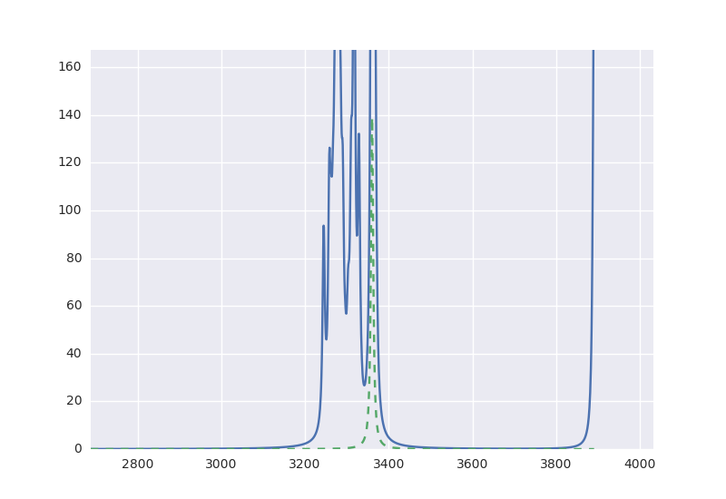

| Atom # | Element | Sum of vibrational eigenvalues |
|--------|---------|--------------------------------|
| 25 | 1 | 0.9748846085563152 |
| 8 | 1 | 0.1307669683062202 |
| 36 | 1 | 0.12806248474865697 |
| 24 | 8 | 0.06164414002968976 |
| 5 | 1 | 0.06 |
| 22 | 1 | 0.0565685424949238 |
| 19 | 1 | 0.03 |
| 37 | 1 | 0.01414213562373095 |
| 23 | 6 | 0.01414213562373095 |
| 7 | 8 | 0.01414213562373095 |

## Peak #127: 3367.9895 1/cm   
Raman activity: 145.0358  
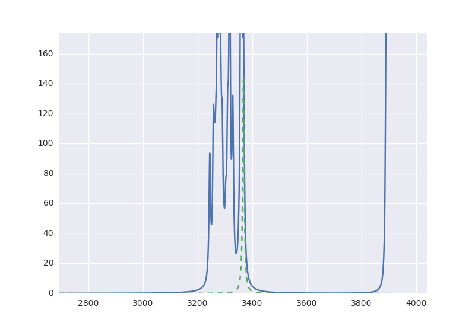

| Atom # | Element | Sum of vibrational eigenvalues |
|--------|---------|--------------------------------|
| 11 | 1 | 0.9668505572217455 |
| 40 | 1 | 0.11575836902790226 |
| 10 | 8 | 0.06164414002968976 |
| 5 | 1 | 0.04358898943540673 |
| 19 | 1 | 0.03 |
| 9 | 6 | 0.01414213562373095 |
| 8 | 1 | 0.01414213562373095 |

## Peak #128: 3890.3454 1/cm   
Raman activity: 58.1657  
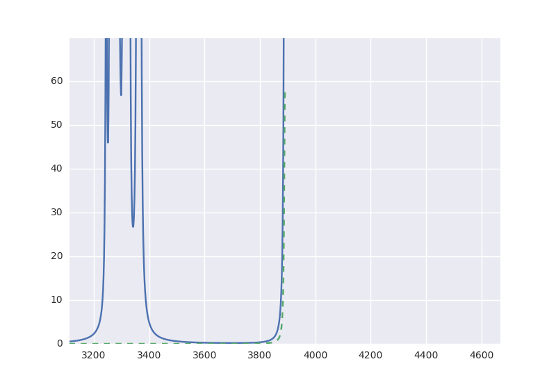

| Atom # | Element | Sum of vibrational eigenvalues |
|--------|---------|--------------------------------|
| 38 | 1 | 0.789430174239622 |
| 30 | 1 | 0.198997487421324 |
| 1 | 8 | 0.05744562646538029 |
| 42 | 1 | 0.01414213562373095 |
| 29 | 8 | 0.01414213562373095 |

## Peak #129: 3890.6867 1/cm   
Raman activity: 150.0603  
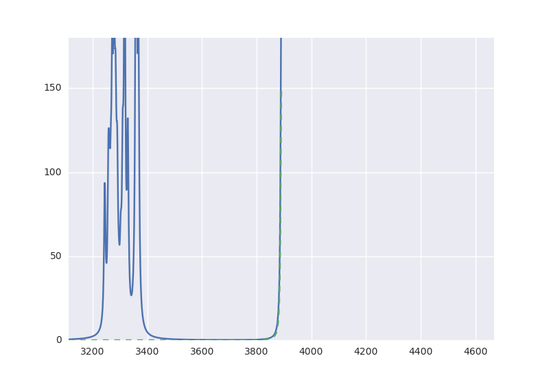

| Atom # | Element | Sum of vibrational eigenvalues |
|--------|---------|--------------------------------|
| 30 | 1 | 1.2634476641317598 |
| 38 | 1 | 0.1307669683062202 |
| 29 | 8 | 0.08544003745317531 |
| 31 | 1 | 0.01414213562373095 |
| 1 | 8 | 0.01414213562373095 |

